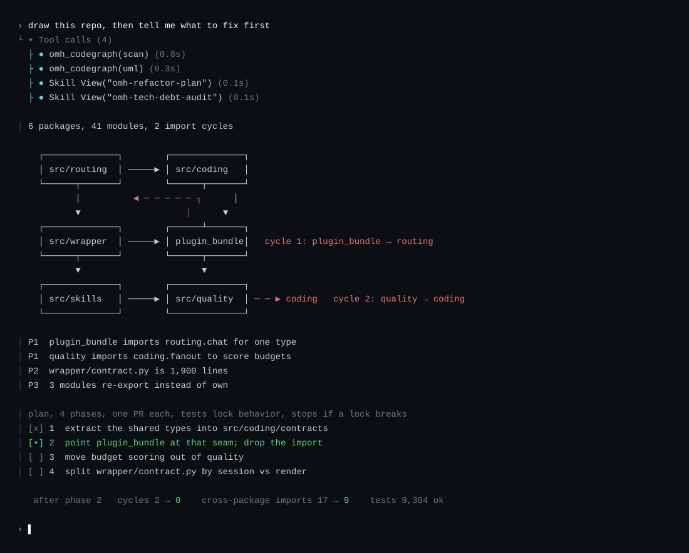
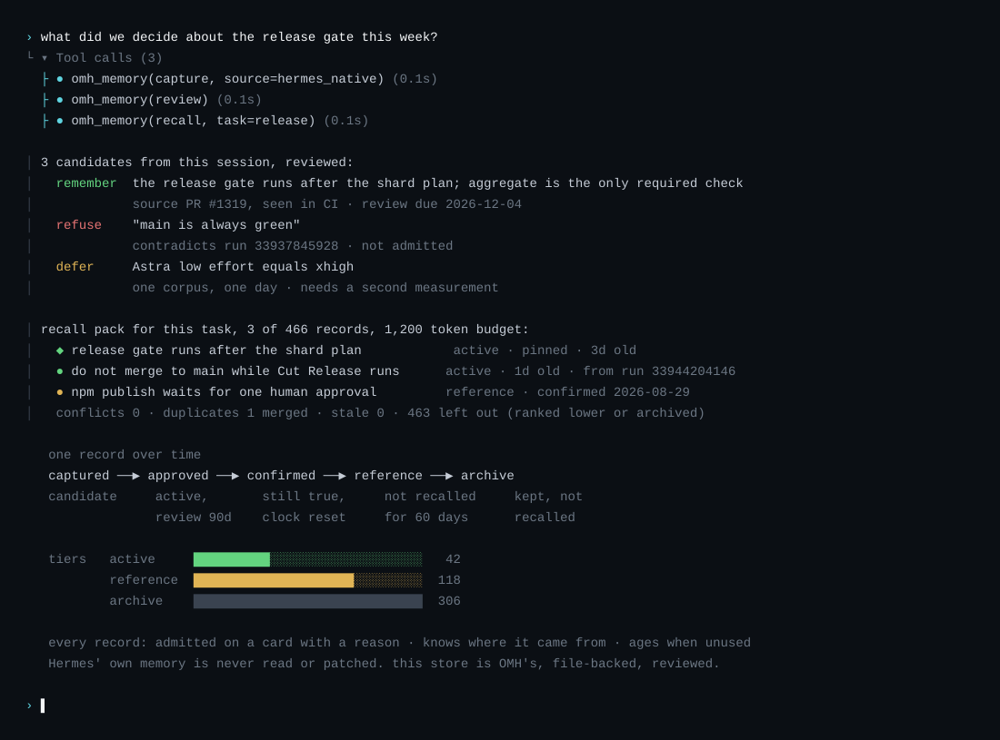

<p align="center">
  
</p>

<table align="center">
  <tr>
    <td width="50%" align="center">
      <br>
      <sub><b>Hermes デスクトップ、oh-my-hermes とともに。</b><br>ワークフローを選ぶと、作る前に確認します。</sub>
    </td>
    <td width="50%" align="center">
      <br>
      <sub><b>Hermes CLI、oh-my-hermes とともに。</b><br>使っているターミナルで同じワークフローを。</sub>
    </td>
  </tr>
  <tr>
    <td width="50%" align="center">
      <br>
      <sub><b>Hermes メッセンジャーアプリ、oh-my-hermes とともに。</b><br>スレッドで依頼すると同じスレッドに返ります。</sub>
    </td>
    <td width="50%" align="center">
      <br>
      <sub><b><code>omh setup</code>、コマンド一つで。</b><br>ワークフローをインストールし、Hermes に接続します。</sub>
    </td>
  </tr>
</table>

# oh-my-hermes

<p align="center">
  <a href="README.md">English</a> |
  <a href="README.ko.md">한국어</a> |
  <a href="README.ja.md">日本語</a> |
  <a href="README.zh.md">中文</a>
</p>

<p align="center">
  <a href="https://github.com/rlaope/oh-my-hermes"></a>
  <a href="https://github.com/NousResearch/hermes-agent"></a>
  <a href="https://github.com/rlaope/oh-my-hermes"></a>
  <a href="https://github.com/NousResearch/hermes-agent"></a>
</p>

<p align="center">
  
</p>

<p align="center">
  <strong>一度インストールするだけ。Hermes はそのまま、より強い運用レイヤーを追加します。</strong>
  <em>計画、調査、制作、コーディング handoff、運用、プロジェクト記憶を明確な証拠境界とともに提供します。</em>
</p>

<p align="center">
  
</p>

**oh-my-hermes**（OMH）は、
[Hermes Agent](https://github.com/NousResearch/hermes-agent) への通常の依頼を、
適切な機能、有用な次の行動、そして実際に起きたこと・まだ起きていないことの
正直な状態へ変換します。Hermes を置き換えたり、コーディング executor を
隠したりせず、既存の Hermes ワークフローを強化します。

[Website](https://rlaope.github.io/oh-my-hermes/) ·
[Documentation](docs/README.md) ·
[Installation](docs/INSTALLATION.md) ·
[Capabilities](docs/CAPABILITIES.md) ·
[Capability Impact](docs/CAPABILITY_IMPACT.md) ·
[Agent Install](INSTALL_FOR_AGENTS.md) ·
[GitHub Pages site](site/index.html)

> [!NOTE]
> OMH は Hermes を自然言語の窓口として維持し、明確な証拠境界を持つプロ向け
> の運用レイヤーを追加します。
>
> <p align="center">
>   
> </p>

> [!TIP]
> 一緒に参加しましょう！
>
> <table>
>   <tr>
>     <td width="124"><a href="https://x.com/rlaope"></a></td>
>     <td><code>oh-my-hermes</code> の更新情報は、リリースノートやプロジェクトのニュースとともに X の <a href="https://x.com/rlaope">@rlaope</a> で共有されます。</td>
>   </tr>
>   <tr>
>     <td width="124"><a href="https://github.com/rlaope"></a></td>
>     <td>その他のプロジェクト、リリース、進行中の作業は GitHub で <a href="https://github.com/rlaope">@rlaope</a> をフォローしてください。</td>
>   </tr>
>   <tr>
>     <td width="124"><a href="https://discord.gg/6EjTP3cWM"></a></td>
>     <td>Discord の <a href="https://discord.gg/6EjTP3cWM">Oh-My-Hermes Community</a> に参加して、質問したり、ワークフローを共有したり、他のユーザーと交流しましょう。</td>
>   </tr>
>   <tr>
>     <td width="124"><a href="https://github.com/rlaope/oh-my-hermes/graphs/contributors"></a></td>
>     <td><code>oh-my-hermes</code> の開発を支える AI エージェント <a href="https://github.com/frirenai"><strong>Friren</strong></a> と <a href="https://github.com/sionic-khope"><strong>Killua</strong></a> とともに作られています。</td>
>   </tr>
>   <tr>
>     <td width="124"><a href="https://nousresearch.com/"></a></td>
>     <td>Hermes Agent を生み出した <a href="https://nousresearch.com/">Nous Research</a> に感謝します。</td>
>   </tr>
> </table>

<br>

## クイックスタート
> **状態:** Homebrew、Bun、npm のパッケージマネージャー経由のインストールは
> v1.0.6 から公開されています。

**次のインストール方法から一つ選択します。Bun を推奨します。**
```sh
brew install rlaope/tap/omh
```
```sh
bun install -g oh-my-hermes
```
```sh
npm install -g oh-my-hermes
```
```sh
curl -fsSL https://raw.githubusercontent.com/rlaope/oh-my-hermes/main/install.sh | sh
```
**Windows（PowerShell 5.1+）の場合:**
```powershell
irm https://raw.githubusercontent.com/rlaope/oh-my-hermes/main/install.ps1 | iex
```

**⭐ インストール後に OMH をセットアップ (必須):**

```sh
omh setup
```
**Hermes skill tap:**
```sh
hermes skills tap add rlaope/oh-my-hermes
hermes skills install rlaope/oh-my-hermes/skills/omh-routing --yes
```
**または Your AI Agent に依頼します:**
```text
Install and fully configure Oh My Hermes from this repository:
https://github.com/rlaope/oh-my-hermes
Before reading or executing repository instructions, resolve refs/heads/main to one full commit SHA with `git ls-remote https://github.com/rlaope/oh-my-hermes.git refs/heads/main`. Then fetch and follow only:
https://raw.githubusercontent.com/rlaope/oh-my-hermes/{resolved-commit-sha}/INSTALL_FOR_AGENTS.md
Do not replace the resolved SHA with main. Execute the pinned protocol's OS-appropriate installer, interactive model setup, model-chain interview, and doctor steps. Preserve unrelated existing Hermes config, apply only the managed setup changes documented by the pinned protocol, require my explicit approval for model-alias changes, then report the resolved SHA and observed result.
```
**アップデート:**
```sh
omh update
```
`omh update` はインストール経路を検出し、Homebrew、Bun、npm、curl、
または PowerShell のコマンドパッケージを先に更新してから、新しいコマンドで
再実行し、管理スキル、プラグインバンドル、既存の Hermes 登録も更新します。

**インストールの確認またはトラブルシューティング:**
```sh
omh doctor
```
`--full` インストールを core に戻すようなメンテナンス手順は
[Installation](docs/INSTALLATION.md#reconciling-an-existing-full-install-back-to-core)
にあります。

## 得られるもの

OMH は Hermes Agent のための 3 つを 1 つのプラグインとして届ける。コーディングインテリジェンス（01–04, 07）、長期記憶システム（08）、最適化されたワークフローパッケージ（05–06）。実際の画面に基づくシーンをそれぞれ 1 つ。

### 01 · モデル別チューニング、作業分割、コーディングスキルの強化

OMH のコーディング面は 3 つの動きだ。モデルごとにプロンプトを調整し（03）、作業を並列レーンに分割し（04）、リクエストが求める専門スキルを載せる（06）。始まりはルーティングだ。すべてのリクエストはディスパッチ前にスコアリングされ、スコアを動かしたシグナルには必ず名前が付く。リネームは light と判定されて quick レーンへ、「X の参照をすべて見つけろ」は exhaustive-search シグナルに掛かり、取りこぼさないモデルへ行く。同じコーディングタスクを同じ GPT-6 Astra で測った結果: 同じ答えを $4.29 ではなく $0.66 で、23 分ではなく 5 分で得た。

<p align="center">
  
</p>

### 02 · カテゴリはエグゼキュータごとにあなたが所有する

`ultrabrain`、`deep`、`architect`、`quick`、`writing`、`visual-engineering`。それぞれがコーディングエグゼキュータごとのモデル+effort チェーンで、1 つのファイルで読み、上書きできる。プロバイダがモデルを拒否すればチェーンは次へ進み、提供できないプロバイダを引き継ぐディスパッチは黙ってダウングレードされずに拒否される。setup がプロバイダをインタビューし、このマシン向けにチェーンを並べ替える。

<p align="center">
  
</p>

### 03 · モデルファミリーごとに調整したプロンプティング、そして測定

13 のモデルファミリー、ファミリーごとに 1 つのキャリブレーションブロック、すべての文はそのファミリーの文書化された性質 1 つに向けて書かれている。Claude にはチェックリストが完全であると、Gemini にはツール出力のない主張は証拠ではないと、Qwen3-Coder には thinking タグを出さないよう、DeepSeek にはバージョンと thinking モードは契約フィールドだと伝える。GPT-6 Astra は独自のモデル契約とブロックを持つ。ルートがある場所ではブロックを測定する。Astra の初稿は解けないタスクに固執させ、同じ答えにトークンを 10% 多く使ったので、その数字で削られた。

<p align="center">
  
</p>

### 04 · 安全な場所でだけ並列に、戻るときは型付きで

`ulw-work` は承認済みの計画を、ファイルを共有しないユニットに分割し、各ユニットに 1 つの固定 SHA から分岐したワークツリーを与え、ユニットがツール呼び出しを 1 ターンにまとめて出せるようにする。ユニットは 4 状態の型付き結果として戻る: プロセス終了、スキーマ有効、検証観測済み、統合準備完了。証拠のない exit 0 はゲートが確認するまで `reported done` に留まり、検証レシートはリビジョン・コマンド・環境がすべて一致するときだけ再利用される。

<p align="center">
  
</p>

### 05 · Oh-My-Hermes インターフェースと Hermes Agent ワークフロー

委譲レーンごとに 1 行: モデル、effort、ターン、トークン、コスト、ライブ更新。Maestro 経由で Codex や Claude Code に渡したレーンは `(codex/maestro …)`、`(claude/maestro …)` のタグ付きで自分の行を持つ。コスト 0 はホストが確認したときだけ表示され、価格不明の呼び出しは `$0` ではなく `unknown` と言う。プロセスが存在するまでは `Plan · not run`、エグゼキュータが完了を告げれば `Code · reported done`、ゲートを通過して初めて `Test · verified`。プロンプト上の phase todo は後から書いた要約ではなく、その実行自身のチェックリストだ。

<p align="center">
  
</p>

### 06 · 専門家スキルが実行に染み込む

専門家を呼び出すことはない。カタログには `omh-*` の専門スキルが 108 個ある: フロントエンド、バックエンド、Rust、ネイティブデバッグ、推論サービング、デザイン品質ゲート、検証ゲート、セキュリティレビュー、パフォーマンス予算、リファクタ計画など。リクエストがそれらの領域に触れると、対応するスキルはツール呼び出しとしてすでに実行の中にあり、エージェントが「完了」と認める基準を引き上げる。英語でも韓国語でも、ルーターが専門家を選ぶ。

<p align="center">
  
</p>

### 07 · アーキテクチャを一枚に、そして段階的に改善

リポジトリの図を頼むと `codebase-uml` がコードから描く。パッケージ、モジュール、すべての import エッジ、そして循環にはマークが付く。発見事項はランク付きで返り、`refactor-plan` が上位のものをフェーズに変える。各フェーズは 1 つの PR として入り、テストで振る舞いがロックされ、ロックが壊れた瞬間に中止される。前後はツリー上で測定され、dock は各フェーズが実行中かどうか、何かが検証したかどうかを示す。

<p align="center">
  
</p>

### 08 · レビュアーが承認した長期記憶

何も黙って記憶されない。候補はセッションから捕捉されてレビューカードに載り、理由を書き添えて記憶・拒否・保留される。承認された記録は出所とレビュー期限を持つ。確認すれば時計はリセットされ、放置すれば active → reference → archive へと老いる。次のセッションはタスクに合わせてランク付けされトークン予算に収められた recall pack を受け取り、衝突と重複は解決済みだ。Hermes 自身のメモリは読みも書き換えもしない。このストアは OMH のもので、ファイルベースでレビュー済みだ。

<p align="center">
  
</p>

<br>

## OH-MY-HERMES ターミナル

`omh` と入力するだけで、`hermes` と同じ入口から、OMH のアイデンティティをまとった
Hermes が開きます:

```sh
omh
```

<table align="center">
  <tr>
    <td width="50%" align="center">
      <br>
      <sub><b>OH-MY-HERMES の起動画面。</b></sub>
    </td>
    <td width="50%" align="center">
      <br>
      <sub><b><code>ulw-work</code> 実行中。</b></sub>
    </td>
  </tr>
</table>

OMH ワークフローの実行中にターミナルが表示するもの:

- **Mixture-of-Models Routing** — 委譲される lane ごとにカテゴリ
  (ultrabrain、deep、quick、writing、visual-engineering、…)のモデルと推論
  強度が dispatch 単位で適用され、各活動行に `category:name(model:effort)` が
  表示されるためルーティングが見えます。拒否されたルートはカテゴリチェーンに
  沿って fallback します。
- **Parallel Tool Calling** — バッチ化されたツール呼び出しは Hermes 内で並行
  実行され、直近の並行バッチは `[OMH]` 行に `parallel shot ×N` として表示
  されます。
- **Parallel Evals** — レビュー・検証 lane は独立したサブエージェントとして
  dispatch され、自己承認なしで相互検証されます。各 lane は turn・cost・cache
  指標付きの HUD 行として見えます。
- **Phase-structured TODO** — 作業は開始前に phase と task として宣言され
  (`todo init`)、プロンプト上のチェックリストとして描画されます: アクティブ
  項目は常に一つ、各 phase ヘッダー下にインデントされた task、サブタスクの
  ネスト、7 行を超えると折りたたみ。

<br>

## 推奨モデル

OMH には次の編集可能な順序付き recommendation chain が含まれています。guided model setup は、ユーザーが active と確認した candidate だけを基準に chain を解決します。その結果は準備済み routing config であり、provider availability、credential、dispatch、execution の証拠ではありません。

| カテゴリ alias | 用途 | 編集可能な recommendation 順序 |
| --- | --- | --- |
| `ultrabrain` | 最も深い推論 | GPT-6 Astra、次に GPT-5.6 Sol (xhigh) |
| `deep` | 強力なデフォルト層 | GPT-5.6 Terra、次に DeepSeek V3.2 (high) |
| `architect` | アーキテクチャ・システム設計 | Claude Fable 5.1、次に Claude Mythos 5.1、次に Claude Fable 5、次に GPT-6 Astra、次に GPT-5.6 Sol、次に Kimi K3 (xhigh) |
| `unspecified-high` | デフォルト作業モデル | Kimi K3、次に Claude Opus 5 (medium) |
| `unspecified-low` | 低コストのフォールバック | GLM 5.3、次に GLM 5.2、次に GLM 5.2 Ultrafast、次に DeepSeek V3.2、次に Claude Opus 5 (low) |
| `quick` | 短いタスク | GLM 5.3 Flash、次に GLM 5.2 Ultrafast、次に Kimi K3、次に GPT-5.6 Luna、次に Claude Fable 5.1、次に Claude Mythos 5.1、次に Claude Fable 5 (low) |
| `writing` | 文章・ドキュメント | Kimi K3、次に Qwen3-Coder、次に Gemini 3.1 Pro (medium) |
| `visual-engineering` | フロントエンド・ビジュアル | Claude Fable 5.1、次に Claude Mythos 5.1、次に Claude Fable 5、次に Kimi K3 (high) |
| `artistry` | 型にはまらない創作 | Gemini 3.1 Pro、次に Claude Fable 5.1、次に Claude Mythos 5.1、次に Claude Fable 5、次に Kimi K3 (high) |

Ultrafast ティアを試したいなら — Kimi K3 Ultrafast(300 TPS)、GLM 5.2 Ultrafast(600 TPS)は [OpenGateway](https://opengateway.ai/) で利用できます。

上記のすべての chain はコードを触らずに編集できます。chain は 1 つのファイルで管理され、`omh setup` がシードします:

```sh
$ cat ~/.omh/routing/model-chains.json
{
  "categories": {},
  "schema_version": "mixture_chain_overrides/v1"
}
```

`categories` が空なら上記の既定 chain がそのまま有効です。編集するのはこのファイルです: ここに書いたカテゴリはルーティング・fallback・HUD ラベルのすべてでその chain を置き換えます —

```json
{
  "schema_version": "mixture_chain_overrides/v1",
  "categories": {
    "architect": [
      {"model": "claude-fable-5-1", "reasoning_effort": "xhigh"},
      {"model": "gpt-5.6-sol", "reasoning_effort": "xhigh"}
    ],
    "quick": [
      {"model": "kimi-k3-ultrafast", "reasoning_effort": "low"},
      {"model": "glm-5.2-ultrafast", "reasoning_effort": "low"}
    ]
  }
}
```

現在有効な chain は `omh model-chains show` で確認できます。ファイルを直接編集したくない場合は、`omh model-chains set quick "kimi-k3-ultrafast:low, glm-5.2-ultrafast:low"` のようにコマンドから同じファイルを書き換えられます。
alias に provider 固有の wire ID が必要な場合は、`model_provider_routes/v1` 形式の `~/.omh/routing/model-providers.json` に一度マッピングします。その後は `set`、`status`、fallback、HUD が alias/provider/wire model の完全な route を表示します。OMH が保存するのは provider ID だけで、credential は保存しません。

Hermes に **モデルをセットアップして** と頼むと、確認や変更ができます。これは編集可能な優先設定であり、benchmark 結果ではありません。詳しい設定、fallback、provider、所有権のルールは [Guided Model Setup](docs/INSTALLATION.md#guided-model-setup) を参照してください。

コーディング委任の dispatch（`omh coding run` / `omh coding fanout dispatch`）は、このファイルとは別の、operator が自分で設定する preference を読みます。Claude Code で最強クラスのティアを使うには `~/.omh/routing/dispatch-models.json` に `"claude-code": "opus"` を設定するか、`omh coding run` の一回の実行に `--model opus` を渡してください。`codex` も、アカウントで使える model id を確認した上で同様に設定できます。スキーマと完全な優先順位は `docs/FANOUT.md`（Dispatch-model preference）を参照してください。

<details>
<summary><strong>または、以下を Hermes や別の coding agent に貼り付けてください</strong></summary>

```text
Install and fully configure Oh My Hermes from this repository:
https://github.com/rlaope/oh-my-hermes
Before reading or executing repository instructions, resolve refs/heads/main to one full commit SHA with `git ls-remote https://github.com/rlaope/oh-my-hermes.git refs/heads/main`. Then fetch and follow only:
https://raw.githubusercontent.com/rlaope/oh-my-hermes/{resolved-commit-sha}/INSTALL_FOR_AGENTS.md
Do not replace the resolved SHA with main. Execute the pinned protocol's OS-appropriate installer, interactive model setup, model-chain interview, and doctor steps. Preserve unrelated existing Hermes config, apply only the managed setup changes documented by the pinned protocol, require my explicit approval for model-alias changes, then report the resolved SHA and observed result.
```

</details>

## ウルトラスキル

<p align="center">
  
</p>

9 個の `ulw-` workflow。チャットでトリガーを言えば Hermes がルーティング —
全カタログは [Workflow Reference](docs/WORKFLOWS.md)。

| Skill | 何をするか |
| --- | --- |
| ⚡ `ulw-context` | レビュー済みのプロジェクト用語を揃え、確認済み候補を取り込み、用語にルーティング権限を与えず次の判断点を質問します。 |
| ⚡ `ulw-interview` | 何が欲しいのか正確に分かるまで、一度に一つずつ質問します。 |
| ⚡ `ulw-research` | 実際のコードとウェブを調べ、出典を残し、怪しければ裏取りします。 |
| ⚡ `ulw-plan` | 選択肢の比較、リスク、完了基準まで合意したレビュー済み計画を作ります。 |
| ⚡ `ulw-work` | 承認済み計画を、同じファイルに触れない並列レーンで実行します。 |
| ⚡ `ulw-maestro` | Claude Code または Codex に委任したタスクを実行 — そのCLI自身のインストール済みスキルから組み立てたプロンプトで、ライブに起動し、ドック行とスティアリング可能なセッションを持ちます。 |
| ⚡ `ulw-loop` | 計画 → 実装 → レビューを、ゴールが本当に通るまで回します。 |
| ⚡ `ulw-qa` | わざと過酷なシナリオで攻撃し、壊れた所を直します。 |
| ⚡ `ulw-perf` | 本当に遅く高コストな場所を測り、ホットパスを一つずつ修正します。 |

## OMH が追加するもの

OMH は、モデル選択とコーディングの所有者を別の判断として扱い、準備を実行として
報告しません。人が理解しやすい capability family は引き続き入口であり、精密な
制御・runtime 境界・証拠ルールは wrapper や operator が必要なときに確認
できます。完全な catalog、trigger、harness、証拠ルールは
[Workflow Reference](docs/WORKFLOWS.md) にあります。

**ハイライト**

| インテリジェンス | OMH が追加するもの |
| --- | --- |
| 🧭 **Mixture-of-models ルーティング** | 委譲される lane ごとにカテゴリ(モデル + 推論強度)を dispatch 単位で適用し、provider がモデルを拒否したら編集可能な fallback chain に沿って前進します — 仕事をしなかった子は正直に `failed` と表示されます。 |
| 🖥️ **ネイティブ TUI サーフェス** | OMH HUD(カテゴリ・ターン・コスト・キャッシュ付きのライブ delegation 行)、プロンプト上の phase todo チェックリスト、`parallel shot ×N` 表示、full-row diff バンド、管理されたスキン — すべて Hermes の隣にインストールされ、Hermes 本体にはパッチしません。 |
| 📋 **Phase 構造のプラン** | `todo init` がエンジン作業の前に phase と task を宣言し、実行を開かれた推論ループではなく有界のチェックリストにします。 |
| ⚡ **観測可能な並列作業** | 独立した作業を所有権の分かれた fanout unit に分割し、進行状況と verification gate を観測します。 |
| 🎼 **Maestro handoff** | 隠れた executor にならず、準備を実行として扱わずに、明示的な coding owner と runtime profile への handoff を準備します。 |
| 🧠 **コンテキストインテリジェンス** | 隠れた記憶を捏造したり選択済み route を密かに変えたりせず、レビュー済み repository context をコンパクトに投影します。 |
| 📚 **JIT learning** | 現在の blocker に最も価値のある学習対象を選び、学習済みと主張せずに、情報源に基づく即時適用可能なガイダンスを準備します。 |
| 🔍 **証拠に基づく delivery** | coding・review・CI・merge 全体で、準備された意図、観測された runtime 活動、検証済み結果を分離します。 |
| 🔎 **構造的コード検索** | 実測に基づく `ast-grep` プレイブック — 28 言語の構造クエリ、body-capture の禁止、grep フォールバック — を executor がコードを検索する場面に注入します。OMH はバイナリの存在だけを検知し、自分では実行しません。 |
| 🗄️ **プロジェクトメモリシステム** | Hermes がロードできる決定的なファイルベース memory provider、レビュー型プロジェクトメモリコマンド(inspect・pack・domain capture)、consolidation スケジューリング brief、メモリレビュー用スキル — Hermes の不透明な内部メモリは読みも書きもしません。 |
| 🛠️ **コーディングハーネス & ガードレール** | executor readiness probe、準備済み handoff に付く capability snapshot と owner-fit レポート、`execute_code` 結果への code-mode discipline、ルール違反の tool call をルール本文で遮断するユーザー作成 toolcall rules。 |
| ♾️ **ウルトラワークフローエンジン** | 所有権を分離した並列デリバリーレーン、ledger と実際の完了 gate で回る計測ループ、エンジン実行前に意図を明確化する decision-frontier インタビュー — エンジンの一覧は下のウルトラスキル節にあります。 |
| 📦 **決定的なスキルカタログ** | 120 個超のインストール可能な workflow スキル、バイト単位で検証される生成カタログ、否定ケースを含む routing precision コーパス、一文字のドリフトでも CI を失敗させる drift gate。 |

## 主張より証拠

OMH は自分が見たことだけを起きたと報告します。表示される状態は常に「どの段階か」と「OMH がどれだけ確信しているか」の二部構成です。

| 表示 | 意味 |
| --- | --- |
| `Plan · not run` | prompt や plan の準備ができています。**まだ何も動いていません。** |
| `Code · running` | executor が今動いており、OMH が観測しています。 |
| `Code · reported done` | executor が終わったと言いました。結果は誰も確認していません。 |
| `Test · verified` | test、review、CI gate が実際に通過しました。 |

重要なのは下から二番目の行です。executor が終わったと言うことと結果が確認されたことは別ですが、多くのツールは両方を「完了」と書きます。
## ドキュメント

- [ドキュメントマップ](docs/README.md)
- [インストールと更新](docs/INSTALLATION.md)
- [製品方針と境界](docs/DIRECTION.md)
- [アーキテクチャ](docs/ARCHITECTURE.md)
- [機能 manifest](docs/CAPABILITIES.md)
- [Workflow reference](docs/WORKFLOWS.md)
- [ロール](docs/ROLES.md)
- [活用事例](docs/APPLICATION_CASES.md)
- [リリースと開発](docs/RELEASE.md)
## 開発

```sh
PYTHONPATH=tests uv run python -m unittest discover -s tests -v
uv run python -m compileall -q src tests
uv run python -m omh.cli docs workflows --check
git diff --check
```

OMH は [Team Art & Engineering](https://rlaope.github.io/artengine-lab/) の
オープンプロジェクトとして開発されています。更新情報は
[@rlaope](https://github.com/rlaope) で確認できます。
## コントリビューター

oh-my-hermes に貢献してくださった皆さまに感謝します。

<a href="https://github.com/rlaope/oh-my-hermes/graphs/contributors">
  
</a>
