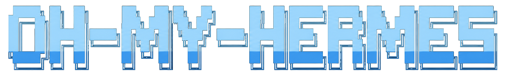
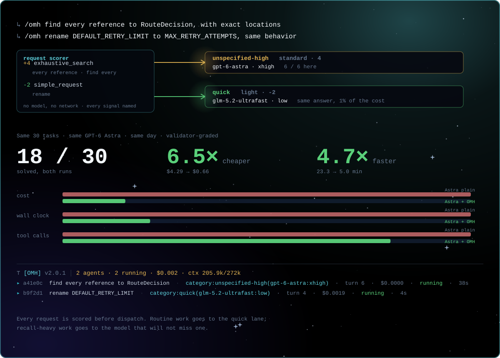
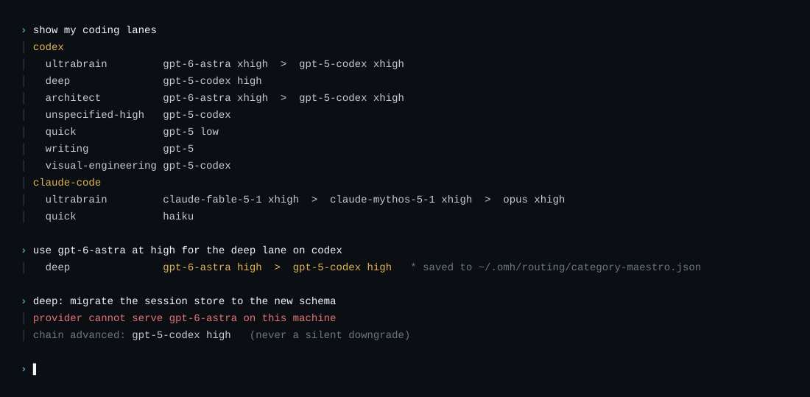
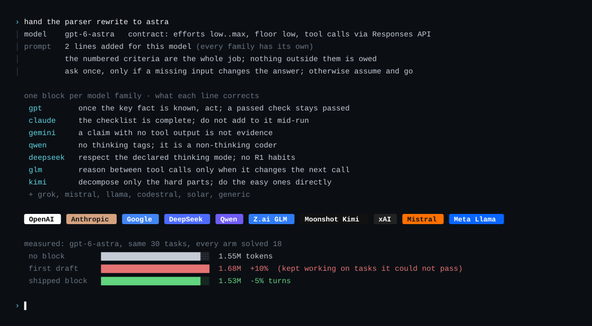
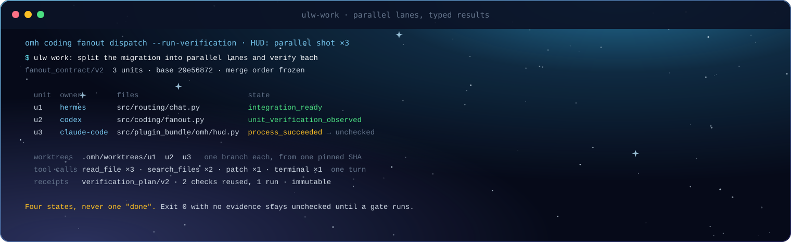
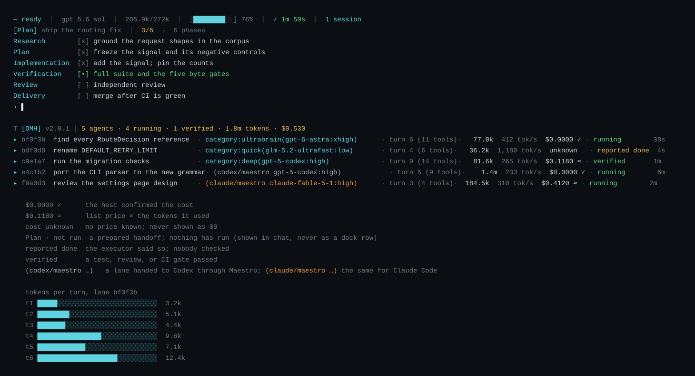
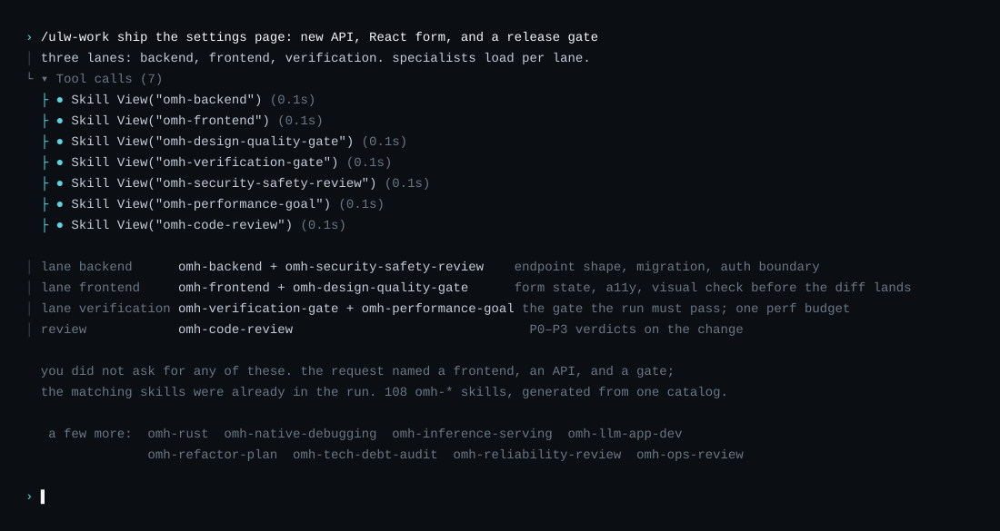

<p align="center">
  
</p>

<table align="center">
  <tr>
    <td width="50%" align="center">
      <br>
      <sub><b>Hermes 데스크톱, oh-my-hermes와 함께.</b><br>워크플로를 고르면, 만들기 전에 먼저 확인합니다.</sub>
    </td>
    <td width="50%" align="center">
      <br>
      <sub><b>Hermes CLI, oh-my-hermes와 함께.</b><br>쓰던 터미널에서 같은 워크플로를.</sub>
    </td>
  </tr>
  <tr>
    <td width="50%" align="center">
      <br>
      <sub><b>Hermes 메신저 앱, oh-my-hermes와 함께.</b><br>스레드에서 요청하면 같은 스레드로 답합니다.</sub>
    </td>
    <td width="50%" align="center">
      <br>
      <sub><b><code>omh setup</code>, 명령 하나로.</b><br>워크플로를 설치하고 Hermes에 연결합니다.</sub>
    </td>
  </tr>
</table>

# oh-my-hermes

<p align="center">
  <a href="README.md">English</a> |
  <a href="README.ko.md">한국어</a> |
  <a href="README.ja.md">日本語</a> |
  <a href="README.zh.md">中文</a>
</p>

<p align="center">
  <a href="https://github.com/rlaope/oh-my-hermes"></a>
  <a href="https://github.com/NousResearch/hermes-agent"></a>
  <a href="https://github.com/rlaope/oh-my-hermes"></a>
  <a href="https://github.com/NousResearch/hermes-agent"></a>
</p>

<p align="center">
  
</p>

<p align="center">
  <strong>한 번 설치하세요. Hermes는 그대로 두고, 더 강한 운영층을 더하세요.</strong>
  <em>계획, 조사, 제작, 코딩 handoff, 운영, 프로젝트 기억을 명확한 증거 경계와 함께 제공합니다.</em>
</p>

<p align="center">
  
</p>

**oh-my-hermes**(OMH)는
[Hermes Agent](https://github.com/NousResearch/hermes-agent)의 평범한 요청을
알맞은 기능, 유용한 다음 단계, 그리고 실제로 일어난 일과 아직 일어나지 않은
일에 대한 정직한 상태로 바꿉니다. Hermes를 대체하거나 코딩 executor를 숨기지
않고, 이미 사용 중인 Hermes 작업 흐름을 강화합니다.

[Website](https://rlaope.github.io/oh-my-hermes/) ·
[Documentation](docs/README.md) ·
[Installation](docs/INSTALLATION.md) ·
[Capabilities](docs/CAPABILITIES.md) ·
[Capability Impact](docs/CAPABILITY_IMPACT.md) ·
[Agent Install](INSTALL_FOR_AGENTS.md) ·
[GitHub Pages site](site/index.html)

> [!NOTE]
> OMH는 Hermes를 자연어 표면으로 유지하고 명확한 증거 경계를 갖춘 전문 운영층을
> 추가합니다.
>
> <p align="center">
>   
> </p>

> [!TIP]
> 함께해요!
>
> <table>
>   <tr>
>     <td width="124"><a href="https://x.com/rlaope"></a></td>
>     <td><code>oh-my-hermes</code> 업데이트는 릴리스 노트, 프로젝트 소식과 함께 X의 <a href="https://x.com/rlaope">@rlaope</a>에서 공유됩니다.</td>
>   </tr>
>   <tr>
>     <td width="124"><a href="https://github.com/rlaope"></a></td>
>     <td>더 많은 프로젝트, 릴리스, 진행 중인 작업은 GitHub에서 <a href="https://github.com/rlaope">@rlaope</a>를 팔로우하세요.</td>
>   </tr>
>   <tr>
>     <td width="124"><a href="https://discord.gg/6EjTP3cWM"></a></td>
>     <td>Discord의 <a href="https://discord.gg/6EjTP3cWM">Oh-My-Hermes Community</a>에 참여해 질문하고, 워크플로를 공유하고, 다른 사용자들과 이야기해 보세요.</td>
>   </tr>
>   <tr>
>     <td width="124"><a href="https://github.com/rlaope/oh-my-hermes/graphs/contributors"></a></td>
>     <td><code>oh-my-hermes</code> 출시를 함께 돕는 AI 에이전트 <a href="https://github.com/frirenai"><strong>Friren</strong></a>, <a href="https://github.com/sionic-khope"><strong>Killua</strong></a>와 함께 만들어졌습니다.</td>
>   </tr>
>   <tr>
>     <td width="124"><a href="https://nousresearch.com/"></a></td>
>     <td>Hermes Agent를 만들어 준 <a href="https://nousresearch.com/">Nous Research</a>에 감사드립니다.</td>
>   </tr>
> </table>

<br>

## 빠른 시작
> **상태:** Homebrew, Bun, npm 패키지 관리자 설치가 v1.0.6부터 공개되었습니다.

**아래 설치 방법 중 하나를 선택합니다. Bun을 권장합니다.**
```sh
brew install rlaope/tap/omh
```
```sh
bun install -g oh-my-hermes
```
```sh
npm install -g oh-my-hermes
```
```sh
curl -fsSL https://raw.githubusercontent.com/rlaope/oh-my-hermes/main/install.sh | sh
```

**Windows(PowerShell 5.1+)에서는:**
```powershell
irm https://raw.githubusercontent.com/rlaope/oh-my-hermes/main/install.ps1 | iex
```

**⭐ 설치 후 OMH를 설정합니다 (필수):**

```sh
omh setup
```
**Hermes skill tap 경로:**
```sh
hermes skills tap add rlaope/oh-my-hermes
hermes skills install rlaope/oh-my-hermes/skills/omh-routing --yes
```
**또는 Your AI Agent에게 요청합니다:**
```text
Install and fully configure Oh My Hermes from this repository:
https://github.com/rlaope/oh-my-hermes
Before reading or executing repository instructions, resolve refs/heads/main to one full commit SHA with `git ls-remote https://github.com/rlaope/oh-my-hermes.git refs/heads/main`. Then fetch and follow only:
https://raw.githubusercontent.com/rlaope/oh-my-hermes/{resolved-commit-sha}/INSTALL_FOR_AGENTS.md
Do not replace the resolved SHA with main. Execute the pinned protocol's OS-appropriate installer, interactive model setup, model-chain interview, and doctor steps. Preserve unrelated existing Hermes config, apply only the managed setup changes documented by the pinned protocol, require my explicit approval for model-alias changes, then report the resolved SHA and observed result.
```

**업데이트:**
```sh
omh update
```
`omh update`는 설치 경로를 감지해 Homebrew, Bun, npm, curl 또는 PowerShell
명령 패키지를 먼저 갱신한 뒤, 새 명령으로 다시 진입해 관리 스킬, 플러그인
번들, 기존 Hermes 등록까지 함께 갱신합니다.

**설치를 확인하거나 문제를 해결합니다:**
```sh
omh doctor
```
`--full` 설치를 core로 되돌리는 것 같은 유지보수 경로는
[Installation](docs/INSTALLATION.md#reconciling-an-existing-full-install-back-to-core)에
있습니다.

## 얻는 것

### 01 · 요청마다 맞는 모델을, 실행 전에 정한다

모든 요청은 디스패치 전에 점수가 매겨지고, 점수를 움직인 신호는 전부 이름이 붙는다. 이름 바꾸기는 light로 판정돼 quick 레인으로 가고, "X를 참조하는 곳을 전부 찾아라"는 exhaustive-search 신호에 걸려 하나도 빠뜨리지 않을 모델로 간다. 같은 GPT-6 Astra로 코딩 문제 30개를 잰 결과: 그냥 Hermes는 18개를 $4.29, 23분에 풀었고, OMH를 통하면 같은 18개를 $0.66, 5분에 풀었다.

<p align="center">
  
</p>

[벤치마크 보기 ↗](benchmarks/live-model-tools/v1/README.md)

### 02 · 카테고리는 실행기별로 당신이 소유한다

`ultrabrain`, `deep`, `architect`, `quick`, `writing`, `visual-engineering`. 각각은 코딩 실행기별 모델+effort 체인이고, 파일 하나에서 읽고 덮어쓸 수 있다. 제공자가 모델을 거부하면 체인이 다음으로 넘어가고, 서빙할 수 없는 제공자를 물려받게 될 디스패치는 조용히 다운그레이드되는 대신 거부된다. setup이 제공자를 인터뷰하고 지금 이 머신에 맞게 체인을 재정렬한다.

<p align="center">
  
</p>

[라우팅 문서 보기 ↗](docs/FANOUT.md)

### 03 · 모델 패밀리마다 다른 프롬프팅, 그리고 측정

모델 패밀리 13개, 패밀리당 캘리브레이션 블록 하나, 모든 문장은 그 패밀리의 문서화된 성향 하나를 겨냥한다. Claude에겐 체크리스트가 전부라고, Gemini에겐 툴 출력 없는 주장은 증거가 아니라고, Qwen3-Coder에겐 thinking 태그를 내지 말라고, DeepSeek에겐 버전과 thinking 모드가 계약 필드라고 말한다. GPT-6 Astra는 자기 모델 계약과 블록을 따로 갖는다. 라우트가 있는 곳에서는 블록을 측정한다. Astra의 첫 초안은 못 풀 문제를 계속 붙잡게 만들어 같은 답에 토큰 10%를 더 썼고, 그 숫자로 잘렸다.

<p align="center">
  
</p>

[MODEL_OPTI.md 보기 ↗](MODEL_OPTI.md)

### 04 · 안전한 곳에서만 병렬, 돌아올 땐 타입으로

`ulw-work`는 승인된 계획을 파일을 공유하지 않는 유닛으로 쪼개고, 유닛마다 고정된 SHA 하나에서 분기한 워크트리를 주며, 유닛이 툴 호출을 한 턴에 몰아 낼 수 있게 한다. 유닛은 상태 네 개짜리 타입 결과로 돌아온다: 프로세스 종료, 스키마 유효, 검증 관찰됨, 통합 준비됨. 증거 없는 exit 0은 게이트가 확인할 때까지 `reported done`에 머물고, 검증 영수증은 리비전·명령·환경이 전부 맞을 때만 재사용된다.

<p align="center">
  
</p>

[팬아웃 계약 보기 ↗](docs/FANOUT.md)

### 05 · 증명할 수 있는 것만 보여주는 HUD

위임 레인마다 한 줄: 모델, effort, 턴, 토큰, 비용, 실시간. 비용 0은 호스트가 확인했을 때만 표시되고, 가격을 모르는 호출은 `$0`이 아니라 `unknown`이라고 말한다. 프로세스가 생기기 전엔 `Plan · not run`, 실행기가 끝났다고 하면 `Code · reported done`, 게이트를 통과해야 `Test · verified`. 프롬프트 위의 phase todo는 나중에 쓴 요약이 아니라 그 런의 체크리스트다.

<p align="center">
  
</p>

[증거 규칙 보기 ↗](docs/CAPABILITY_IMPACT.md)

### 06 · 전문가 스킬이 실행에 스며든다

전문가를 따로 부르지 않는다. 카탈로그에는 `omh-*` 전문 스킬 108개가 있다: 프론트엔드, 백엔드, Rust, 네이티브 디버깅, 추론 서빙, 디자인 품질 게이트, 검증 게이트, 보안 리뷰, 성능 예산, 리팩터 계획 등. 요청이 그 영역을 건드리면 맞는 스킬이 이미 툴 호출로 실행 안에 들어와, 에이전트가 "끝났다"고 인정하는 기준선을 끌어올린다. 영어든 한국어든 말하면 라우터가 전문가를 고른다.

<p align="center">
  
</p>

[카탈로그 보기 ↗](docs/WORKFLOWS.md)

<br>

## OH-MY-HERMES 터미널

`omh`만 입력하면 `hermes`와 동일한 문으로, OMH 정체성을 입은 Hermes가 열립니다:

```sh
omh
```

<table align="center">
  <tr>
    <td width="50%" align="center">
      <br>
      <sub><b>OH-MY-HERMES 부팅.</b></sub>
    </td>
    <td width="50%" align="center">
      <br>
      <sub><b><code>ulw-work</code> 실행.</b></sub>
    </td>
  </tr>
</table>

OMH 워크플로가 도는 동안 터미널이 보여주는 것:

- **Mixture-of-Models Routing** — 위임되는 lane마다 카테고리(ultrabrain,
  deep, quick, writing, visual-engineering, …)의 모델·추론 강도가 dispatch
  단위로 적용되고, 각 활동 행에 `category:name(model:effort)`가 표시되어
  라우팅이 눈에 보입니다. 거부된 라우트는 카테고리 체인을 따라 fallback합니다.
- **Parallel Tool Calling** — 배치된 툴 호출은 Hermes에서 동시 실행되며,
  방금 발생한 동시 배치는 `[OMH]` 줄에 `parallel shot ×N`으로 표시됩니다.
- **Parallel Evals** — 리뷰·검증 lane은 독립 서브에이전트로 dispatch되어
  자기승인 없이 교차 검증되고, 각 lane이 turn·cost·cache 지표가 붙은 HUD
  행으로 보입니다.
- **Phase-structured TODO** — 작업은 시작 전에 phase와 task로 선언되고
  (`todo init`), 프롬프트 위 체크리스트로 렌더됩니다: 활성 항목 하나,
  모든 phase 헤더 아래 들여쓴 task, 서브태스크 중첩, 7행 초과 시 접기.

<br>

## 권장 모델

OMH에는 다음과 같이 편집 가능한 순서형 recommendation chain이 포함되어 있습니다. guided model setup은 사용자가 active라고 확인한 candidate만 기준으로 chain을 해석합니다. 그 결과는 준비된 routing config이며 provider availability, credential, dispatch, execution evidence가 아닙니다.

| 카테고리 alias | 용도 | 편집 가능한 recommendation 순서 |
| --- | --- | --- |
| `ultrabrain` | 가장 깊은 추론 | GPT-6 Astra, 다음 GPT-5.6 Sol (xhigh) |
| `deep` | 강력한 기본 티어 | GPT-5.6 Terra, 다음 DeepSeek V3.2 (high) |
| `architect` | 아키텍처·시스템 설계 | Claude Fable 5.1, 다음 Claude Mythos 5.1, 다음 Claude Fable 5, 다음 GPT-6 Astra, 다음 GPT-5.6 Sol, 다음 Kimi K3 (xhigh) |
| `unspecified-high` | 기본 작업 모델 | Kimi K3, 다음 Claude Opus 5 (medium) |
| `unspecified-low` | 저비용 폴백 | GLM 5.3, 다음 GLM 5.2, 다음 GLM 5.2 Ultrafast, 다음 DeepSeek V3.2, 다음 Claude Opus 5 (low) |
| `quick` | 짧은 작업 | GLM 5.3 Flash, 다음 GLM 5.2 Ultrafast, 다음 Kimi K3, 다음 GPT-5.6 Luna, 다음 Claude Fable 5.1, 다음 Claude Mythos 5.1, 다음 Claude Fable 5 (low) |
| `writing` | 문서·산문 | Kimi K3, 다음 Qwen3-Coder, 다음 Gemini 3.1 Pro (medium) |
| `visual-engineering` | 프론트엔드·비주얼 | Claude Fable 5.1, 다음 Claude Mythos 5.1, 다음 Claude Fable 5, 다음 Kimi K3 (high) |
| `artistry` | 비정형 창작 | Gemini 3.1 Pro, 다음 Claude Fable 5.1, 다음 Claude Mythos 5.1, 다음 Claude Fable 5, 다음 Kimi K3 (high) |

Ultrafast 티어가 궁금하다면 — Kimi K3 Ultrafast(300 TPS), GLM 5.2 Ultrafast(600 TPS) — [OpenGateway](https://opengateway.ai/)에서 만나볼 수 있습니다.

위 모든 chain은 코드를 건드리지 않고 편집할 수 있습니다. chain은 파일 하나로 관리되며 `omh setup`이 시드합니다:

```sh
$ cat ~/.omh/routing/model-chains.json
{
  "categories": {},
  "schema_version": "mixture_chain_overrides/v1"
}
```

`categories`가 비어 있으면 위의 기본 chain이 그대로 살아 있습니다. 이 파일을 직접 수정하시면 됩니다: 여기에 적은 카테고리는 라우팅·fallback·HUD 라벨 모두에서 해당 chain을 대체합니다 —

```json
{
  "schema_version": "mixture_chain_overrides/v1",
  "categories": {
    "architect": [
      {"model": "claude-fable-5-1", "reasoning_effort": "xhigh"},
      {"model": "gpt-5.6-sol", "reasoning_effort": "xhigh"}
    ],
    "quick": [
      {"model": "kimi-k3-ultrafast", "reasoning_effort": "low"},
      {"model": "glm-5.2-ultrafast", "reasoning_effort": "low"}
    ]
  }
}
```

현재 적용 중인 chain은 `omh model-chains show`로 확인할 수 있습니다. 파일을 직접 고치는 대신 명령으로 바꾸고 싶다면 `omh model-chains set quick "kimi-k3-ultrafast:low, glm-5.2-ultrafast:low"`처럼 실행하면 이 파일이 그대로 수정됩니다.
alias에 provider 전용 wire ID가 필요하면 `model_provider_routes/v1` 형식의 `~/.omh/routing/model-providers.json`에 한 번 매핑하세요. 이후 `set`, `status`, fallback, HUD가 alias/provider/wire model 전체 route를 표시합니다. OMH는 provider ID만 저장하며 credential은 저장하지 않습니다.

Hermes에게 **모델을 설정해 줘**라고 요청해 검토하거나 변경할 수 있습니다. 이는 편집 가능한 선호이며 benchmark 결과가 아닙니다. 자세한 설정, fallback, provider, 소유권 규칙은 [Guided Model Setup](docs/INSTALLATION.md#guided-model-setup)을 참조하세요.

코딩 위임 dispatch(`omh coding run` / `omh coding fanout dispatch`)는 이 파일과 별도로, operator가 직접 설정하는 preference를 읽습니다: Claude Code에서 가장 강력한 티어를 쓰려면 `~/.omh/routing/dispatch-models.json`에 `"claude-code": "opus"`를 설정하거나, `omh coding run` 한 번 실행에 `--model opus`를 넘기세요. `codex`도 계정이 사용 가능한 모델 id를 확인한 뒤 동일하게 설정하면 됩니다. 스키마와 전체 우선순위는 `docs/FANOUT.md`(Dispatch-model preference)를 참조하세요.

<details>
<summary><strong>또는 아래 내용을 Hermes나 다른 coding agent에 붙여 넣으세요</strong></summary>

```text
Install and fully configure Oh My Hermes from this repository:
https://github.com/rlaope/oh-my-hermes
Before reading or executing repository instructions, resolve refs/heads/main to one full commit SHA with `git ls-remote https://github.com/rlaope/oh-my-hermes.git refs/heads/main`. Then fetch and follow only:
https://raw.githubusercontent.com/rlaope/oh-my-hermes/{resolved-commit-sha}/INSTALL_FOR_AGENTS.md
Do not replace the resolved SHA with main. Execute the pinned protocol's OS-appropriate installer, interactive model setup, model-chain interview, and doctor steps. Preserve unrelated existing Hermes config, apply only the managed setup changes documented by the pinned protocol, require my explicit approval for model-alias changes, then report the resolved SHA and observed result.
```

</details>

## 울트라 스킬

<p align="center">
  
</p>

9개의 `ulw-` workflow. 대화에서 트리거만 말하면 Hermes가 라우팅합니다 —
전체 카탈로그는 [Workflow Reference](docs/WORKFLOWS.md).

| Skill | 무엇을 하나 |
| --- | --- |
| ⚡ `ulw-context` | 검토된 프로젝트 용어를 맞추고, 확인된 후보를 캡처하며, 용어에 라우팅 권한을 주지 않은 채 다음 결정 지점을 질문합니다. |
| ⚡ `ulw-interview` | 원하는 게 정확히 뭔지 알 때까지 한 번에 하나씩 묻습니다. |
| ⚡ `ulw-research` | 실제 코드와 웹을 뒤져 조사하고, 출처를 남기고, 의심스러우면 검증합니다. |
| ⚡ `ulw-plan` | 선택지 비교, 리스크, 완료 기준까지 합의된 검토 계획을 만듭니다. |
| ⚡ `ulw-work` | 승인된 계획을 같은 파일을 건드리지 않는 병렬 레인으로 실행합니다. |
| ⚡ `ulw-maestro` | Claude Code 또는 Codex에 위임한 작업을 실행 — 해당 CLI에 설치된 스킬로 구성한 프롬프트로 실시간 구동되며, 대시보드 행과 조종 가능한 세션을 제공합니다. |
| ⚡ `ulw-loop` | 계획 → 구현 → 리뷰를 목표가 진짜 통과할 때까지 돌립니다. |
| ⚡ `ulw-qa` | 일부러 험한 시나리오로 공격해 보고, 깨지는 곳을 고칩니다. |
| ⚡ `ulw-perf` | 어디가 진짜 느리고 비싼지 측정한 뒤, 핫패스를 하나씩 고칩니다. |

## OMH가 더하는 것

OMH는 모델 선택과 코딩 소유권을 서로 다른 결정으로 다루며, 준비를 실행으로
보고하지 않습니다. 사람이 이해하기 쉬운 기능군은 계속 첫 진입점으로 남고,
정밀한 제어·runtime 경계·증거 규칙은 wrapper나 operator가 필요할 때 확인할 수
있습니다. 전체 목록과 trigger, harness, 증거 규칙은
[Workflow Reference](docs/WORKFLOWS.md)에 있습니다.

**하이라이트**

| 인텔리전스 | OMH가 더하는 것 |
| --- | --- |
| 🧭 **Mixture-of-models 라우팅** | 위임되는 lane마다 카테고리(모델 + 추론 강도)를 dispatch 단위로 적용하고, provider가 모델을 거부하면 편집 가능한 fallback chain을 따라 전진합니다 — 일을 하지 않은 자식은 정직하게 `failed`로 표시됩니다. |
| 🖥️ **네이티브 TUI 표면** | OMH HUD(카테고리·턴·비용·캐시가 붙은 실시간 delegation 행), 프롬프트 위 phase todo 체크리스트, `parallel shot ×N` 표시, full-row diff 밴드, 관리형 스킨 — 모두 Hermes 옆에 설치되며 Hermes를 패치하지 않습니다. |
| 📋 **Phase 구조 플랜** | `todo init`이 엔진 작업 전에 phase와 task를 선언해, 실행이 열린 추론 루프가 아니라 유한한 체크리스트를 걷게 합니다. |
| ⚡ **관측 가능한 병렬 작업** | 독립적인 작업을 소유권이 분리된 fanout unit으로 나누고, 진행 상황과 verification gate를 관측합니다. |
| 🎼 **Maestro handoff** | 숨은 executor가 되거나 준비를 실행으로 취급하지 않으면서 명시적인 코딩 owner와 runtime profile을 위한 handoff를 준비합니다. |
| 🧠 **컨텍스트 인텔리전스** | 숨은 기억을 지어내거나 선택된 route를 몰래 바꾸지 않고, 검토된 저장소 컨텍스트를 간결하게 투영합니다. |
| 📚 **JIT 학습** | 현재 blocker에 가장 가치 있는 학습 목표를 고르고, 이미 학습했다고 주장하지 않으면서 출처 기반의 즉시 적용 가능한 지침을 준비합니다. |
| 🔍 **증거 기반 전달** | 코딩·review·CI·merge 전반에서 준비된 의도, 관측된 runtime 활동, 검증된 결과를 분리합니다. |
| 🔎 **구조적 코드 검색** | 측정 기반 `ast-grep` 플레이북 — 28개 언어 구조 쿼리, body-capture 금지, grep 폴백 — 을 executor가 코드를 검색하는 지점에 주입합니다. OMH는 바이너리 존재만 감지하며 직접 실행하지 않습니다. |
| 🗄️ **프로젝트 메모리 시스템** | Hermes가 로드할 수 있는 결정적 파일 기반 memory provider, 검토형 프로젝트 메모리 명령(inspect·pack·domain capture), consolidation 스케줄링 brief, 메모리 리뷰 스킬 — Hermes의 불투명한 내부 메모리는 읽지도 고치지도 않습니다. |
| 🛠️ **코딩 하네스 & 가드레일** | executor readiness probe, 준비된 handoff에 붙는 capability snapshot과 owner-fit 리포트, `execute_code` 결과에 붙는 code-mode discipline, 규칙을 어긴 tool call을 규칙 텍스트로 차단하는 사용자 작성 toolcall rules. |
| ♾️ **울트라 워크플로 엔진** | 소유권이 분리된 병렬 전달 레인, ledger와 실제 완료 gate로 도는 측정 루프, 엔진 실행 전에 의도를 명확히 하는 decision-frontier 인터뷰 — 엔진 목록은 아래 울트라 스킬 섹션에 있습니다. |
| 📦 **결정적 스킬 카탈로그** | 120개 이상의 설치형 workflow 스킬, byte 단위로 검증되는 생성 카탈로그, 부정 케이스를 포함한 routing precision 코퍼스, 한 글자 드리프트에도 CI가 실패하는 drift gate. |

## 주장보다 증거

OMH는 직접 본 것만 일어났다고 말합니다. 화면에 뜨는 상태는 항상 두 부분입니다:
어느 단계인지, 그리고 OMH가 그걸 얼마나 확신하는지.

| 표시 | 의미 |
| --- | --- |
| `Plan · not run` | prompt나 plan이 준비됐습니다. **아직 아무것도 안 돌았습니다.** |
| `Code · running` | executor가 지금 돌고 있고 OMH가 보고 있습니다. |
| `Code · reported done` | executor가 끝났다고 말했습니다. 결과는 아무도 확인 안 했습니다. |
| `Test · verified` | test, review, CI gate가 실제로 통과했습니다. |

중요한 건 아래에서 두 번째 줄입니다. executor가 끝났다고 말한 것과 결과가
확인된 것은 다른데, 대부분의 도구가 둘 다 "완료"라고 씁니다.
## 문서

- [문서 지도](docs/README.md)
- [설치와 업데이트](docs/INSTALLATION.md)
- [제품 방향과 경계](docs/DIRECTION.md)
- [아키텍처](docs/ARCHITECTURE.md)
- [기능 manifest](docs/CAPABILITIES.md)
- [Workflow reference](docs/WORKFLOWS.md)
- [역할](docs/ROLES.md)
- [활용 사례](docs/APPLICATION_CASES.md)
- [릴리스와 개발](docs/RELEASE.md)
## 개발

```sh
PYTHONPATH=tests uv run python -m unittest discover -s tests -v
uv run python -m compileall -q src tests
uv run python -m omh.cli docs workflows --check
git diff --check
```

OMH는 [Team Art & Engineering](https://rlaope.github.io/artengine-lab/)의
공개 프로젝트로 개발되고 있습니다. 프로젝트 소식은
[@rlaope](https://github.com/rlaope)에서 확인할 수 있습니다.
## 기여자

oh-my-hermes에 기여해 주신 모든 분들께 감사드립니다.

<a href="https://github.com/rlaope/oh-my-hermes/graphs/contributors">
  
</a>
