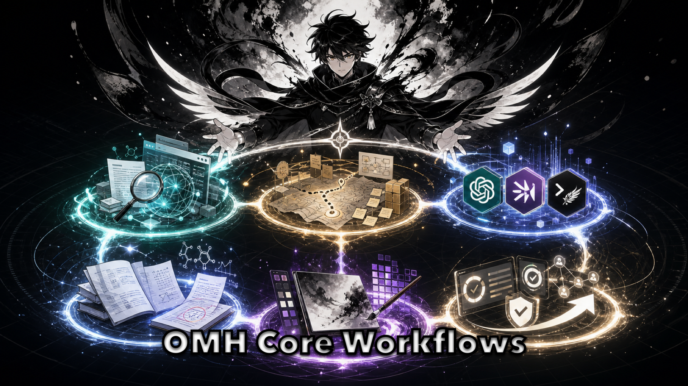

# oh-my-hermes

<p align="center">
  
</p>

<p align="center">
  <strong>Install once. Keep your Hermes workflow. Let OMH make the next step safe.</strong>
  <br>
  <em>Chat-first skills, workflow contracts, status cards, and handoffs that fit existing Hermes setups without breaking them.</em>
</p>

<p align="center">
  <a href="https://github.com/rlaope/oh-my-hermes"></a>
  
  
  
</p>

Most people skip the docs. **oh-my-hermes** is built for that reality: install
it, keep working in [Hermes](https://github.com/NousResearch/hermes-agent), and
let the added skills, contracts, and status cards make the next action obvious
without replacing your existing setup.

The product is not "more CLI commands." The `omh` command is setup, repair,
doctor, verifier, and wrapper/backend infrastructure. For
[Hermes](https://github.com/NousResearch/hermes-agent) wrappers and routers,
that CLI contract is a first-class backend surface; for normal users, the main
experience is still chat:

```text
user says a plain request in Hermes
  -> OMH routes it to the right skill/playbook/profile
  -> Hermes explains the next action and evidence boundary
  -> coding is handed off to the selected runtime only when the user or wrapper accepts that path
```

OMH exists for the gap between installation and real use: config checks,
workflow choice, evidence boundaries, and the first useful task. It adds a thin
practical layer of ready-to-use workflows such as `web-research`, `doctor`,
`idea-to-deploy`, `ultragoal`, `loop`, and `ultraprocess` so Hermes can feel
easier to start, easier to trust, and more natural to apply in real work.

> [!NOTE]
> **Friren Agent is hard at work improving OMH inside Art&Engine.**
> Explore [Team Art & Engineering](https://rlaope.github.io/artengine-lab/)
> for the studio context behind OMH.
>
> <p align="center">
>   
> </p>
>
> <p align="center">
>   
> </p>

<br>

## Quick Start

```sh
curl -fsSL https://raw.githubusercontent.com/rlaope/oh-my-hermes/main/install.sh | sh
omh setup
omh doctor
```

Hermes skill tap path:

```sh
hermes skills tap add rlaope/oh-my-hermes
hermes skills install rlaope/oh-my-hermes/skills/oh-my-hermes --yes
```

```text
Use OMH request-to-handoff for: I want to safely add a feature to this repo.
```

[Website](https://rlaope.github.io/oh-my-hermes/) -
[Documentation](docs/README.md) -
[Installation](docs/INSTALLATION.md) -
[Capabilities](docs/CAPABILITIES.md) -
[Agent Install](INSTALL_FOR_AGENTS.md) -
[Roles](docs/ROLES.md) -
[Application Cases](docs/APPLICATION_CASES.md) -
[GitHub Pages site](site/index.html)

> [!NOTE]
> **GitHub Follow**
> Follow [@rlaope](https://github.com/rlaope) on GitHub for OMH updates and
> related Hermes-native workflow projects.
> Explore [Team Art & Engineering](https://rlaope.github.io/artengine-lab/)
> for the studio behind OMH.

<br>

## Why OMH

- **Hermes stays the surface** - users ask in plain language, and Hermes can
  answer with a family, workflow, role, next action, or handoff.
- **Discovery starts with outcomes** - planning, learning, material creation,
  coding delegation, and operations appear as capability families before users
  need to know skill names.
- **Research and planning are first-class** - source finding, paper learning,
  web research, briefs, interviews, plans, and strategy work stay in
  Hermes-facing paths instead of defaulting to coding.
- **Coding is delegated deliberately** - Codex, Claude Code, Hermes, or another
  selected executor receives a scoped handoff only after the request is clear.
- **Prepared is not observed** - plans, generated prompts, status cards,
  dispatch, execution, review, CI, and merge evidence stay separate.
- **Local and inspectable** - skills, manifests, plans, sessions, and status
  records stay in user-owned local directories.

<br>

## Core Workflows

<p align="center">
  
</p>

The full skill catalog is larger. These 10 are the representative modes to
understand first; the rest live in [Workflow Reference](docs/WORKFLOWS.md) and
[Capabilities](docs/CAPABILITIES.md).

<!-- Surface family anchors: Plan and decide; Learn and gather; Create materials and visuals; Delegate coding and ship; Operate and observe. -->

- **Deep Interview** (`deep-interview`) - clarify the one missing decision
  before planning. Use when the request is still fuzzy.

- **Ralplan** (`ralplan`) - turn repo facts, sources, risks, acceptance
  criteria, and verification commands into a reviewed plan.

- **Ultragoal** (`ultragoal`) - keep an ambitious goal tied to checkpoints and
  completion gates instead of a one-shot answer.

- **Ultra Process** (`ultraprocess`) - run one delivery cycle: research ->
  ralplan -> implementation path -> code review -> docs/status sync.

- **Loop** (`loop`) - iterate through research, plan, handoff,
  feedback, and repeat when the right implementation must be discovered.

- **Web Research** (`web-research`) - gather current, source-backed evidence
  for market, docs, competitor, implementation, or best-practice questions.

- **Paper Learning** (`paper-learning`) - explain a supplied paper or paper PDF
  at very easy, moderate, or expert level without dropping section coverage.

- **Source Finder** (`source-finder`) - prepare typed source candidates:
  papers, datasets, repos, docs, public decks, and similar inputs.

- **Idea To Deploy** (`idea-to-deploy`) - prepare scoped coding work for Codex, Claude Code, Hermes, or another runtime without claiming execution.

- **Workflow Learning** (`workflow-learning`) - turn missed routes or weak
  workflows into traces, evals, review queues, regression cases, and patch
  proposals.

<br>

## What You Get

| Surface | What it means in practice |
| --- | --- |
| Skill pack | Hermes gets workflows like `loop`, `ralplan`, `source-finder`, `web-research`, `paper-learning`, `materials-package`, `img-summary`, and `ultraprocess`. |
| Setup and repair | `omh setup`, `omh doctor`, `omh update`, and `omh uninstall` keep the local install understandable. |
| Chat workflow picker | Hermes can answer "what can OMH do?" without making the user approve shell commands. |
| OMH context brief | Hermes or a wrapper can fetch a compact OMH mental model, generic-tool checkpoint, and route hint before falling back to ordinary chat/tools. |
| Catalog-aware list | `omh list` groups installed workflows by lane, and `omh list --json` includes descriptions, routing hints, examples, and evidence boundaries for wrappers or operators. |
| Route hint cards | Wrappers can preview the nearest OMH workflow with `chat_route_hint/v1`, even before plugin load is observed. |
| Deterministic demos | `omh demo orchestration` shows the local recommend -> chat -> plan -> handoff -> status path; `--executor` can demonstrate Codex, Claude Code, or Hermes paths without treating prepared handoffs as execution. |
| Plugin runtime evidence | Hosts or wrappers can record plugin load/use with `omh plugin observe-host`, and plugin tools/hooks can self-record the same metadata when the host passes observation context; active-ready and historical events stay separate from install smoke. |
| Coding agent paths | Hermes can prepare work for Codex, Claude Code, Hermes itself, or another runtime without pretending the work already ran. |
| Workspace isolation | Hermes can show whether the current workspace is ok, recommend or require a worktree, use `omh worktree prepare` to create one, and use `omh worktree bind` to render open/attach/record actions for the selected coding agent. |
| Agent ops review | Hermes can explain quality gates, blockers, next actions, and throughput levers for AI-agent work without turning a prepared handoff into evidence. |
| Evidence-aware status | Plans, handoffs, dispatch, results, verification, review, CI, and merge readiness stay visibly separate. |
| Workflow learning | Hermes can show learning-readiness and improvement-review cards for workflow attempts, including missed OMH routes: metadata-only trace, deterministic eval, human review queue, non-applying patch proposal, regression case, audit, and export bundle. |
| Request flow | Hermes chooses a lightweight role flow per request: direct answer, research, product ops, coding handoff, or review gate. |

<br>

## Request Flow

OMH keeps the flow simple and visible. Hermes chooses the smallest role path that
fits the request instead of locking setup to one team model.

```text
plain request
  -> choose workflow lane
  -> prepare plan, source brief, or handoff
  -> observe execution / review / CI only when evidence exists
  -> report next action in Hermes chat
```

| Request shape | Typical flow |
| --- | --- |
| Quick answer or setup repair | Hermes explains, OMH checks local state, then suggests the next command. |
| Research or product signal | Source finder / research / brief workflow before implementation. |
| Coding task | Scoped handoff to Codex, Claude Code, Hermes, or another chosen runtime. |
| Release or review question | Separate prepared claims from observed tests, review, CI, and merge evidence. |

<br>

## How It Feels In Hermes

| Plain user message | OMH-shaped Hermes behavior |
| --- | --- |
| "Payment failures keep coming up." | Route to feedback triage or investigation first; prepare reproduction and evidence needs before coding. |
| "Can this issue become a PR?" | Convert the issue into a plan, acceptance criteria, verification commands, and an executor/runtime-neutral handoff. |
| "Prepare next week's strategy meeting." | Use research, meeting, and strategy skills without defaulting to implementation. |
| "Explain this paper at expert level without dropping details." | Use `paper-learning` to choose the explanation level, mark source/PDF extraction evidence, preserve section coverage, and keep figure OCR, citation checking, math validation, reproduction, and peer review unobserved until recorded. |
| "Turn the revenue spreadsheet into an Excel and PDF package with render QA." | Use `materials-package` to scope audience, source inputs, target formats, missing data, QA ladder, and generation handoff without claiming files, screenshots, formulas, approval, or delivery were observed. |
| "Make this repo feel 10k-star quality." | Treat it as a north star, choose a smaller loopable goal, and keep the next verification visible. |
| "Are we ready to release?" | Separate prepared claims from observed test, review, CI, and merge-readiness evidence. |

Advanced team presets, team/swarm readiness, plugin status helpers, the
optional MCP bridge with host-specific config recipes, host-session evidence
records, runtime observation, and release smoke commands are covered in the
documentation below.

<br>

## Documentation

| Need | Read |
| --- | --- |
| Full docs map | [Documentation](docs/README.md) |
| Install, update, reapply, uninstall, and installer flags | [Installation](docs/INSTALLATION.md) |
| AI-agent pasteable install protocol | [Agent Install](INSTALL_FOR_AGENTS.md) |
| Product direction and boundaries | [Direction](docs/DIRECTION.md) |
| Architecture and module ownership | [Architecture](docs/ARCHITECTURE.md) |
| Capability manifests for Hermes/plugin/wrapper use | [Capabilities](docs/CAPABILITIES.md) |
| Orchestration pattern contracts | [Orchestration Patterns](docs/ORCHESTRATION_PATTERNS.md) |
| Common oh-my runtime parity and gaps | [Parity Matrix](docs/PARITY.md) |
| Situation playbooks | [Playbooks](docs/PLAYBOOKS.md) |
| Role surfaces and profile packs | [Roles](docs/ROLES.md) |
| Memory/context review and handoff packs | [Memory Context Review](docs/MEMORY_CONTEXT.md) |
| Discord-style and plugin-native wrapper examples | [Chat Wrapper Examples](docs/CHAT_WRAPPER_EXAMPLES.md) |
| Harness quality contracts | [Harness Quality Contract](docs/HARNESS_QUALITY.md) |
| Representative workflows | [Application Cases](docs/APPLICATION_CASES.md) |
| Public website source | [GitHub Pages site](site/index.html) |

<br>

## Development

Development, release smoke, product readiness, and evidence-bundle details live
in [Release](docs/RELEASE.md). For a quick local sanity check from a source
checkout:

```sh
python3 -m unittest discover -s tests
python3 -m compileall src
python3 -m omh.cli docs workflows --check
```

OMH 1.0.1 is a quality-gated stable baseline. Richer profile activation probes
and more artifact-backed wrapper examples are tracked in the roadmap and
release docs.
