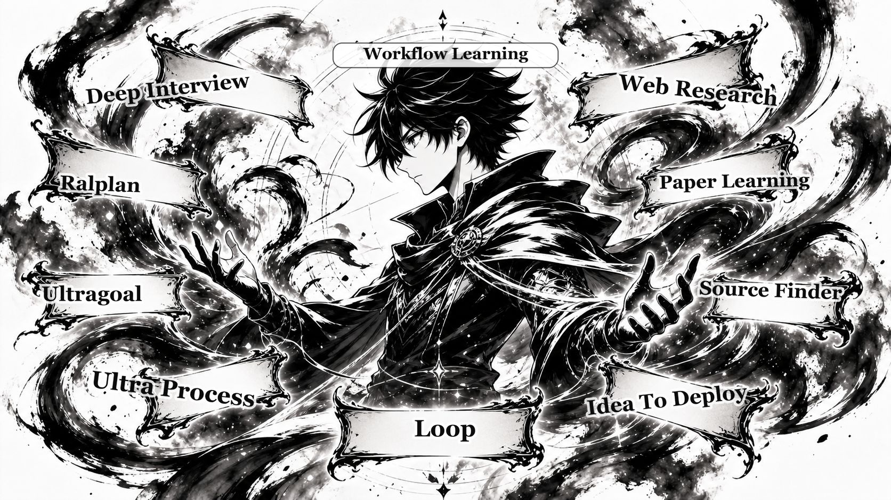

# oh-my-hermes

<p align="center">
  <a href="README.md">English</a> |
  <a href="README.ko.md">한국어</a> |
  <a href="README.ja.md">日本語</a> |
  <a href="README.zh.md">中文</a>
</p>

<p align="center">
  <a href="https://github.com/rlaope/oh-my-hermes"></a>
  
  
  
</p>

<p align="center">
  
</p>

<p align="center">
  <strong>Install once. Keep your Hermes workflow. Let OMH make the next step safe.</strong>
  <br>
  <em>Chat-first skills, workflow contracts, status cards, and handoffs that fit existing Hermes setups without breaking them.</em>
</p>

**oh-my-hermes** is built for that reality: install it, keep working in
[Hermes](https://github.com/NousResearch/hermes-agent), and let the added
skills, contracts, and status cards make the next action obvious without
replacing your existing setup.
Common Japanese, Chinese, Spanish, French, German, Korean, Hindi, and English operator
requests stay local and deterministic: OMH can route them and frame the first
chat card without calling a translation API.

```text
user says a natural-language request in Hermes
  -> OMH recommends the smallest useful workflow lane
  -> Hermes clarifies, researches, plans, or reports the next evidence boundary
  -> coding-heavy work becomes an explicit handoff to the selected runtime only when accepted
```

> [!NOTE]
> **Friren Agent is hard at work improving OMH inside Art&Engine.**
> Explore [Team Art & Engineering](https://rlaope.github.io/artengine-lab/)
> for the studio context behind OMH.
>
> <p align="center">
>   
> </p>
>
> <p align="center">
>   
> </p>

<br>

## Quick Start

```sh
curl -fsSL https://raw.githubusercontent.com/rlaope/oh-my-hermes/main/install.sh | sh
omh setup

omh doctor
```

Hermes skill tap path:

```sh
hermes skills tap add rlaope/oh-my-hermes
hermes skills install rlaope/oh-my-hermes/skills/oh-my-hermes --yes
```

```text
Use OMH request-to-handoff for: I want to safely add a feature to this repo.
```

[Website](https://rlaope.github.io/oh-my-hermes/) -
[Documentation](docs/README.md) -
[Installation](docs/INSTALLATION.md) -
[Capabilities](docs/CAPABILITIES.md) -
[Agent Install](INSTALL_FOR_AGENTS.md) -
[Roles](docs/ROLES.md) -
[Application Cases](docs/APPLICATION_CASES.md) -
[GitHub Pages site](site/index.html)

> [!NOTE]
> **GitHub Follow**
> Follow [@rlaope](https://github.com/rlaope) on GitHub for OMH updates and
> related Hermes-native workflow projects.
> Explore [Team Art & Engineering](https://rlaope.github.io/artengine-lab/)
> for the studio behind OMH.

<br>

## Core Workflows

<p align="center">
  
</p>

<p align="center">
  
</p>

---

<!-- Surface family anchors: Plan and decide; Learn and gather; Create materials and visuals; Delegate coding and ship; Operate and observe. -->

- **Deep Interview** (`deep-interview`) - clarify the one missing decision
  before planning. Use when the request is still fuzzy.

- **Ralplan** (`ralplan`) - turn repo facts, sources, risks, acceptance
  criteria, and verification commands into a reviewed plan.

- **Ultragoal** (`ultragoal`) - keep an ambitious goal tied to checkpoints and
  completion gates instead of a one-shot answer.

- **Loop** (`loop`) - iterate through research, plan, handoff,
  feedback, and repeat when the right implementation must be discovered.

- **Web Research** (`web-research`) - gather current, source-backed evidence
  for market, docs, competitor, implementation, or best-practice questions.

- **Idea To Deploy** (`idea-to-deploy`) - prepare scoped coding work for Codex, Claude Code, Hermes, or another runtime without claiming execution.

- **Workflow Learning** (`workflow-learning`) - turn missed routes or weak
  workflows into traces, evals, review queues, regression cases, and patch
  proposals.

**+46** more built-in skills are included for operations, research, materials,
review, release, and workflow-support lanes.

The full skill catalog is larger. These 7 are the representative modes to
understand first; the rest live in [Workflow Reference](docs/WORKFLOWS.md) and
[Capabilities](docs/CAPABILITIES.md).

<br>

## What You Get

**Ready-to-use workflow skills**

- Installable Hermes skills for interview, planning, durable goals, loops,
  research, coding handoff prep, review, release, materials, and operations.
- Each skill carries trigger guidance, completion gates, recovery notes, and
  evidence boundaries so Hermes can pick the next useful step instead of
  guessing from keywords.

**Profiles and role surfaces**

- Operator, researcher, planner, handoff, review, and status roles give Hermes a
  stable way to explain who owns the next action.
- Profile packs keep chat, wrapper, and coding-agent behavior aligned without
  making one executor the hidden default.

**Subagent and executor handoffs**

- Coding-heavy work can be prepared for Codex, Claude Code, Hermes runtime, or
  another selected executor while preserving the prepared-vs-observed boundary.
- Worktree and session helpers make it easier to open, attach, record, and
  review subagent work without mixing unrelated repo state.

**Evidence-aware operation**

- Status cards separate plan, handoff, dispatch, result, verification, review,
  CI, and merge-readiness evidence.
- Runtime and plugin observations stay metadata-only by default, so reports can
  be useful without leaking raw prompts, platform events, or logs.

**Learning loop**

- Missed routes, weak workflows, quality gaps, and regression cases can become
  workflow-learning traces, review queues, and patch proposals.
- The product improves through observed outcomes, not by pretending every
  prepared handoff already executed.

<br>

## Request Flow

OMH keeps the flow simple and visible. Hermes chooses the smallest role path that
fits the request instead of locking setup to one team model.

```text
plain request
  -> choose workflow lane
  -> prepare plan, source brief, or handoff
  -> observe execution / review / CI only when evidence exists
  -> report next action in Hermes chat
```

| Request shape | Typical flow |
| --- | --- |
| Quick answer or setup repair | Hermes explains, OMH checks local state, then suggests the next command. |
| Research or product signal | Source finder / research / brief workflow before implementation. |
| Coding task | Scoped handoff to Codex, Claude Code, Hermes, or another chosen runtime. |
| Release or review question | Separate prepared claims from observed tests, review, CI, and merge evidence. |

<br>

## Documentation

1. Full docs map: [Documentation](docs/README.md)
2. Install, update, reapply, uninstall, and installer flags: [Installation](docs/INSTALLATION.md)
3. AI-agent pasteable install protocol: [Agent Install](INSTALL_FOR_AGENTS.md)
4. Product direction and boundaries: [Direction](docs/DIRECTION.md)
5. Architecture and module ownership: [Architecture](docs/ARCHITECTURE.md)
6. Capability manifests for Hermes/plugin/wrapper use: [Capabilities](docs/CAPABILITIES.md)
7. Orchestration pattern contracts: [Orchestration Patterns](docs/ORCHESTRATION_PATTERNS.md)
8. Common oh-my runtime parity and gaps: [Parity Matrix](docs/PARITY.md)
9. Situation playbooks: [Playbooks](docs/PLAYBOOKS.md)
10. Role surfaces and profile packs: [Roles](docs/ROLES.md)
11. Memory/context review and handoff packs: [Memory Context Review](docs/MEMORY_CONTEXT.md)
12. Discord-style and plugin-native wrapper examples: [Chat Wrapper Examples](docs/CHAT_WRAPPER_EXAMPLES.md)
13. Harness quality contracts: [Harness Quality Contract](docs/HARNESS_QUALITY.md)
14. Representative workflows: [Application Cases](docs/APPLICATION_CASES.md)
15. Public website source: [GitHub Pages site](site/index.html)

<br>

## Development

Development, release smoke, product readiness, and evidence-bundle details live
in [Release](docs/RELEASE.md). For a quick local sanity check from a source
checkout:

```sh
PYTHONPATH=tests uv run python -m unittest discover -s tests -v
uv run python -m compileall -q src tests
uv run python -m omh.cli docs workflows --check
uv run --no-editable omh recommend "risky refactor" --limit 1 --json
```

The final command intentionally uses `uv run --no-editable` so the source
checkout proves the packaged `omh` console script can import and run. Normal
users should use the installed `omh` command printed by the curl installer.

OMH 1.0.2 is a quality-gated stable baseline. Richer profile activation probes
and more artifact-backed wrapper examples are tracked in the roadmap and
release docs.
