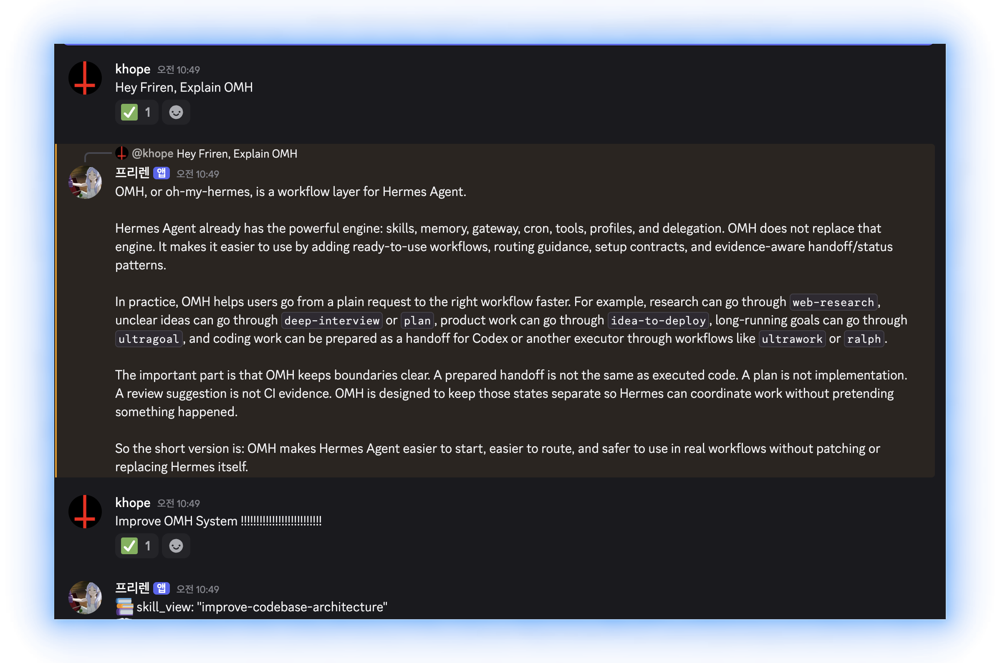
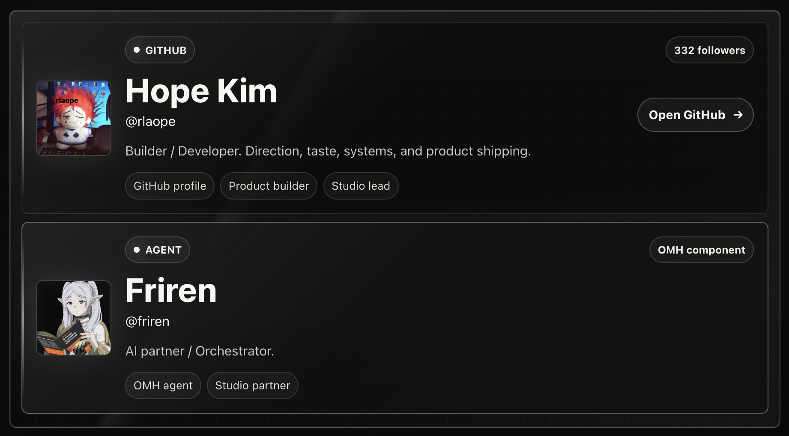
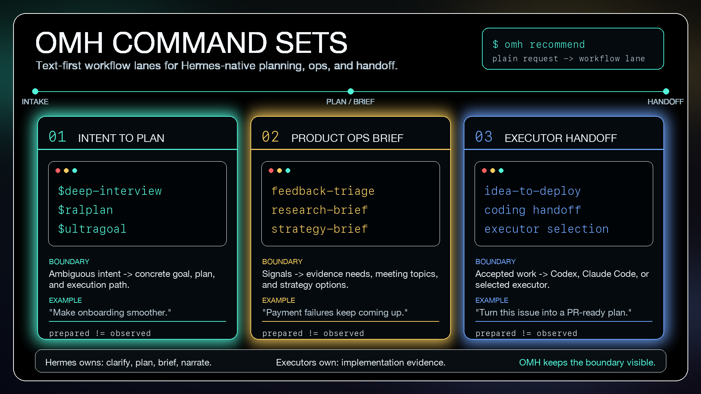
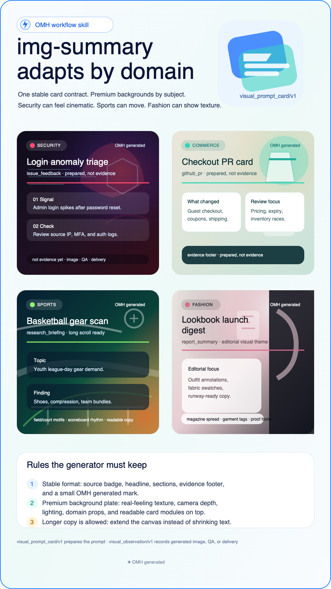
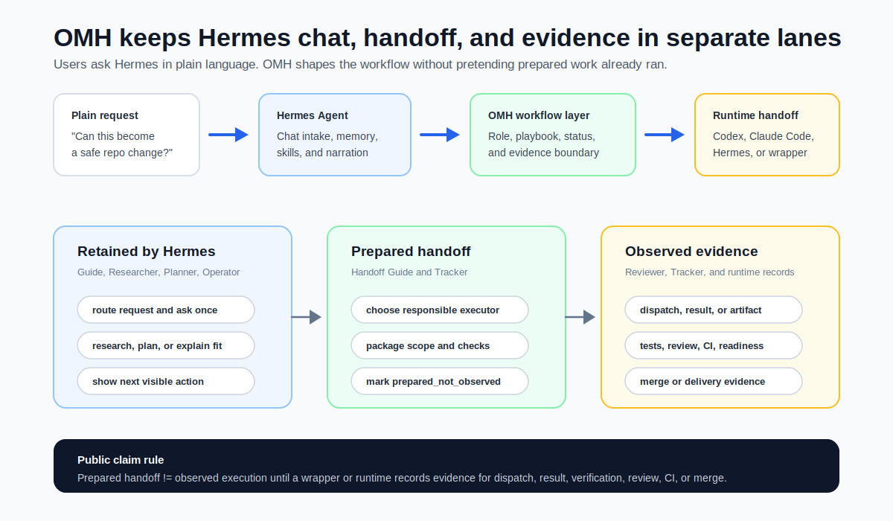

# oh-my-hermes

<p align="center">
  
</p>

<p align="center">
  <strong>Install once. Keep your Hermes workflow. Let OMH make the next step safe.</strong>
  <br>
  <em>Chat-first skills, workflow contracts, status cards, and handoffs that fit existing Hermes setups without breaking them.</em>
</p>

<p align="center">
  <a href="https://github.com/rlaope/oh-my-hermes"></a>
  
  
  
</p>

Most people skip the docs. **oh-my-hermes** is built for that reality: install
it, keep working in [Hermes](https://github.com/NousResearch/hermes-agent), and
let the added skills, contracts, and status cards make the next action obvious
without replacing your existing setup.

The product is not "more CLI commands." The `omh` command is setup, repair,
doctor, verifier, and wrapper/backend infrastructure. For
[Hermes](https://github.com/NousResearch/hermes-agent) wrappers and routers,
that CLI contract is a first-class backend surface; for normal users, the main
experience is still chat:

```text
user says a plain request in Hermes
  -> OMH routes it to the right skill/playbook/profile
  -> Hermes explains the next action and evidence boundary
  -> coding is handed off to the selected runtime only when the user or wrapper accepts that path
```

OMH exists for the gap between installation and real use: config checks,
workflow choice, evidence boundaries, and the first useful task. It adds a thin
practical layer of ready-to-use workflows such as `web-research`, `doctor`,
`idea-to-deploy`, `ultragoal`, `loop`, and `ultraprocess` so Hermes can feel
easier to start, easier to trust, and more natural to apply in real work.

> [!NOTE]
> **Friren Agent is hard at work improving OMH inside Art&Engine.**
>
> Improve OMH System !!
>
> <p align="center">
>   <a href="https://rlaope.github.io/artengine-lab/">
>     
>   </a>
> </p>
>
> <p align="center">
>   <a href="https://rlaope.github.io/artengine-lab/">
>     
>   </a>
> </p>

<br>

## Quick Start

Install the `omh` command, then connect it to Hermes:

```sh
curl -fsSL https://raw.githubusercontent.com/rlaope/oh-my-hermes/main/install.sh | sh
omh setup

# check omh status
omh doctor
```

That is the normal path. The installer only prepares the isolated `omh` command
package; `omh setup` is the explicit step that installs OMH workflows and
registers them with Hermes. On a first install, press Enter through the
recommended setup choices, then restart or reload Hermes Agent.

If your Hermes environment supports skill taps, this Hermes-native path also
works:

```sh
hermes skills tap add rlaope/oh-my-hermes
hermes skills install rlaope/oh-my-hermes/skills/oh-my-hermes --yes
```

Then talk to Hermes:

```text
Use OMH request-to-handoff for: I want to safely add a feature to this repo.
```

Hermes should route the request, name the responsible role, show the next
action, and keep the prepared handoff separate from observed work. Normal
users do not need to know `omh recommend`, `omh chat interact`, or other
backend commands.

OMH's setup footprint is deliberately small: it installs Hermes-visible skills,
records local status contracts, and can repair managed `skills.external_dirs`
drift without patching Hermes core. Localized terminal output, project-local
setup, pinned releases, manual `./omh` picker behavior, and wrapper
registration contracts live in the [installation guide](docs/INSTALLATION.md).

[Website](https://rlaope.github.io/oh-my-hermes/) -
[Documentation](docs/README.md) -
[Installation](docs/INSTALLATION.md) -
[Capabilities](docs/CAPABILITIES.md) -
[Agent Install](INSTALL_FOR_AGENTS.md) -
[Roles](docs/ROLES.md) -
[Application Cases](docs/APPLICATION_CASES.md) -
[GitHub Pages site](site/index.html)

> [!NOTE]
> **GitHub Follow**
> Follow [@rlaope](https://github.com/rlaope) on GitHub for OMH updates and
> related Hermes-native workflow projects.
> Explore [Team Art & Engineering](https://rlaope.github.io/artengine-lab/)
> for the studio behind OMH.

<br>

## Why OMH

<p align="center">
  
</p>

- **Chat-first** - users ask Hermes in plain language; `omh` commands stay in
  the background for setup, repair, verification, and wrapper backends.
- **Install-first** - OMH adds Hermes-visible skills and workflow defaults
  without asking teams to adopt another dashboard.
- **Safe handoffs** - coding can go to Codex, Claude Code, Hermes, or another
  selected runtime, while OMH keeps "prepared" separate from "observed."
- **Workspace-aware starts** - risky, parallel, or runtime-owned coding requests
  can show Prepare worktree before Hermes starts Codex, Claude Code, Hermes, or
  another configured coding-agent session; the backend can explicitly create the
  local Git worktree when that button is used.
- **Useful beyond coding** - research, planning, feedback triage, meeting prep,
  reports, automation blueprints, material packages, and loop work all have
  Hermes-facing workflow paths.
- **Local and inspectable** - skills, manifests, plans, sessions, and status
  records stay in user-owned local directories.

<br>

## Core Workflows

| Need | OMH helps Hermes do this | Example |
| --- | --- | --- |
| `deep-interview` / `ralplan` / `ultragoal` / `loop` / `ultraprocess` | Shape fuzzy intent into an interview, plan, goal loop, or one PR-ready delivery cycle. | "Make onboarding feel smoother." |
| `feedback-triage` / `research-brief` / `strategy-brief` | Keep product signals, source-backed research, and decisions in non-coding workflows. | "Payment failures keep coming up." |
| `research-department` / `web-research` / `research-brief` / `report-package` | Prepare Scout -> Analyst -> Briefer research operations with source inbox and briefing status boundaries. | "Every morning, watch competitor news and brief me if something changed." |
| `operating-rhythm` / `report-package` / `reliability-review` | Record cadence, reports, and reliability reviews as local artifacts with evidence boundaries. | "Turn the sprint retro and incident review into durable records." |
| `automation-blueprint` / `web-research` / `report-package` | Prepare recurring research or ops blueprints with schedule, delivery, and silence policy. | "Every morning, check competitor news and send a digest only if something changed." |
| `materials-package` / `report-package` | Shape decks, PDFs, spreadsheets, documents, HWP, Markdown, and upload-ready packages. | "Turn the revenue spreadsheet into an Excel and PDF package." |
| `img-summary` | Prepare provider-neutral image-card prompts whose format follows the source, whose scene follows the domain, and whose poster archetype sets the design grammar. | "Make a PR summary card for reviewers." |
| `idea-to-deploy` / coding runtime handoff / executor selection | Prepare work for Codex, Claude Code, Hermes, or another runtime without hiding execution. | "Turn this issue into a PR-ready plan and hand it to implementation." |
| `agent-ops-review` | Show a manager view of AI-agent research, coding, review, blockers, next actions, and throughput levers. | "As a manager, show the quality and progress of agent work." |

### Img Summary Skill

`img-summary` helps Hermes turn source material into an image-card prompt
that another connected image tool can use. It is not one fixed template.
OMH separates three design decisions: source kind chooses the information
structure, domain chooses the scene/material world, and poster archetype
chooses the visual grammar. A PR can become a technical systems poster, a
security issue can become cinematic key art, a sports research card can feel
like an event poster, and a fashion report can become a luxury lookbook. Use
`--poster-archetype auto` for the default or choose styles such as
`swiss_grid`, `cinematic_key_art`, `data_infographic`, `sports_event`, and
`luxury_lookbook`. Use `--aspect-ratio long_scroll` when the card needs room
for more sections or denser copy. Generated images, visual QA, and delivery
stay separate until they are recorded as observed evidence. If no image
generator is connected yet, Hermes can ask which tool to use: a GPT image
tool, an existing Hermes connector, a generic image tool, or prompt-only mode.

> <p align="center">
>   
> </p>
>
> **Made with `img-summary`.** Hermes uses this skill to turn notes, PRs,
> issues, research, reports, or release notes into a shareable image-card
> prompt for a connected image tool.
>
> **How it works.** OMH prepares `visual_prompt_card/v1` plus
> `poster_archetype/v1`: source kind, source-specific format, detected
> `domain_key`, domain-aware visual theme, poster grammar, readable card copy, generation prompt,
> negative prompt, QA checklist, and wrapper actions. The prompt asks image
> tools to keep the source badge, content modules, evidence footer, and small
> `OMH generated` mark stable while changing the background plate, scene,
> material texture, camera treatment, lighting, motifs, palette, layout
> density, and poster language for the subject. It explicitly rejects flat
> vector clipart, plain gradients, generic glass cards, color-swapped
> templates, and low-detail wallpaper.
>
> **Rules.** A prepared card is not a generated image. Image generation,
> visual QA, attachment, and delivery stay unobserved until a wrapper or user
> records `visual_observation/v1`.
>
> **Screen meaning.** The card shows the expected flow: source material ->
> prompt card -> connected image tool -> observed evidence. If no image tool is
> connected, Hermes asks the user to choose GPT image, a Hermes connector, a
> generic image tool, or prompt-only mode.

<br>

## What You Get

| Surface | What it means in practice |
| --- | --- |
| Skill pack | Hermes gets workflows like `loop`, `ralplan`, `web-research`, `materials-package`, `img-summary`, and `ultraprocess`. |
| Setup and repair | `omh setup`, `omh doctor`, `omh update`, and `omh uninstall` keep the local install understandable. |
| Chat workflow picker | Hermes can answer "what can OMH do?" without making the user approve shell commands. |
| Coding agent paths | Hermes can prepare work for Codex, Claude Code, Hermes itself, or another runtime without pretending the work already ran. |
| Workspace isolation | Hermes can show whether the current workspace is ok, recommend or require a worktree, and use `omh worktree prepare` to create the local Git worktree only when explicitly chosen. |
| Agent ops review | Hermes can explain quality gates, blockers, next actions, and throughput levers for AI-agent work without turning a prepared handoff into evidence. |
| Evidence-aware status | Plans, handoffs, dispatch, results, verification, review, CI, and merge readiness stay visibly separate. |
| Workflow learning | Hermes can show learning-readiness and improvement-review cards for workflow attempts: metadata-only trace, deterministic eval, human review queue, non-applying patch proposal, regression case, audit, and export bundle. |
| Organization patterns | Solo, research, product ops, coding runtime, and CTO-style patterns stay available so Hermes can choose the right role flow per request. |

<br>

## Organization Patterns

Profiles describe how Hermes should organize work around a request. They are
role-interaction patterns, not hidden workers. Setup does not need to lock one
organization model; Hermes can choose the pattern per request, and visible role
files remain an explicit advanced option.

<p align="center">
  
</p>

<br>

## How It Feels In Hermes

| Plain user message | OMH-shaped Hermes behavior |
| --- | --- |
| "Payment failures keep coming up." | Route to feedback triage or investigation first; prepare reproduction and evidence needs before coding. |
| "Can this issue become a PR?" | Convert the issue into a plan, acceptance criteria, verification commands, and an executor/runtime-neutral handoff. |
| "Prepare next week's strategy meeting." | Use research, meeting, and strategy skills without defaulting to implementation. |
| "Turn the revenue spreadsheet into an Excel and PDF package with render QA." | Use `materials-package` to scope audience, source inputs, target formats, missing data, QA ladder, and generation handoff without claiming files, screenshots, formulas, approval, or delivery were observed. |
| "Make this repo feel 10k-star quality." | Treat it as a north star, choose a smaller loopable goal, and keep the next verification visible. |
| "Are we ready to release?" | Separate prepared claims from observed test, review, CI, and merge-readiness evidence. |

Advanced team presets, plugin status helpers, the optional MCP bridge with
host-session evidence records, runtime observation, and release smoke commands
are covered in the documentation below.

<br>

## Documentation

| Need | Read |
| --- | --- |
| Full docs map | [Documentation](docs/README.md) |
| Install, update, reapply, uninstall, and installer flags | [Installation](docs/INSTALLATION.md) |
| AI-agent pasteable install protocol | [Agent Install](INSTALL_FOR_AGENTS.md) |
| Product direction and boundaries | [Direction](docs/DIRECTION.md) |
| Architecture and module ownership | [Architecture](docs/ARCHITECTURE.md) |
| Capability manifests for Hermes/plugin/wrapper use | [Capabilities](docs/CAPABILITIES.md) |
| Orchestration pattern contracts | [Orchestration Patterns](docs/ORCHESTRATION_PATTERNS.md) |
| Common oh-my runtime parity and gaps | [Parity Matrix](docs/PARITY.md) |
| Situation playbooks | [Playbooks](docs/PLAYBOOKS.md) |
| Role surfaces and profile packs | [Roles](docs/ROLES.md) |
| Memory/context review and handoff packs | [Memory Context Review](docs/MEMORY_CONTEXT.md) |
| Discord-style wrapper examples | [Chat Wrapper Examples](docs/CHAT_WRAPPER_EXAMPLES.md) |
| Harness quality contracts | [Harness Quality Contract](docs/HARNESS_QUALITY.md) |
| Representative workflows | [Application Cases](docs/APPLICATION_CASES.md) |
| Public website source | [GitHub Pages site](site/index.html) |

<br>

## Development

Development and release smoke details live in [Release](docs/RELEASE.md). For a
quick local sanity check from a source checkout:

```sh
python3 -m unittest discover -s tests
python3 -m compileall src
python3 -m omh.cli docs workflows --check
```

OMH 1.0.1 is a quality-gated stable baseline. Richer profile activation probes
and more artifact-backed wrapper examples are tracked in the roadmap and
release docs.
