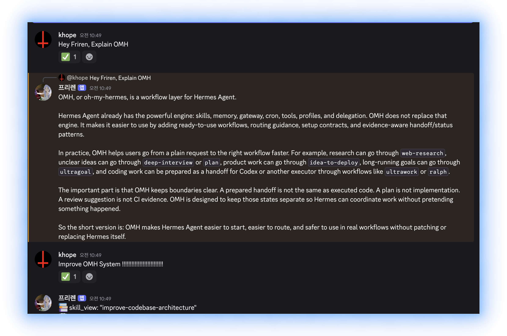

<p align="center">
  
</p>

<table align="center">
  <tr>
    <td width="50%" align="center">
      <br>
      <sub><b>Hermes 桌面端，搭配 oh-my-hermes。</b><br>选一个工作流，它会先确认再构建。</sub>
    </td>
    <td width="50%" align="center">
      <br>
      <sub><b>Hermes CLI，搭配 oh-my-hermes。</b><br>在你已在用的终端里运行同样的工作流。</sub>
    </td>
  </tr>
  <tr>
    <td width="50%" align="center">
      <br>
      <sub><b>Hermes 消息应用，搭配 oh-my-hermes。</b><br>在话题里提出请求，结果回到同一个话题。</sub>
    </td>
    <td width="50%" align="center">
      <br>
      <sub><b><code>omh setup</code>，一条命令。</b><br>安装工作流并连接到 Hermes。</sub>
    </td>
  </tr>
</table>

# oh-my-hermes

<p align="center">
  <a href="README.md">English</a> |
  <a href="README.ko.md">한국어</a> |
  <a href="README.ja.md">日本語</a> |
  <a href="README.zh.md">中文</a>
</p>

<p align="center">
  <a href="https://github.com/rlaope/oh-my-hermes"></a>
  <a href="https://github.com/NousResearch/hermes-agent"></a>
  <a href="https://github.com/rlaope/oh-my-hermes"></a>
  <a href="https://github.com/NousResearch/hermes-agent"></a>
</p>

<p align="center">
  
</p>

<p align="center">
  <strong>只需安装一次。保留 Hermes，再加上一层更强的工作系统。</strong>
  <em>以清晰的证据边界提供规划、研究、内容制作、编码 handoff、运维和项目记忆。</em>
</p>

<p align="center">
  
</p>

**oh-my-hermes**（OMH）把
[Hermes Agent](https://github.com/NousResearch/hermes-agent) 中的普通请求，
转化为合适的能力、明确的下一步，以及对“已经发生”和“尚未发生”的诚实状态。
它不会取代 Hermes，也不会隐藏编码 executor，而是增强现有 Hermes 工作流。

[Website](https://rlaope.github.io/oh-my-hermes/) ·
[Documentation](docs/README.md) ·
[Installation](docs/INSTALLATION.md) ·
[Capabilities](docs/CAPABILITIES.md) ·
[Capability Impact](docs/CAPABILITY_IMPACT.md) ·
[Agent Install](INSTALL_FOR_AGENTS.md) ·
[GitHub Pages site](site/index.html)

> [!NOTE]
> OMH 保留 Hermes 作为自然语言入口，并增加具有明确证据边界的专业工作层。
>
> <p align="center">
>   
> </p>
>
> <p align="center">
>   
> </p>
>
> <p align="center">
>   
> </p>
## 快速开始
> **状态：** Homebrew、Bun 与 npm 包管理器安装方式已随 v1.0.6 正式公开。

**从以下安装方式中选择一种。推荐 Bun。**
```sh
brew install rlaope/tap/omh
```
```sh
bun install -g oh-my-hermes
```
```sh
npm install -g oh-my-hermes
```
```sh
curl -fsSL https://raw.githubusercontent.com/rlaope/oh-my-hermes/main/install.sh | sh
```

**在 Windows（PowerShell 5.1+）上：**
```powershell
irm https://raw.githubusercontent.com/rlaope/oh-my-hermes/main/install.ps1 | iex
```

**安装后设置 OMH：**
```sh
omh setup
```

**Hermes skill tap：**

```sh
hermes skills tap add rlaope/oh-my-hermes
hermes skills install rlaope/oh-my-hermes/skills/omh-routing --yes
```

**或者向 Your AI Agent 提出请求：**

```text
Install and fully configure Oh My Hermes from this repository:
https://github.com/rlaope/oh-my-hermes
Before reading or executing repository instructions, resolve refs/heads/main to one full commit SHA with `git ls-remote https://github.com/rlaope/oh-my-hermes.git refs/heads/main`. Then fetch and follow only:
https://raw.githubusercontent.com/rlaope/oh-my-hermes/{resolved-commit-sha}/INSTALL_FOR_AGENTS.md
Do not replace the resolved SHA with main. Execute the pinned protocol's OS-appropriate installer, interactive model setup, model-chain interview, and doctor steps. Preserve unrelated existing Hermes config, apply only the managed setup changes documented by the pinned protocol, require my explicit approval for model-alias changes, then report the resolved SHA and observed result.
```

**更新：**
```sh
omh update
```
`omh update` 会检测安装来源，先通过 Homebrew、Bun、npm、curl 或
PowerShell 更新命令包，再重新进入新命令，同时刷新托管技能、插件包和现有
Hermes 注册。

**验证安装或排查问题：**
```sh
omh doctor
```

把 `--full` 安装收敛回 core 这类维护路径，见
[Installation](docs/INSTALLATION.md#reconciling-an-existing-full-install-back-to-core)。

## OH-MY-HERMES 终端

只需输入 `omh`,即可从与 `hermes` 相同的入口,打开带有 OMH 标识的 Hermes:

```sh
omh
```

<table align="center">
  <tr>
    <td width="50%" align="center">
      <br>
      <sub><b>OH-MY-HERMES 启动画面。</b></sub>
    </td>
    <td width="50%" align="center">
      <br>
      <sub><b><code>ulw-work</code> 运行中。</b></sub>
    </td>
  </tr>
</table>

OMH 工作流运行时,终端会展示:

- **Mixture-of-Models Routing** — 每条委派 lane 按类别(ultrabrain、deep、
  quick、writing、visual-engineering 等)在每次 dispatch 时应用模型与推理
  强度;每个活动行都带有 `category:name(model:effort)`,路由清晰可见。被
  拒绝的路由沿类别链 fallback。
- **Parallel Tool Calling** — 批量工具调用在 Hermes 中并发执行,刚发生的
  并发批次会在 `[OMH]` 行标注为 `parallel shot ×N`。
- **Parallel Evals** — 评审与验证 lane 作为独立子代理调度,交叉核验而非
  自我批准,每条 lane 都是一个带 turn、cost、cache 指标的 HUD 行。
- **Phase-structured TODO** — 工作在开始前以 phase 和 task 声明
  (`todo init`),渲染为提示符下方的清单:单一活动项、子任务嵌套、超过
  七行后折叠。

<br>

## 推荐模型

OMH 随附以下可编辑的有序 recommendation chain。guided model setup 只会依据用户确认 active 的 candidate 来解析 chain。结果是已准备的 routing config，不是 provider availability、credential、dispatch 或 execution 证据。

| 类别 alias | 用途 | 可编辑的 recommendation 顺序 |
| --- | --- | --- |
| `ultrabrain` | 最深度推理 | GPT-5.6 Sol (xhigh) |
| `deep` | 强力默认层 | GPT-5.6 Terra，其次 DeepSeek V3.2 (high) |
| `architect` | 架构与系统设计 | Claude Fable 5，其次 GPT-5.6 Sol，其次 Kimi K3 (xhigh) |
| `unspecified-high` | 默认工作模型 | Kimi K3，其次 Claude Opus 5 (medium) |
| `unspecified-low` | 低成本回退 | GLM 5.2，其次 GLM 5.2 Ultrafast，其次 DeepSeek V3.2，其次 Claude Opus 5 (low) |
| `quick` | 短任务 | GLM 5.2 Ultrafast，其次 Kimi K3，其次 GPT-5.6 Luna，其次 Claude Fable 5 (low) |
| `writing` | 文章与文档 | Kimi K3，其次 Qwen3-Coder，其次 Gemini 3.1 Pro (medium) |
| `visual-engineering` | 前端与视觉 | Claude Fable 5，其次 Kimi K3 (high) |
| `artistry` | 非常规创作 | Gemini 3.1 Pro，其次 Claude Fable 5，其次 Kimi K3 (high) |

想试试 Ultrafast 档? Kimi K3 Ultrafast(300 TPS)与 GLM 5.2 Ultrafast(600 TPS)都在 [OpenGateway](https://opengateway.ai/) 上提供。

上面的每条 chain 都可以在不改代码的情况下编辑。chain 由一个文件管理，`omh setup` 会生成它:

```sh
$ cat ~/.omh/routing/model-chains.json
{
  "categories": {},
  "schema_version": "mixture_chain_overrides/v1"
}
```

`categories` 为空时，上面的默认 chain 全部保持生效。要修改就编辑这个文件: 写入其中的类别会在路由、fallback 与 HUD 标签中替换对应 chain —

```json
{
  "schema_version": "mixture_chain_overrides/v1",
  "categories": {
    "architect": [
      {"model": "claude-fable-5", "reasoning_effort": "xhigh"},
      {"model": "gpt-5.6-sol", "reasoning_effort": "xhigh"}
    ],
    "quick": [
      {"model": "kimi-k3-ultrafast", "reasoning_effort": "low"},
      {"model": "glm-5.2-ultrafast", "reasoning_effort": "low"}
    ]
  }
}
```

当前生效的 chain 可用 `omh model-chains show` 查看。不想手动编辑文件的话，也可以运行 `omh model-chains set quick "kimi-k3-ultrafast:low, glm-5.2-ultrafast:low"`，同一个文件会被直接修改。
如果 alias 需要 provider 专用的 wire ID，请在 `~/.omh/routing/model-providers.json` 中按 `model_provider_routes/v1` 映射一次。此后 `set`、`status`、fallback 和 HUD 都会显示完整的 alias/provider/wire model route。OMH 只保存 provider ID，不保存 credential。

请让 Hermes **设置我的模型**，以查看或更改这些推荐。它们是可编辑的偏好，不是 benchmark 结果。详细的设置、fallback、provider 与所有权规则见 [Guided Model Setup](docs/INSTALLATION.md#guided-model-setup)。

<details>
<summary><strong>也可以把以下内容粘贴给 Hermes 或其他 coding agent</strong></summary>

```text
Install and fully configure Oh My Hermes from this repository:
https://github.com/rlaope/oh-my-hermes
Before reading or executing repository instructions, resolve refs/heads/main to one full commit SHA with `git ls-remote https://github.com/rlaope/oh-my-hermes.git refs/heads/main`. Then fetch and follow only:
https://raw.githubusercontent.com/rlaope/oh-my-hermes/{resolved-commit-sha}/INSTALL_FOR_AGENTS.md
Do not replace the resolved SHA with main. Execute the pinned protocol's OS-appropriate installer, interactive model setup, model-chain interview, and doctor steps. Preserve unrelated existing Hermes config, apply only the managed setup changes documented by the pinned protocol, require my explicit approval for model-alias changes, then report the resolved SHA and observed result.
```

</details>

## Ultra 技能

<p align="center">
  
</p>

八个 `ulw-` workflow。说出触发词，其余交给 Hermes —— 完整目录见
[Workflow Reference](docs/WORKFLOWS.md)。

| Skill | 做什么 |
| --- | --- |
| ⚡ `ulw-context` | 对齐经审查的项目术语，捕获已确认的候选项，并在不赋予术语路由权的前提下追问下一个决策点。 |
| ⚡ `ulw-interview` | 一次问一个问题，直到确切知道你要什么。 |
| ⚡ `ulw-research` | 翻真实代码和网页做调研，留下出处，可疑就核实。 |
| ⚡ `ulw-plan` | 做一份评审过的计划：比过方案、点明风险、定好完成标准。 |
| ⚡ `ulw-work` | 把已确认的计划放进互不碰同一文件的并行车道执行。 |
| ⚡ `ulw-loop` | 计划 → 实现 → 评审，循环到目标真正通过。 |
| ⚡ `ulw-qa` | 故意用狠场景攻击，坏哪修哪。 |
| ⚡ `ulw-perf` | 先测出真正慢和贵的地方，再逐条修热路径。 |

## OMH 提供什么

OMH 把模型选择和编码所有权作为两个独立决策，并且绝不把准备报告为执行。
容易理解的能力族仍然是入口；精确控制、runtime 边界和证据规则会在 wrapper
或 operator 需要时保持可查。完整 catalog、trigger、harness 和证据规则位于
[Workflow Reference](docs/WORKFLOWS.md)。

**亮点**

| 智能层 | OMH 提供什么 |
| --- | --- |
| 🧭 **Mixture-of-models 路由** | 每条委派 lane 按类别(模型 + 推理强度)在每次 dispatch 时应用,provider 拒绝某个模型时沿可编辑的 fallback chain 前进 — 没有做任何工作的子代理会诚实地标记为 `failed`。 |
| 🖥️ **原生 TUI 表面** | OMH HUD(带类别、轮次、成本、缓存的实时 delegation 行)、提示符下方的 phase todo 清单、`parallel shot ×N` 标注、整行 diff 色带、受管理的皮肤 — 全部安装在 Hermes 旁边,绝不修改 Hermes 本体。 |
| 📋 **Phase 结构化计划** | `todo init` 在引擎工作开始前声明 phase 和 task,让运行沿有界清单推进,而不是陷入开放式推理循环。 |
| ⚡ **可观测的并行工作** | 把独立工作拆成所有权隔离的 fanout unit,并观测进度和 verification gate。 |
| 🎼 **Maestro handoff** | 在不成为隐藏 executor、也不把准备当作执行的前提下,为明确的 coding owner 和 runtime profile 准备 handoff。 |
| 🧠 **上下文智能** | 在不虚构隐藏记忆、也不暗中改变已选 route 的前提下,投影紧凑且经过审查的仓库上下文。 |
| 📚 **JIT learning** | 为当前 blocker 选择最有价值的学习目标,并在不声称已经学会的前提下准备有来源、可立即应用的指导。 |
| 🔍 **证据约束的交付** | 在 coding、review、CI 和 merge 全程分开已准备意图、已观测 runtime 活动与已验证结果。 |
| 📦 **确定性技能目录** | 100+ 可安装的 workflow 技能、逐字节校验的生成目录、包含负向用例的 routing precision 语料,以及一字符漂移即令 CI 失败的 drift gate。 |

## 证据先于声明

OMH 只报告自己观测到的事情。你看到的每个状态都由两部分组成：处于哪个阶段，
以及 OMH 对它有多确定。

| 显示 | 含义 |
| --- | --- |
| `Plan · not run` | prompt 或 plan 已就绪。**还没有任何东西运行过。** |
| `Code · running` | executor 正在运行，OMH 正在观测。 |
| `Code · reported done` | executor 说它完成了。没有人检查过结果。 |
| `Test · verified` | test、review 或 CI gate 确实通过了。 |

关键是倒数第二行：executor 说自己完成了，与结果被检查过是两回事，
而大多数工具把两者都写成「完成」。
## 文档

- [文档地图](docs/README.md)
- [安装与更新](docs/INSTALLATION.md)
- [产品方向与边界](docs/DIRECTION.md)
- [架构](docs/ARCHITECTURE.md)
- [能力 manifest](docs/CAPABILITIES.md)
- [Workflow reference](docs/WORKFLOWS.md)
- [角色](docs/ROLES.md)
- [应用案例](docs/APPLICATION_CASES.md)
- [发布与开发](docs/RELEASE.md)
## 开发

```sh
PYTHONPATH=tests uv run python -m unittest discover -s tests -v
uv run python -m compileall -q src tests
uv run python -m omh.cli docs workflows --check
git diff --check
```

OMH 是 [Team Art & Engineering](https://rlaope.github.io/artengine-lab/) 的
开源项目。请关注 [@rlaope](https://github.com/rlaope) 获取更新。
## 贡献者

感谢每一位为 oh-my-hermes 做出贡献的人。

<a href="https://github.com/rlaope/oh-my-hermes/graphs/contributors">
  
</a>
