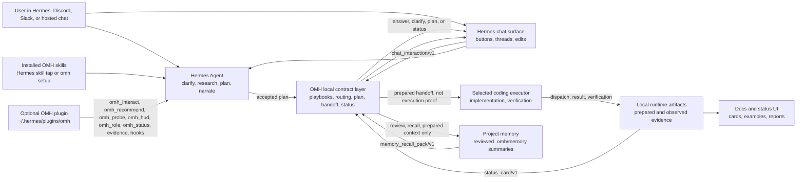

# Architecture

## Goals

The product direction is defined in `docs/DIRECTION.md`; this architecture
document describes the current module boundaries that implement that direction.

oh-my-hermes should feel like a native Hermes workflow layer, not a pile
of copied prompt files.

The architecture favors:

- Hermes-native skill installation as the primary user-facing entry point
- a thin Hermes plugin bridge for workflow recommendation, capability probing,
  and metadata-only HUD/status context
- a small support command interface for bootstrap, verification, and wrappers
- reversible local bootstrap installation
- generated skill text from testable catalog data
- explicit compatibility contracts
- reviewed project-local memory as prepared context, not execution evidence
- conservative routing behavior
- delegation-first coding, where Hermes plans and narrates while the selected
  coding executor performs main implementation work

## System View

This is the product architecture, not the package tree. Wrappers render chat
UX, OMH produces deterministic local contracts, Hermes keeps user-facing
reasoning, and executor lanes provide observed coding evidence only after a
separate runtime record exists.



```text
Chat user
  -> Hermes Agent owns conversation, planning, and status narration
  -> Installed OMH skills provide workflow and evidence guidance
  -> Hermes chat surface asks OMH for backend contracts
  -> Executor owns main coding work when dispatched
  -> Runtime artifacts own observed evidence
```

## Package Layout

```text
src/
  omh/
    __init__.py              # public package shim; maps source folders below into omh.*
    cli/                     # module entry point package for omh.cli and python -m omh.cli
    chat_router.py           # compatibility facade to routing/chat.py
    recommend.py             # compatibility facade to routing/recommend.py
    coding_delegation.py     # compatibility facade to coding/coding_delegation.py
    runtime_artifacts.py     # compatibility facade to runtime/artifacts.py
    wrapper_contract.py      # compatibility facade to wrapper/contract.py

  commands/
    main.py                  # parser assembly and top-level error handling
    chat.py
    coding.py
    runtime.py
    setup.py

  routing/
    chat.py
    intent.py
    localization.py
    policy.py
    recommend.py
    route_plan.py
    task_cards.py

  workflows/
    materials.py
    operations.py
    paper_learning.py
    research_department.py
    source_finder.py
    visual_summary.py
    workflow_learning.py

  coding/
    coding_contracts.py
    coding_delegation.py
    codex_progress.py
    executor_progress.py
    executor_readiness.py
    executors.py
    isolation.py
    team_readiness.py
    worktree_creator.py

  install/
    command_path.py
    config_adapter.py
    installer.py
    manifest.py
    plugin_pack.py
    plugin_observations.py

  maintenance/
    doctor.py
    probe.py
    release.py

  mcp/
    bridge.py

  quality/
    capability_roadmap.py
    grounded_score.py
    harness_quality.py
    parity.py

  surfaces/
    context.py
    demo.py
    hud.py
    menubar_app.py
    menubar_status.py
    quickstart.py

  system/
    hashutil.py
    ingress.py
    local_store.py
    paths.py
    targets.py
    workflow_state.py

  catalogs/
    playbooks.py
    roles.py
  profiles/
    setup.py
    team.py
  runtime/
    artifacts.py
    records.py
  wrapper/
    contract.py
    executor_sessions.py
    lifecycle.py
    sessions.py
  core/
  skills/
    catalog.py
    packaging.py
    render.py
  plugin_bundle/
    omh/
      plugin.yaml
      config.yaml
      hooks/
      tools/
skills/
  <skill-name>/SKILL.md       # tap-compatible Hermes skill pack generated from the same catalog
```

## Main Modules

`skills/` is the Hermes-native distribution surface. It mirrors the generated
skill templates so `hermes skills tap add rlaope/oh-my-hermes` can expose
OMH directly when Hermes taps are available.

`plugin_bundle/omh/` is the Hermes plugin payload installed by `omh setup` to
`~/.hermes/plugins/omh`. The v1 plugin registers deterministic
`omh_interact` chat/session interaction, `omh_recommend` route hints,
metadata-only `omh_probe` capability status/roadmap, compact metadata-only
`omh_hud`, detailed metadata-only `omh_status`, `omh_role` role context, a
bounded `omh_gather_evidence` local verification probe, and passive lifecycle
hooks for bounded status context, role marker validation, and metadata-only
session-end checkpointing. The
`pre_llm_call` hook can also add
`omh_context_brief/v1` plus `omh_route_hint/v1` for messages that look like
planning, research, ops, materials, visual summary, automation,
workflow-learning, or coding-handoff work. That hook payload carries only
hash/length metadata, matched cue labels, candidate workflow names, next
actions, generic-tool checkpoint rules, and boundaries; it does not include the
raw user message or prove a workflow executed. For capability/catalog questions,
the context brief adds `omh_catalog_question_hint/v1` so Hermes can show the
workflow picker or capability summary without shell approval. The `pre_tool_call` hook mirrors
the generic-tool checkpoint as structured `omh_generic_tool_checkpoint/v1`
metadata before image, file, search, or coding tools, while preserving the
legacy text context for hosts that only consume prompt strings. It uses only
tool labels and tool-family hints, never raw tool input. `omh hud`
exposes the same status-line payload for local operator smoke tests. The HUD
line stays limited to version, plugin bridge readiness, target topology, current
or default coding agent, and evidence state. Host-supplied token metadata
remains available in the machine-readable payload but is not shown in the
Hermes-facing status line.
It intentionally omits install inventory such as managed skill counts. Its
evidence probe is allowlisted, shell-free, bounded to a project root, and emits
truncated structured command output. It does not provide an arbitrary shell,
patch Hermes core, or claim execution evidence from prepared handoffs. Role
context is prompt guidance only; it is not proof
that a separate role, worker, or executor ran.

`menubar_status.py` owns the platform-neutral macOS menu bar view model exposed
by `omh menubar status --json`. Its `menubar_status/v1` payload is a UI
projection over the same local HUD, target registry, and runtime evidence. It is
intentionally not the source of truth. The payload separates `hermes_agents` from
`external_coding_executors` so Codex, Claude Code, OMX, OMO, OMC, or generic
coding tools cannot be rendered as Hermes agents by accident. Compact surfaces
receive source and model `icon_id` values plus tooltip text rather than Markdown
tables or prose-only labels. `display.menu_cards` is the human-facing card model
for the native menu bar helper, grouping the same contract into Agent Status,
Coding Agent, and Evidence sections so compact UI surfaces do not need to render
raw JSON-like text. The Agent Status section uses an explicit `Agent | PID |
Status` row shape.

Plain `omh menubar status` renders a short terminal summary from the same
payload so operators see Summary, Agent Status, Coding Agent, Evidence, and
Observation sections without reading raw JSON. Machine consumers should request
`--json` or set `OMH_OUTPUT=json`.

`current_external_coding_executor` names the selected row explicitly, preferring
`runtime/state.json` `last_run_id` when it matches the recent executor list, so
settings and compact summaries do not rely on an unnamed list-order convention.

`workflows/memory.py` owns OMH project memory. It stores candidates, reviewed
records, review decisions, and recall packs under `.omh/memory/` using local
JSON files. Setup records `project_memory_policy/v1` with `off`,
`review-first`, or `auto-safe` mode. Coding handoffs can receive
`memory_recall_pack/v1` when reviewed records are relevant. These packs are
prepared context only; they are not execution, review, CI, merge, or Hermes
internal-memory evidence.

The menu bar status contract reports configured Hermes targets and prepared
handoffs without inventing process state. PID, `running`, and `restarting`
values are applied only from a caller-provided `menubar_process_overlay/v1`
payload or an explicit `omh menubar status --observe-local-processes --json`
request from the native macOS helper. That observation is app-local, expires
after a short TTL, and applies restarting state only inside its restart window.
OMH does not turn prepared handoffs into observed execution, review, CI, or merge
evidence. Plain `omh menubar status` remains metadata-only, even though its
default terminal output is human-readable.

`cli.py` is a compatibility adapter. `commands/main.py` owns parser assembly,
top-level error handling, and the public command handler re-export surface.
Domain command modules under `commands/` own support JSON output for bootstrap,
repair, verification, wrapper backends, and operator debugging. New command
handlers should be added to the matching domain module rather than growing
`commands/main.py`.

`ingress.py` owns platform-neutral message text and source metadata extraction
for Discord, Slack, Hermes, and generic wrapper event shapes.

`targets.py` owns the deterministic Hermes target registry. It records which
Hermes home, wrapper target, or agent reference was observed, derives
`omh_target_topology/v1`, and keeps single-target versus multi-target behavior
as setup evidence rather than runtime execution proof.

`routing/chat.py` owns deterministic pre-dispatch routing decisions for chat
wrappers. It consumes plain messages or platform-shaped event payloads and
returns `dispatch`, `clarify`, or `fallback` decisions from local catalog data.
`routing/localization.py` owns deterministic locale phrase expansion for common
non-English operator requests. It preserves the raw message, adds only canonical
scoring hints, and makes locale-match metadata available to scored
recommendations without calling translation services.
`wrapper/localized_copy.py` owns the separate human-facing chat copy catalog for
common localized card frames. It can mirror the user's language for supported
operator-facing cards, but it does not translate raw prompts, change routing
scores, or turn prepared states into observed evidence.
`routing/policy.py` owns shared confidence and ambiguity policy, and
`routing/recommend.py` owns local catalog recommendation scoring.

`coding_delegation.py` owns deterministic coding handoff preparation. It maps
implementation-shaped task text to an action, intent, workflow, harness,
executor profile, acceptance criteria, and verification expectations without
LLM, API, or network calls.

`wrapper/contract.py` owns the platform-neutral chat interaction contract. It
composes routing, planning, delegation, and status primitives into a
`chat_interaction/v1` envelope with a renderable `chat_response/v1`, safe action
buttons, a stable thread key, and overclaim guards for Discord, Slack, and
hosted Hermes adapters.

`wrapper/lifecycle.py` owns Codex-oriented lifecycle helpers above the existing
runtime artifact layer. It starts prepared handoffs, records dispatch and
executor observations, records verification observations, and reports derived
status without mutating prepared handoff records into execution proof.

`wrapper/executor_sessions.py` owns wrapper-native executor session metadata.
It turns Hermes actions such as Start Codex session, Start Claude Code session,
Attach coding session, Refresh status, Record completed, Record blocked, and Ask
Hermes to verify into `executor_session/v1` records and status lines. It can
bridge to the Codex lifecycle run or a runtime-start observation when Hermes or
the wrapper reports an observed coding-session start/attach event. OMH still
does not secretly launch Codex, Claude Code, Hermes, workers, worktrees, or
network transports; it tells Hermes what to start and records what Hermes or the
wrapper actually observed.

`hermes_planning.py` owns deterministic Hermes-facing planning artifacts under
`.hermes/plans/` and the machine-readable plan wrapper contract used after plan
acceptance.

`runtime/artifacts.py` and `runtime/records.py` own local JSON/JSONL evidence,
schema validation, redacted export, and derived delegated coding status.
They also own `runtime_observation/v1`, the runtime-level observation ledger for
Hermes, OMX, OMO, and OMC handoffs. Each record names one observed or blocked
ladder step such as runtime start, worktree creation, worker dispatch, worker
result, verification, review, CI, merge readiness, or merge. Missing records
remain missing evidence; OMH does not infer them from prepared handoff text.

`workflow_learning.py` owns the metadata-only learning plane above routing,
wrapper sessions, and runtime artifacts. It projects workflow attempts into
`workflow_learning_trace/v1`, evaluates them with deterministic
`workflow_eval_result/v1` rubrics, creates review-only
`improvement_candidate/v1` records, and stores `regression_case/v1` fixtures for
future replay. It is deliberately projection-first: trace recording does not
mutate skills, patch Hermes, train a model, or upgrade prepared work into
observed evidence. This gives Hermes good process data to review while keeping
status, verification, CI, merge, and skill changes separately observed.
`omh learning missed-route` composes those primitives for the common wrapper
case where Hermes did not use the expected OMH workflow; it records review
material and an optional minimized replay fixture, not an automatic fix.

`wrapper/sessions.py` owns metadata-only chat session persistence for wrappers.
It records chat continuity, plan decisions, and a link to a prepared run id, but
it does not own execution, review, CI, merge readiness, or merge evidence.

`installer.py` owns managed skill writes, manifest updates, update behavior, and
uninstall behavior.

`config_adapter.py` owns the Hermes config edit boundary. It should remain
small, heavily tested, and conservative.

`skills/catalog.py` owns workflow names, descriptions, trigger phrases, and
use-when rules as data.

`catalogs/playbooks.py` owns situation-level pipeline data. Playbooks sit above
individual skills: they describe common wrapper-visible paths for research,
interview, planning, coding handoff, local pipeline buildout, and
release-readiness review. `playbooks.py` remains only as a compatibility
adapter.

`catalogs/roles.py` owns the wrapper-visible responsibility-role catalog.
Roles are descriptors for chat/status clarity, not runtime agent evidence.
`roles.py` remains only as a compatibility adapter.

`profiles/setup.py` owns setup profile categories, executor defaults, and the
selected operating model recorded by `omh setup --operating-model <id>`.
Operating models are lightweight collaboration defaults such as solo operator,
small team, research ops, or coding runtime team. They change routing and
status narration defaults; setup state persists only the stable
`operating_model_id`, not a mutable catalog snapshot. They do not install
visible role files or prove that Hermes spawned agents. `profiles/team.py` owns
optional team profile packs such as CTO/PM-style role files. `setup_profiles.py`
and `team_profiles.py` remain only as compatibility adapters.

`skills/render.py` owns generated `SKILL.md` content. It should render from the
catalog rather than becoming a second source of truth. `skills/packaging.py`
owns assembly of the managed skill bundle from rendered templates.

`chat_router.py`, `recommend.py`, `runtime_artifacts.py`,
`runtime_records.py`, `wrapper_contract.py`, `wrapper_sessions.py`,
`coding_lifecycle.py`, `playbooks.py`, `roles.py`, `setup_profiles.py`,
`team_profiles.py`, `cli.py`, and `skill_pack.py` are compatibility facades so
older imports keep working while the package grows internally. Facades should
stay thin and point at the deeper source-owner modules.

## Routing

Routing, planning, and delegation have these local surfaces:

1. Hermes-native installed skills. The tap-compatible `skills/` directory and
   the managed `~/.omh/skills` bootstrap directory expose the same generated
   guidance to Hermes.
2. Prompt-level guidance. The router skill gives Hermes a structured map of
   workflow names and strong trigger phrases, but it does not override Hermes
   core behavior.
3. Situation playbooks. `omh playbook recommend` lets wrappers map a natural
   request to a higher-level pipeline before they choose a lower-level skill,
   plan, research lane, or handoff.
4. Task abstraction cards. `omh_task_card/v1` lets wrappers classify work such
   as runtime portability, environment reproduction, or router-design feedback
   before selecting a workflow. The card names operation primitives, workflow
   rails, risk domains, and prepared/observed boundaries, so a request like
   "reproduce this Hermes setup on another MacBook" is not collapsed into a
   narrow migration workflow.
5. Wrapper-native chat orchestration. Plugin `omh_interact` and
   `omh chat interact` let Discord, Slack, or hosted Hermes wrappers receive
   one platform-neutral `chat_interaction/v1` envelope with renderable chat
   copy, state, action buttons, and a thread key.
6. Wrapper session persistence. `omh chat session` lets wrappers persist
   metadata-only plan decisions, recover status by `session_id`, and link an
   accepted plan to a prepared coding run without owning execution evidence.
7. Wrapper-native executor session actions. After a handoff is prepared, the
   wrapper can render action buttons and record observed open/attach/result or
   verification-request events as `executor_session/v1` metadata. This is the
   layer that lets a Discord or Hermes chat user ask "what is happening with
   Codex or Claude Code?" without typing backend commands.
8. Wrapper-assisted chat routing. `omh chat route` lets Discord, Slack, or
   hosted Hermes wrappers run a deterministic pre-dispatch decision before they
   forward a plain user message to Hermes.
9. Wrapper-assisted coding delegation. `omh coding delegate` lets wrappers turn
   implementation-shaped messages into a deterministic `coding_delegation/v1`
   handoff payload for an executor lane.
10. Runtime observation recording. `omh runtime observe` lets wrappers or
   operators append observed lifecycle events into
   `.omh/runtime/journal/events.jsonl` and, for runtime handoffs, maintain
   `runtime_observation/v1` compatibility without implying unrecorded worktree,
   worker, verification, review, CI, or merge steps.
11. Hermes-facing planning artifacts. `omh hermes plan` lets wrappers or
   operators create deterministic `hermes_plan/v1` planning scaffolds under
   `.hermes/plans/` without claiming that execution or review already happened.

`omh_interact` is the plugin-native Hermes-facing entry point for this
contract, and `omh chat interact` is the CLI/backend equivalent. They compose
the lower-level surfaces into one response envelope so each Hermes Agent
surface can share the same orchestration policy. The `chat_response/v1`
subobject is safe to render directly: it names the state, provides concise
copy, exposes platform-neutral actions, and never asks the end user to run an
`omh` command. The surrounding envelope preserves source metadata, message hash
and length, thread key, selected mode, next action, redaction policy, and claim
boundary. Metadata-only session records also include `record_provenance` so a
plugin-authored record and a wrapper/backend-authored record are distinguishable
without upgrading either one into execution evidence.

The routing and delegation surfaces read from the same catalog metadata. The
chat router returns a `routing_instruction` and `routing_prompt_template` for
custom wrappers to forward, with raw-message prompt expansion available only
through `--include-message`. Coding delegation returns a
`delegation_prompt_template`, recommended workflow, harness, acceptance
criteria, verification expectations, and optional metadata-only
`coding_delegation.json` evidence. With `--executor choose`, it returns a
human-in-the-loop executor-choice contract. With `--executor codex`, it also
returns a `coding_executor_handoff/v1` instruction payload that names Codex as
the executor target without launching Codex. Codex handoffs include
`codex_skill` and `codex_invocation.dispatch_text_template`, so a wrapper can
turn a Hermes workflow into the Codex `$skill {message}` surface while still
keeping the raw message out of persisted OMH artifacts. Claude Code and generic
profiles return a `coding_prompt_handoff/v1` prompt-only payload that must not
create a lifecycle run or observed execution evidence. Hermes, OMX, OMO, and OMC
profiles return a `coding_runtime_handoff/v1` contract with runtime profile,
team/swarm, worker-protocol, and worktree guidance. Runtime handoffs are still
prepared state only: they do not mean Hermes, tmux, workers, subagents, or
worktrees were started. All coding handoff modes also include
`worktree_session_isolation/v1`, which tells wrappers whether the current
workspace is acceptable, an isolated worktree is recommended, or an isolated
worktree is required before opening an executor. That record stores a compact
snapshot of the generated workspace policy. When a wrapper or operator chooses
the explicit workspace action, `omh worktree prepare` creates a local Git
worktree and records `omh_worktree_observation/v1`; that observation is
workspace-isolation evidence only. `omh worktree bind` can then return a
wrapper recipe for opening or attaching Codex, Claude Code, Hermes, or another
runtime from that worktree; the recipe is still not executor dispatch or result
evidence. Runtime ladders still need a separate `runtime_observation/v1`
`worktree_creation` event when the created worktree is attached to a prepared
runtime handoff. The coding handoff also stores acceptance criteria,
verification expectations, report contract, and evidence contract,
runtime-specific invocation templates, and the
`runtime_observation/v1` recording contract, but not the raw prompt body. With
`--record`,
the companion `run.json` is marked as
`artifact_kind: prepared_coding_delegation`, `phase: prepared`, and
`observation_status: prepared_not_observed`; validation treats the run envelope
and `coding_delegation.json` as a required pair. The run envelope is
implementation bookkeeping, not proof that Hermes executed the handoff.

The wrapper contract and lower-level surfaces are local contracts; execution
evidence still comes from Hermes Agent and the selected executor/runtime. The
append-only observation journal is the bridge between "prepared" and "observed"
lifecycle status. For Hermes/OMX/OMO/OMC runtime handoffs, the
legacy-compatible runtime observation ledger is mirrored into that journal. A
wrapper can record `runtime_start` while `worktree_creation`, `worker_dispatch`,
`worker_result`, `verification`, `review`, `ci`, `merge_readiness`, and `merge`
remain explicitly missing.

Hermes planning writes Markdown plans under the configured Hermes home rather
than runtime JSON under `.omh/runtime/`. The artifact is user-facing: it includes
the task statement, goals, non-goals, options, risks, acceptance criteria,
verification, execution handoff guidance, and reviewer status. Review gates
default to `not_observed` unless wrapper metadata proves a separate review ran.
Weak requests create a companion `.hermes/context/` artifact and keep the plan
`blocked` until Hermes asks the smallest blocking clarification.

The machine-readable planning bridge is stdout JSON plus the accepted plan
artifact, not a Discord/channel summary. Each `hermes_plan/v1` payload includes
`wrapper_contract` with the current wrapper step, decision gate, optional
recorded plan artifact path, and coding-delegation handoff template. For
implementation-shaped draft plans, `wrapper_contract.coding_delegate.argv_template`
is the adapter contract for calling
`omh coding delegate --executor codex --record --from-plan <accepted-plan.md>`
after plan acceptance. `omh coding delegate --from-plan` rejects draft plans by
default and uses the accepted artifact or generated context pack as executor
context when the wrapper wants a run-backed Codex handoff and a future
`runtime.run.run_id`. Blocked or non-coding plans keep `coding_delegate.available`
false so wrappers do not infer execution from presentation text.

`omh chat session` is the recovery layer for adapters that need button/thread
state to survive restarts. The session id is derived from `thread_key`. Session
records own chat continuity, route summary, plan accepted/revision/cancelled
decisions, and a `current_run_id` link. The linked run remains the only
authoritative source for prepared handoff, dispatch, executor result,
verification, review, CI, merge readiness, and merge observations.

`executor_session/v1` is the chat-facing companion to that recovery layer. It
records that a wrapper observed an open/attach/result/verification-request
event for the selected executor. For Codex, observed open maps to lifecycle
dispatch and observed result maps to the Codex run ledger. For Claude Code and
generic agents, it remains prompt-only session metadata. For Hermes/OMX/OMO/OMC
runtime handoffs, observed open records `runtime_start` while later ladder
steps remain missing until explicit `runtime_observation/v1` evidence exists.

Future routing work should deepen the catalog first, then render richer skill
metadata from it.

The delegation-first completion model is tracked in
`docs/DELEGATION_FIRST_COMPLETENESS.md`. It is the product boundary for making
OMH feel more complete without turning Hermes into the main coding executor.

## Hermes Capability Boundary

`omh probe` is the non-mutating capability inspection surface. It reports
observable local evidence for:

- external skill directory registration
- managed skill installation
- hook-like files
- plugin and app paths
- MCP bridge server availability, setup preference, runtime tool-call
  observation, host session observation, and MCP host config paths as separate
  capabilities
- wrapper observation artifacts
- native skill metadata readiness

Probe results use `available`, `missing`, `unknown`, or `unverified`. A file or
directory probe marked `unverified` is not a native integration claim. Deeper
Hermes integration requires both a stable Hermes extension contract and runtime
evidence that the extension ran.
`mcp_bridge_server` is the installed stdio bridge command, `mcp_preference` is
OMH setup state only, `mcp_bridge_runtime` is a local OMH-observed bridge tool
call, `mcp_host_session` is host/wrapper-supplied load or session evidence, and
`mcp_host_config` is a host-file probe only. Keeping them separate prevents a
requested bridge preference or config file from being mistaken for observed MCP
host load, connector invocation, or coding execution.

The MCP bridge is intentionally narrow. `omh mcp serve` speaks newline-delimited
stdio JSON-RPC and exposes only `omh_status`, `omh_recommend`, and `omh_probe`;
`omh_probe` can include parity and capability-roadmap projections when a host
requests those advisory views.
`omh mcp config-recipe --host ...` can print host-shaped config snippets for
Claude Code, Codex, OpenCode, Cursor, and generic MCP hosts, but it does not
mutate those host files. The bridge does not expose arbitrary shell commands,
call external APIs, dispatch coding executors, or prove a specific Hermes host
loaded the bridge.
When a host or wrapper does observe bridge load or use, it can record
`omh_mcp_host_session/v1` through `omh mcp observe-host`; observed records
require an evidence reference and remain host-load/session evidence only.

Plugin runtime load uses a parallel contract. Local plugin install and
import/register smoke prove only the copied bundle. A Hermes host or wrapper can
record `omh_plugin_host_observation/v1` with `omh plugin observe-host` after it
actually sees plugin load, status query, session end, or unload. Invoked OMH
plugin tools/hooks can also self-record the same observation schema when the
host supplies bounded `observation` metadata. That observation can make
`plugin_runtime_observed` available in `omh probe`, but it still proves only the
recorded plugin event. Active native readiness is narrower: only `plugin_load`,
`tool_call`, `hook_call`, and `status_query` observations keep
`native_integration_claim_ready` true. `blocked` is descriptive host metadata
and `session_end`/`plugin_unload` are historical
runtime evidence, not active readiness.

For terminal operators, `omh probe` prints a compact status summary by default.
Wrappers and automation should request the full capability payload with
`omh probe --json` or `OMH_OUTPUT=json`.

`omh probe --parity` adds `omh_parity_matrix/v1`. That matrix compares common
oh-my runtime capability axes with OMH's actual surfaces: skill/plugin
distribution, specialist roles, team/swarm workers, worktree isolation, HUD and
session observability, MCP/tool bridge, loop/autopilot workflow, and
release maintenance. It is a product and operator contract, not a hidden runtime
claim. Team/swarm worker support is exposed as `omh_team_worker_readiness/v1`
through `omh runtime team-readiness`: OMH can show the worker protocol, runtime
templates, wrapper actions, installed skill visibility, and observed
`runtime_observation/v1` ledger status. That readiness is still not worker
launch, pane/session creation, worker result, review, CI, or merge evidence.
Worktree isolation is available only for the explicit
`omh worktree prepare/list/bind` backend and its local
`omh_worktree_observation/v1` ledger plus wrapper binding recipes; it does not
auto-launch an executor. MCP host load and plugin runtime events likewise
belong to Hermes, the selected executor, or another observed integration until
the matching ledger records exist.

## Harness Contract

Representative harnesses are preview metadata for generated prompt guidance.
They are not separate runtime roles, hidden hooks, or proof that Hermes exposes a
matching internal role system.

Runtime artifacts make that boundary inspectable. A harness can request local
evidence under `.omh/runtime/`, but the artifact must separate requested
delegation from observed delegation. If Hermes or a wrapper does not expose a
specialist lane result, the recorded result stays `not_observed` or
`not_available`.

When a harness is added, removed, or renamed, update these surfaces together:

- `src/skills/catalog.py`
- `src/skills/render.py`
- `docs/APPLICATION_CASES.md`
- `tests/test_router_content.py`

Each harness must also define runtime evidence expectations in catalog data:

- artifact event names
- delegation expectation
- privacy default

This keeps the generated router, public examples, and regression tests aligned
around one catalog contract.

## Runtime Artifacts

Runtime artifacts are local JSON/JSONL files under `.omh/runtime/`.

```text
.omh/
  targets.json
  runtime/
    state.json
    runs/
      <run-id>/
        run.json
        events.jsonl
        routing.json
        coding_delegation.json
        delegation.json
        wrapper.json
        evidence/
    wrapper_sessions/
      <session-id>/
        session.json
        events.jsonl
```

`targets.json` records observed Hermes target topology for setup drift, including
single-to-multi and multi-to-single changes. `state.json` records install,
apply, and doctor summaries. A run directory
records a workflow envelope, append-only events, routing decisions, prepared
coding delegation, delegation observation, and wrapper observation plus optional
evidence files. A wrapper session directory records chat-thread continuity and
plan decisions only; it may link to a run id but must not duplicate run-level
execution evidence.

The runtime artifact layer is intentionally small:

- JSON/JSONL only
- no external service
- no prompt body capture in runtime artifacts by default
- schema-versioned files
- CLI inspection through `omh runtime status`, `omh runtime runs`, and
  `omh runtime show <run-id>`
- schema validation through `omh runtime validate`
- redacted export through `omh runtime export`

Bot wrappers can call `omh chat route --record` before invoking Hermes. The
record stores the selected skill, confidence, score, message length, and message
hash without storing the raw prompt body.

Bot wrappers can call `omh coding delegate --executor codex --record` for
implementation-shaped messages when they want a run-backed Codex handoff. The
record stores source metadata, action, intent, recommended workflow and harness,
acceptance criteria, verification expectations, recommendation evidence,
`message_sha256`, `message_length`, and status `prepared_not_observed`. That
status means a handoff was prepared; the companion run envelope is also marked
`prepared_coding_delegation`, not proof that Hermes executed the task.
Executor-choice, runtime-handoff, clarify, fallback, and prompt-only handoffs
return `runtime.recorded=false` and should stay in wrapper/session state.

Bot wrappers can still call `omh runtime delegate` after the response if
delegation metadata is available. If not, they should record `not_observed`
rather than guessing.

Wrappers can also call `omh runtime wrapper` to record whether a prompt was
dispatched, whether a Hermes response was observed, whether verification was
observed, and which gaps remain unobserved. This keeps bot integration evidence
separate from claims about Hermes internals.

Wrappers can call `omh runtime delegation-status --run <run-id>` to combine the
prepared coding delegation, delegation observation, and wrapper observation into
a `delegated_coding_status/v1` summary. The summary exposes `safe_summary`,
`next_action`, review readiness, verification observation, and an
`overclaim_guard` so chat adapters can report progress without implying Hermes
implemented the code.

`omh runtime progress bind|observe|status` is the live executor progress
surface for long Codex or external-coding runs. A wrapper binds a run or wrapper
session to an executor/process identity, then repeatedly calls `observe` with
incremental Codex JSONL or process-output snapshots. OMH summarizes the snapshot
into metadata-only signals, emits a compact `chat_report` only when the stage
changes, and suppresses duplicate/no-op snapshots through persisted binding
state. The latest event/report is projected by `progress status`, including
stale active bindings. These progress artifacts are not result, verification,
review, CI, merge-readiness, or merge evidence.

Wrappers that want one higher-level lifecycle surface can call
`omh coding lifecycle start|dispatch|result|verify|report`. These commands are
thin wrappers over the same runtime files: `coding_delegation.json`,
`delegation.json`, `wrapper.json`, and `events.jsonl`. They reject invalid
transitions such as result-before-dispatch, derive lifecycle status from
observed evidence, and keep review or verification gaps visible in
`chat_response/v1` status copy. Status interactions also expose
`status_card/v1`, a platform-neutral progress card with handoff, execution,
verification, review, CI, merge-ready, and merged steps. Wrappers can render
that card directly instead of inferring progress from prose.

`omh chat session status` also exposes `coding_briefing/v1` as a sibling to the
compact status card. The briefing is the richer Hermes-facing report surface for
delegated coding work: it combines persisted route/plan metadata, compact handoff
contracts, executor-session state, runtime evidence, review/CI/merge status,
pending evidence gaps, and `user_facing_lines[]`. It remains metadata-only: raw
prompts and full interview transcripts are not reconstructed, and merge-ready is
kept distinct from observed merge evidence.

## Hermes Planning Artifacts

Hermes-facing plans live under the configured Hermes home:

```text
.hermes/
  plans/
    <timestamp>-<slug>-<token>.md
  context/
    <timestamp>-<slug>-context-<token>.md
```

`omh hermes plan --record` writes Markdown, not runtime JSON. The plan frontmatter
uses `schema_version: hermes_plan/v1`, `status: draft` or `blocked`, the source
surface, and a review gate with `architect` and `critic` statuses. The command is
deterministic and local-only; it does not run review agents, call services, or
execute the plan. A `not_observed` review gate means the artifact is a planning
scaffold, not consensus approval.

The plan body and stdout payload include `quality_gate` and `deep_interview`
blocks. `quality_gate` names readiness, pass conditions, and evidence that must
be observed before stronger claims are safe. `deep_interview` tells wrappers
whether to ask exactly one blocking question, which decisions are missing, and
which action to take after the user answers.

The stdout `wrapper_contract.plan_artifact` mirrors the recorded artifact path
when `--record` is used. Wrappers should preserve the original message for later
delegation and use `wrapper_contract.message_field` only as the JSON pointer to
the message text inside the payload; they should not scrape the Markdown plan
body to recover commands or state.

## Workflow State

Workflow lifecycle state is stored separately from runtime run evidence under
`.omh/state/`.

```text
.omh/
  state/
    <workflow>-state.json
```

State files are the authoritative local lifecycle surface for adapted workflows:
active status, lifecycle outcome, timestamps, notes, and allowed handoff
metadata. Runtime runs under `.omh/runtime/` remain evidence envelopes for what a
wrapper or operator observed.

The CLI exposes the state layer through:

- `omh state start --workflow <name>`
- `omh state status`
- `omh state finish --workflow <name> --outcome finished`
- `omh state clear --workflow <name>`

Initial transition policy is intentionally conservative: clarification can hand
off to planning, and planning can hand off to execution or QA. Other active
workflow conflicts must be finished or cleared explicitly.

## Safety Model

- Managed files are tracked by manifest hashes.
- Local modifications block updates unless `--force` is supplied.
- Config registration is isolated to `skills.external_dirs`.
- Workspace guidance is printed by `omh snippet`; it is not applied by default.
- Runtime artifacts are local metadata by default and do not capture prompt or
  response bodies unless a future explicit opt-in is added.
