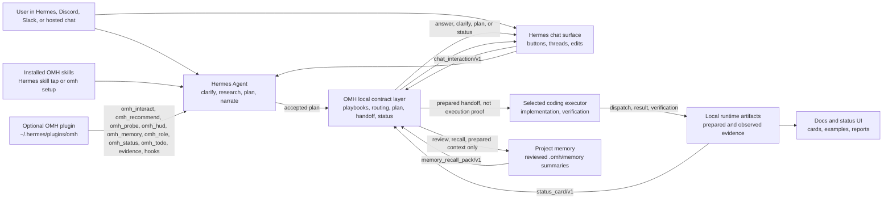

# Architecture

## Goals

The product direction is defined in `docs/DIRECTION.md`; this architecture
document describes the current module boundaries that implement that direction.

This is an agent, wrapper, and maintainer reference. The normal human surface is
Hermes chat plus `omh setup`, `omh update`, and `omh doctor`; backend command
groups described here are integration contracts rather than user workflow.

oh-my-hermes should feel like a native Hermes workflow layer, not a pile
of copied prompt files.

The architecture favors:

- Hermes-native skill installation as the primary user-facing entry point
- a thin Hermes plugin bridge for workflow recommendation, capability probing,
  and metadata-only HUD/status context
- a small support command interface for bootstrap, verification, and wrappers
- reversible local bootstrap installation
- generated skill text from testable catalog data
- explicit compatibility contracts
- reviewed project-local memory as prepared context, not execution evidence
- conservative routing behavior
- delegation-first coding, where Hermes plans and narrates while the selected
  coding executor performs main implementation work

## System View

This is the product architecture, not the package tree. Wrappers render chat
UX, OMH produces deterministic local contracts, Hermes keeps user-facing
reasoning, and executor lanes provide observed coding evidence only after a
separate runtime record exists.


```mermaid
flowchart LR
  user["User in Hermes, Discord, Slack, or hosted chat"]
  skills["Installed OMH skills\nHermes skill tap or omh setup"]
  plugin["Optional OMH plugin\n~/.hermes/plugins/omh"]
  wrapper["Hermes chat surface\nbuttons, threads, edits"]
  omh["OMH local contract layer\nplaybooks, routing, plan, handoff, status"]
  hermes["Hermes Agent\nclarify, research, plan, narrate"]
  executor["Selected coding executor\nimplementation, verification"]
  memory["Project memory\nreviewed .omh/memory summaries"]
  runtime["Local runtime artifacts\nprepared and observed evidence"]
  site["Docs and status UI\ncards, examples, reports"]

  user --> hermes
  skills --> hermes
  plugin -->|"omh_interact, omh_recommend, omh_probe, omh_hud, omh_memory, omh_role, omh_status, omh_todo, evidence, hooks"| hermes
  user --> wrapper
  wrapper -->|"chat_interaction/v1"| omh
  omh -->|"answer, clarify, plan, or status"| wrapper
  wrapper --> hermes
  hermes -->|"accepted plan"| omh
  omh -->|"review, recall, prepared context only"| memory
  memory -->|"memory_recall_pack/v1"| omh
  omh -->|"prepared handoff, not execution proof"| executor
  executor -->|"dispatch, result, verification"| runtime
  runtime -->|"status_card/v1"| omh
  omh --> wrapper
  runtime --> site
```

```text
Chat user
  -> Hermes Agent owns conversation, planning, and status narration
  -> Installed OMH skills provide workflow and evidence guidance
  -> Hermes chat surface asks OMH for backend contracts
  -> Executor owns main coding work when dispatched
  -> Runtime artifacts own observed evidence
```

## Package Layout

```text
src/
  omh/
    __init__.py              # public package shim; maps source folders below into omh.*
    cli/                     # module entry point package for omh.cli and python -m omh.cli
    chat_router.py           # compatibility facade to routing/chat.py
    recommend.py             # compatibility facade to routing/recommend.py
    coding_delegation.py     # compatibility facade to coding/coding_delegation.py
    runtime_artifacts.py     # compatibility facade to runtime/artifacts.py
    wrapper_contract.py      # compatibility facade to wrapper/contract.py

  commands/
    main.py                  # parser assembly and top-level error handling
    chat.py
    coding.py
    runtime.py
    setup.py

  routing/
    chat.py
    intent.py
    localization.py
    policy.py
    recommend.py
    route_plan.py
    task_cards.py

  workflows/
    materials.py
    operations.py
    paper_learning.py
    research_department.py
    source_finder.py
    visual_summary.py
    workflow_learning.py

  coding/
    coding_contracts.py
    coding_delegation.py
    codex_progress.py
    executor_progress.py
    executor_readiness.py
    executors.py
    isolation.py
    owner_fit.py
    owner_retarget.py
    pre_handoff_readiness.py
    team_readiness.py
    worktree_creator.py

  install/
    command_path.py
    config_adapter.py
    installer.py
    manifest.py
    plugin_pack.py
    plugin_observations.py

  maintenance/
    doctor.py
    probe.py
    release.py

  mcp/
    bridge.py

  quality/
    capability_roadmap.py
    grounded_score.py
    harness_quality.py
    parity.py

  surfaces/
    context.py
    demo.py
    hermes_model_settings.py
    hermes_processes.py
    hermes_sessions.py
    hud.py
    menubar_app.py
    menubar_status.py
    quickstart.py

  system/
    append_only_store.py
    hashutil.py
    ingress.py
    local_store.py
    paths.py
    targets.py
    workflow_state.py

  catalogs/
    playbooks.py
    roles.py
  profiles/
    setup.py
    team.py
  runtime/
    artifacts.py
    records.py
  wrapper/
    contract.py
    executor_sessions.py
    lifecycle.py
    sessions.py
  core/
  skills/
    catalog.py
    packaging.py
    render.py
  plugin_bundle/
    omh/
      plugin.yaml
      config.yaml
      hooks/
      tools/
skills/
  <skill-name>/SKILL.md       # tap-compatible Hermes skill pack generated from the same catalog
```

## Main Modules

`skills/` is the Hermes-native distribution surface. It mirrors the generated
skill templates so `hermes skills tap add rlaope/oh-my-hermes` can expose
OMH directly when Hermes taps are available.

`plugin_bundle/omh/` is the Hermes plugin payload installed by `omh setup` to
`~/.hermes/plugins/omh`. The v1 plugin registers deterministic
`omh_interact` chat/session interaction, `omh_recommend` route hints,
metadata-only `omh_probe` capability status/roadmap, compact metadata-only
`omh_hud`, detailed metadata-only `omh_status`, `omh_todo` plan-todo
declaration for the HUD checklist panel, `omh_role` role context, a
bounded `omh_gather_evidence` local verification probe, and passive lifecycle
hooks for bounded status context, role marker validation, and metadata-only
session-end checkpointing. The
`pre_llm_call` hook can also add
`omh_context_brief/v1` plus `omh_route_hint/v1` for messages that look like
planning, research, ops, materials, visual summary, automation,
workflow-learning, or coding-handoff work. That hook payload carries only
hash/length metadata, matched cue labels, candidate workflow names, next
actions, generic-tool checkpoint rules, and boundaries; it does not include the
raw user message or prove a workflow executed. For capability/catalog questions,
the context brief adds `omh_catalog_question_hint/v1` so Hermes can show the
workflow picker or capability summary without shell approval. The `pre_tool_call`
hook enforces user-authored toolcall rules (a matching rule returns the host's
block directive) and validates delegate role markers, warning on unknown
roles; it does not inject generic-tool checkpoint metadata or raw tool input.
`omh hud`
exposes the same status-line payload for local operator smoke tests. The HUD
line stays limited to version, plugin bridge readiness, target topology, current
or default coding agent, and evidence state. Host-supplied token metadata
remains available in the machine-readable payload but is not shown in the
Hermes-facing status line.
It intentionally omits install inventory such as managed skill counts. Its
evidence probe is allowlisted, shell-free, bounded to a project root, and emits
truncated structured command output. It does not provide an arbitrary shell,
patch Hermes core, or claim execution evidence from prepared handoffs. Role
context is prompt guidance only; it is not proof
that a separate role, worker, or executor ran.

`menubar_status.py` owns the platform-neutral macOS menu bar view model exposed
by `omh menubar status --json`. Its `menubar_status/v2` payload is a UI
projection over local HUD, target-registry, runtime, and read-only Hermes
observations; it is intentionally not the source of truth. The payload retains
separate `hermes_agents` and `external_coding_executors` metadata so Codex,
Claude Code, OMX, OMO, OMC, or generic coding tools cannot be rendered as
Hermes agents by accident. `display.menu_cards` is the human-facing model for
the native helper: a Sessions table, a Models table, and one compact coding
metadata footer. Sessions uses the exact columns `Hermes session` / `Count` and
only the `live` and `total` rows. Session source or TUI breakdown is
intentionally not exposed. In Models, `current` is the model observed on the
live Hermes session; `main` and auxiliary aliases are configuration values.

Plain `omh menubar status` renders a short terminal summary from the same
payload so operators see Summary, Sessions, Models, the compact coding metadata
footer, and Observation without reading raw JSON. Machine consumers should
request `--json` or set `OMH_OUTPUT=json`.

`current_external_coding_executor` names the selected row explicitly, preferring
`runtime/state.json` `last_run_id` when it matches the recent executor list, so
settings and compact summaries do not rely on an unnamed list-order convention.

`workflows/memory.py` owns OMH project memory. It stores candidates, reviewed
records, review decisions, and recall packs under `.omh/memory/` using local
JSON files. Setup records `project_memory_policy/v1` with `off`,
`review-first`, or `auto-safe` mode. Coding handoffs can receive
`memory_recall_pack/v1` when reviewed records are relevant. These packs are
prepared context only; they are not execution, review, CI, merge, or Hermes
internal-memory evidence.

The three observer modules keep these inputs separate.
`hermes_processes.py` performs the bounded local process-tree scan and reports
Hermes agent roots and total matching processes. `hermes_sessions.py` opens
Hermes `state.db` read-only for visible live/total session counts and the newest
live session's model. `hermes_model_settings.py` reads `config.yaml` for the
configured `main` and auxiliary model aliases. The status path does not invoke
Hermes, make network requests, or write any Hermes-owned file.

Session counts are a read-only observation of Hermes' own session store; they are not execution, review, CI, merge, or token-usage evidence.

Model settings are read from Hermes configuration; a configured alias is not evidence that a request used that model.

The menu bar status contract reports configured Hermes targets and prepared
handoffs without inventing process state. PID, `running`, and `restarting`
values are applied only from a caller-provided `menubar_process_overlay/v1`
payload or an explicit `omh menubar status --observe-local-processes --json`
request. The native macOS helper makes that explicit request; plain `omh menubar
status` performs no process scan. Process observation is app-local, expires
after a short TTL, and applies restarting state only inside its restart window.
OMH does not turn prepared handoffs into observed execution, review, CI, or
merge evidence.

`cli.py` is a compatibility adapter. `commands/main.py` owns parser assembly,
top-level error handling, and the public command handler re-export surface.
Domain command modules under `commands/` own support JSON output for bootstrap,
repair, verification, wrapper backends, and operator debugging. New command
handlers should be added to the matching domain module rather than growing
`commands/main.py`.

`ingress.py` owns platform-neutral message text and source metadata extraction
for Discord, Slack, Hermes, and generic wrapper event shapes.

`targets.py` owns the deterministic Hermes target registry. It records which
Hermes home, wrapper target, or agent reference was observed, derives
`omh_target_topology/v1`, and keeps single-target versus multi-target behavior
as setup evidence rather than runtime execution proof.

`routing/chat.py` owns deterministic pre-dispatch routing decisions for chat
wrappers. It consumes plain messages or platform-shaped event payloads and
returns `dispatch`, `clarify`, or `fallback` decisions from local catalog data.
`routing/localization.py` owns deterministic locale phrase expansion for common
non-English operator requests. It preserves the raw message, adds only canonical
scoring hints, and makes locale-match metadata available to scored
recommendations without calling translation services.
`wrapper/localized_copy.py` owns the separate human-facing chat copy catalog for
common localized card frames. It can mirror the user's language for supported
operator-facing cards, but it does not translate raw prompts, change routing
scores, or turn prepared states into observed evidence.
`routing/policy.py` owns shared confidence and ambiguity policy, and
`routing/recommend.py` owns local catalog recommendation scoring.

`coding_delegation.py` owns deterministic coding handoff preparation. It maps
implementation-shaped task text to an action, intent, workflow, harness,
executor profile, acceptance criteria, and verification expectations without
LLM, API, or network calls.

`wrapper/contract.py` owns the platform-neutral chat interaction contract. It
composes routing, planning, delegation, and status primitives into a
`chat_interaction/v1` envelope with a renderable `chat_response/v1`, safe action
buttons, a stable thread key, and overclaim guards for Discord, Slack, and
hosted Hermes adapters.

`wrapper/lifecycle.py` owns Codex-oriented lifecycle helpers above the existing
runtime artifact layer. It starts prepared handoffs, records dispatch and
executor observations, records verification observations, and reports derived
status without mutating prepared handoff records into execution proof.

`wrapper/executor_sessions.py` owns wrapper-native executor session metadata.
It turns Hermes actions such as Start Codex session, Start Claude Code session,
Attach coding session, Refresh status, Record completed, Record blocked, and Ask
Hermes to verify into `executor_session/v1` records and status lines. It can
bridge to the Codex lifecycle run or a runtime-start observation when Hermes or
the wrapper reports an observed coding-session start/attach event. OMH still
does not secretly launch Codex, Claude Code, Hermes, workers, worktrees, or
network transports; it tells Hermes what to start and records what Hermes or the
wrapper actually observed.

`hermes_planning.py` owns deterministic Hermes-facing planning artifacts under
`.hermes/plans/` and the machine-readable plan wrapper contract used after plan
acceptance.

`runtime/artifacts.py` and `runtime/records.py` own local JSON/JSONL evidence,
schema validation, redacted export, and derived delegated coding status.
They also own `runtime_observation/v1`, the runtime-level observation ledger for
Hermes, OMX, OMO, and OMC handoffs. Each record names one observed or blocked
ladder step such as runtime start, worktree creation, worker dispatch, worker
result, verification, review, CI, merge readiness, or merge. Missing records
remain missing evidence; OMH does not infer them from prepared handoff text.

`workflow_learning.py` owns the metadata-only learning plane above routing,
wrapper sessions, and runtime artifacts. It projects workflow attempts into
`workflow_learning_trace/v1`, evaluates them with deterministic
`workflow_eval_result/v1` rubrics, creates review-only
`improvement_candidate/v1` records, and stores `regression_case/v1` fixtures for
future replay. It is deliberately projection-first: trace recording does not
mutate skills, patch Hermes, train a model, or upgrade prepared work into
observed evidence. This gives Hermes good process data to review while keeping
status, verification, CI, merge, and skill changes separately observed.
`omh learning missed-route` composes those primitives for the common wrapper
case where Hermes did not use the expected OMH workflow; it records review
material and an optional minimized replay fixture, not an automatic fix.

`wrapper/sessions.py` owns metadata-only chat session persistence for wrappers.
It records chat continuity, plan decisions, and a link to a prepared run id, but
it does not own execution, review, CI, merge readiness, or merge evidence.

`installer.py` owns managed skill writes, manifest updates, update behavior, and
uninstall behavior.

`config_adapter.py` owns the Hermes config edit boundary. It should remain
small, heavily tested, and conservative.

`skills/catalog.py` owns workflow names, descriptions, trigger phrases, and
use-when rules as data.

`catalogs/playbooks.py` owns situation-level pipeline data. Playbooks sit above
individual skills: they describe common wrapper-visible paths for research,
interview, planning, coding handoff, local pipeline buildout, and
release-readiness review. `playbooks.py` remains only as a compatibility
adapter.

`catalogs/roles.py` owns the wrapper-visible responsibility-role catalog.
Roles are descriptors for chat/status clarity, not runtime agent evidence.
`roles.py` remains only as a compatibility adapter.

`profiles/setup.py` owns setup profile categories, executor defaults, and the
selected operating model recorded by `omh setup --operating-model <id>`.
Operating models are lightweight collaboration defaults such as solo operator,
small team, research ops, or coding runtime team. They change routing and
status narration defaults; setup state persists only the stable
`operating_model_id`, not a mutable catalog snapshot. They do not install
visible role files or prove that Hermes spawned agents. `profiles/team.py` owns
optional team profile packs such as CTO/PM-style role files. `setup_profiles.py`
and `team_profiles.py` remain only as compatibility adapters.

`skills/render.py` owns generated `SKILL.md` content. It should render from the
catalog rather than becoming a second source of truth. `skills/packaging.py`
owns assembly of the managed skill bundle from rendered templates.

`chat_router.py`, `recommend.py`, `runtime_artifacts.py`,
`runtime_records.py`, `wrapper_contract.py`, `wrapper_sessions.py`,
`coding_lifecycle.py`, `playbooks.py`, `roles.py`, `setup_profiles.py`,
`team_profiles.py`, `cli.py`, and `skill_pack.py` are compatibility facades so
older imports keep working while the package grows internally. Facades should
stay thin and point at the deeper source-owner modules.

## Routing

Routing, planning, and delegation have these local surfaces:

1. Hermes-native installed skills. The tap-compatible `skills/` directory and
   the managed `~/.omh/skills` bootstrap directory expose the same generated
   guidance to Hermes.
2. Prompt-level guidance. The router skill gives Hermes a structured map of
   workflow names and strong trigger phrases, but it does not override Hermes
   core behavior.
3. Situation playbooks. `omh playbook recommend` lets wrappers map a natural
   request to a higher-level pipeline before they choose a lower-level skill,
   plan, research lane, or handoff.
4. Task abstraction cards. `omh_task_card/v1` lets wrappers classify work such
   as runtime portability, environment reproduction, or router-design feedback
   before selecting a workflow. The card names operation primitives, workflow
   rails, risk domains, and prepared/observed boundaries, so a request like
   "reproduce this Hermes setup on another MacBook" is not collapsed into a
   narrow migration workflow.
5. Wrapper-native chat orchestration. Plugin `omh_interact` and
   `omh chat interact` let Discord, Slack, or hosted Hermes wrappers receive
   one platform-neutral `chat_interaction/v1` envelope with renderable chat
   copy, state, action buttons, and a thread key.
6. Wrapper session persistence. `omh chat session` lets wrappers persist
   metadata-only plan decisions, recover status by `session_id`, and link an
   accepted plan to a prepared coding run without owning execution evidence.
7. Wrapper-native executor session actions. After a handoff is prepared, the
   wrapper can render action buttons and record observed open/attach/result or
   verification-request events as `executor_session/v1` metadata. This is the
   layer that lets a Discord or Hermes chat user ask "what is happening with
   Codex or Claude Code?" without typing backend commands.
8. Wrapper-assisted chat routing. `omh chat route` lets Discord, Slack, or
   hosted Hermes wrappers run a deterministic pre-dispatch decision before they
   forward a plain user message to Hermes.
9. Wrapper-assisted coding delegation. `omh coding delegate` lets wrappers turn
   implementation-shaped messages into a deterministic `coding_delegation/v1`
   handoff payload for an executor lane.
10. Runtime observation recording. `omh runtime observe` lets wrappers or
   operators append observed lifecycle events into
   `.omh/runtime/journal/events.jsonl` and, for runtime handoffs, maintain
   `runtime_observation/v1` compatibility without implying unrecorded worktree,
   worker, verification, review, CI, or merge steps.
11. Hermes-facing planning artifacts. `omh hermes plan` lets wrappers or
   operators create deterministic `hermes_plan/v1` planning scaffolds under
   `.hermes/plans/` without claiming that execution or review already happened.

`omh_interact` is the plugin-native Hermes-facing entry point for this
contract, and `omh chat interact` is the CLI/backend equivalent. They compose
the lower-level surfaces into one response envelope so each Hermes Agent
surface can share the same orchestration policy. The `chat_response/v1`
subobject is safe to render directly: it names the state, provides concise
copy, exposes platform-neutral actions, and never asks the end user to run an
`omh` command. The surrounding envelope preserves source metadata, message hash
and length, thread key, selected mode, next action, redaction policy, and claim
boundary. Metadata-only session records also include `record_provenance` so a
plugin-authored record and a wrapper/backend-authored record are distinguishable
without upgrading either one into execution evidence.

The routing and delegation surfaces read from the same catalog metadata. The
chat router returns a `routing_instruction` and `routing_prompt_template` for
custom wrappers to forward, with raw-message prompt expansion available only
through `--include-message`. Coding delegation returns a
`delegation_prompt_template`, recommended workflow, harness, acceptance
criteria, verification expectations, and optional metadata-only
`coding_delegation.json` evidence. With `--executor choose`, it returns a
human-in-the-loop executor-choice contract. With `--executor codex`, it also
returns a `coding_executor_handoff/v1` instruction payload that names Codex as
the executor target without launching Codex. Codex handoffs include
`codex_skill` and `codex_invocation.dispatch_text_template`, so a wrapper can
turn a Hermes workflow into the Codex `$skill {message}` surface while still
keeping the raw message out of persisted OMH artifacts. Claude Code and generic
profiles return a `coding_prompt_handoff/v1` prompt-only payload that must not
create a lifecycle run or observed execution evidence. Hermes, OMX, OMO, and OMC
profiles return a `coding_runtime_handoff/v1` contract with runtime profile,
team/swarm, worker-protocol, and worktree guidance. Runtime handoffs are still
prepared state only: they do not mean Hermes, tmux, workers, subagents, or
worktrees were started. All coding handoff modes also include
`worktree_session_isolation/v1`, which tells wrappers whether the current
workspace is acceptable, an isolated worktree is recommended, or an isolated
worktree is required before opening an executor. That record stores a compact
snapshot of the generated workspace policy. Worktree creation itself is deferred
to native tooling — upstream Hermes manages worktrees for you (Kanban
worktree-per-task since v0.15.0, Desktop Projects since v0.18.0), or you can run
`git worktree add` manually — so OMH no longer creates worktrees and cannot
collide with the one Hermes is already managing for a task. When a worktree
exists, OMH records `omh_worktree_observation/v1`; that observation is
workspace-isolation evidence only. `omh worktree bind` can then return a
wrapper recipe for opening or attaching Codex, Claude Code, Hermes, or another
runtime from that worktree; the recipe is still not executor dispatch or result
evidence. Runtime ladders still need a separate `runtime_observation/v1`
`worktree_creation` event when the created worktree is attached to a prepared
runtime handoff. The coding handoff also stores acceptance criteria,
verification expectations, report contract, and evidence contract,
runtime-specific invocation templates, and the
`runtime_observation/v1` recording contract, but not the raw prompt body. With
`--record`,
the companion `run.json` is marked as
`artifact_kind: prepared_coding_delegation`, `phase: prepared`, and
`observation_status: prepared_not_observed`; validation treats the run envelope
and `coding_delegation.json` as a required pair. The run envelope is
implementation bookkeeping, not proof that Hermes executed the handoff.

The wrapper contract and lower-level surfaces are local contracts; execution
evidence still comes from Hermes Agent and the selected executor/runtime. The
append-only observation journal is the bridge between "prepared" and "observed"
lifecycle status. For Hermes/OMX/OMO/OMC runtime handoffs, the
legacy-compatible runtime observation ledger is mirrored into that journal. A
wrapper can record `runtime_start` while `worktree_creation`, `worker_dispatch`,
`worker_result`, `verification`, `review`, `ci`, `merge_readiness`, and `merge`
remain explicitly missing.

### Executor-local workflow binding

Coding handoffs may carry one optional `executor_local_workflow/v1` object for
the final guarded workflow. The workflow must have a canonical ID in the
routable skill catalog; workflows outside that catalog omit the binding. The
object is a prepared, task-scoped candidate, not a discovery result,
installed-skill claim, or execution instruction. When present, its exact root
keys are `schema_version`, `profile`, `status`, `routed_workflow`, `candidate`,
`availability`, `dispatchability`, `fallback`, and `claim_boundary`. The
candidate has exactly `kind`, `skill_id`, `invocation`, `rationale`, and
`selection_basis`; the invocation has exactly `mode`, `syntax`, `template`, and
`message_placeholder`.

The profile mapping is deliberately narrow:

| Profile | Candidate kind | Invocation representation | Dispatch rule |
| --- | --- | --- | --- |
| `codex` | `codex_skill` | `command_template`, `$<canonical-skill> {message}` | Only an exact matching `observed_available` record may make the candidate invocation dispatchable, and the parent handoff must remain `ask_before_dispatch`. |
| `hermes` | `hermes_installed_skill` | `display_only`, `/<display-name> {message}` | Always non-dispatchable display metadata. |
| `omx-runtime` | `omx_skill` | `display_only`, `$<canonical-skill> {message}` | Always non-dispatchable display metadata. |
| `omo-runtime` | `omo_skill_reference` | `skill_reference`, empty template | Non-executable reference only; no `load_skills` payload is serialized. |
| `omc-runtime` | `omc_skill_descriptor` | `descriptor_only`, empty template | Non-executable descriptor only; no universal slash command is inferred. |

`claude-code`, `generic`, `choose`, `pi`/generic aliases, and unmapped
profiles omit the binding entirely. OMH has no `pi` profile: a pi or generic
alias is treated as an unmapped generic boundary, not as a new executor.
Canonical Hermes display names come from the catalog (for example,
`ultrawork` displays as `/ulw-work` and `ultraqa` as `/ulw-qa`); the
canonical `skill_id` remains unchanged in the metadata.

Availability is an evidence state machine, not an installation probe. The
root `status` mirrors `availability.status` and is one of `unknown`,
`observed_available`, or `observed_unavailable`. `unknown` is the prepared
default and also covers missing, malformed, stale-profile, stale-skill, or
out-of-scope evidence. `observed_available` and `observed_unavailable` require
an explicit operator-recorded capability snapshot. Its scope must contain
exactly the matching `profile` and `skill_id` plus a canonical local
`environment`, and its `evidence_ref` must be a safe opaque
`namespace:identifier` reference. Its timezone-aware `observed_at` must be no
later than the snapshot `recorded_at` and no more than 24 hours older. OMH does
not probe `PATH`, scan skill directories, load a skill body, install anything,
or invoke an executor to produce this state. A matching observation says only
what that observation recorded at that time; it never proves invocation,
dispatch, execution, verification, review, CI, merge readiness, or merge.

The availability object has exactly `status`, `basis`, `profile`, `skill_id`,
`scope`, `recorded_at`, `observed_at`, and `evidence_ref`. Its `basis` is
`prepared_mapping` for `unknown` and `operator_recorded_snapshot` for either
observed state. The scope is bounded and nonsensitive; it is not a filesystem
listing or a transcript.

The dispatchability object has exactly `handoff_dispatchable`,
`candidate_invocation_dispatchable`, and `reason`. `reason` is restricted to
`availability_not_observed`, `candidate_observed_unavailable`,
`parent_handoff_prepare_only`, `descriptor_only`, and
`observed_available_ask_before_dispatch`, and must agree with the state and
parent lane. Runtime, Hermes display, OMX display, OMO reference, and OMC
descriptor candidates are never dispatchable.
For unknown or unavailable Codex candidates, the actual executor prompt and
legacy `codex_invocation.dispatch_text_template` remain the generic
`{message}` placeholder. The candidate metadata may still display the
prepared `$<canonical-skill> {message}` shape, but it cannot authorize use.
They retain the exact fallback
`Keep the parent handoff prompt and dispatch mode unchanged; do not invoke the candidate.`
Every binding carries the exact claim boundary:
`Prepared executor-local workflow metadata is not evidence of installation, loading, invocation, dispatch, execution, verification, review, CI, merge readiness, or merge.`

The binding is projected consistently, when present, through direct coding
delegation, routed delegation, wrapper session state, briefing/work-summary
metadata, persisted replay, and the wrapper golden contract. Each projection
copies the bounded object; none synthesizes a command or copies a raw prompt,
local path, skill body, transcript, or evidence contents. Manual QA for a
projection must capture the parsed schema, profile, status, skill id,
invocation mode/template, both dispatchability booleans, and the parent lane's
dispatch mode. A missing capture is missing observation, not a positive claim.

The boundary follows pinned upstream evidence. OMO's skill-loader descriptors
contain richer loader metadata than a portable OMH invocation contract, and its
task tool injects skill contents at spawn time; see the pinned
[`b072d279` descriptor types](https://github.com/code-yeongyu/oh-my-openagent/blob/b072d279110bdda2c6ac2525d0d24dc54d16148/packages/skills-loader-core/src/features/opencode-skill-loader/types.ts#L26-L37)
and [`b072d279` task skill loading](https://github.com/code-yeongyu/oh-my-openagent/blob/b072d279110bdda2c6ac2525d0d24dc54d16148/packages/senpi-task/src/tools/task/skills.ts#L17-L23).
OMC's pinned, bounded skill discovery and user-skill compatibility helpers do
not define a universal slash-command grammar; see the
[`41a4c0f` discovery path](https://github.com/Yeachan-Heo/oh-my-claudecode/blob/41a4c0f77144c5beb5f5f000a89cff379c680606/scripts/skill-injector.mjs#L517-L563)
and [`41a4c0f` compatibility helper](https://github.com/Yeachan-Heo/oh-my-claudecode/blob/41a4c0f77144c5beb5f5f000a89cff379c680606/src/utils/user-skill-compat.ts#L48-L89).

Hermes planning writes Markdown plans under the configured Hermes home rather
than runtime JSON under `.omh/runtime/`. The artifact is user-facing: it includes
the task statement, goals, non-goals, options, risks, acceptance criteria,
verification, execution handoff guidance, and reviewer status. Review gates
default to `not_observed` unless wrapper metadata proves a separate review ran.
Weak requests create a companion `.hermes/context/` artifact and keep the plan
`blocked` until Hermes asks the smallest blocking clarification.

The machine-readable planning bridge is stdout JSON plus the accepted plan
artifact, not a Discord/channel summary. Each `hermes_plan/v1` payload includes
`wrapper_contract` with the current wrapper step, decision gate, optional
recorded plan artifact path, and coding-delegation handoff template. For
implementation-shaped draft plans, `wrapper_contract.coding_delegate.argv_template`
is the adapter contract for calling
`omh coding delegate --executor codex --record --from-plan <accepted-plan.md>`
after plan acceptance. `omh coding delegate --from-plan` rejects draft plans by
default and uses the accepted artifact or generated context pack as executor
context when the wrapper wants a run-backed Codex handoff and a future
`runtime.run.run_id`. Blocked or non-coding plans keep `coding_delegate.available`
false so wrappers do not infer execution from presentation text.

`omh chat session` is the recovery layer for adapters that need button/thread
state to survive restarts. The session id is derived from `thread_key`. Session
records own chat continuity, route summary, plan accepted/revision/cancelled
decisions, and a `current_run_id` link. The linked run remains the only
authoritative source for prepared handoff, dispatch, executor result,
verification, review, CI, merge readiness, and merge observations.

`executor_session/v1` is the chat-facing companion to that recovery layer. It
records that a wrapper observed an open/attach/result/verification-request
event for the selected executor. For Codex, observed open maps to lifecycle
dispatch and observed result maps to the Codex run ledger. For Claude Code and
generic agents, it remains prompt-only session metadata. For Hermes/OMX/OMO/OMC
runtime handoffs, observed open records `runtime_start` while later ladder
steps remain missing until explicit `runtime_observation/v1` evidence exists.

Future routing work should deepen the catalog first, then render richer skill
metadata from it.

`executor_capability_snapshot/v1` is also the single capability evidence
source for handoff display and fanout dispatch receipts. Its vocabulary includes
the owner-fit capabilities above plus descriptive edit-surface facts
(`edit_format_hashline`, `edit_format_str_replace`, `edit_format_patch`,
`persistent_eval`, `tool_reentry`, and `code_mode_batching`). Recorded
`host_observed` rows retain bounded scope, evidence reference, and observation
time. Missing rows are projected as explicit `unknown`; the prepared fallback
marks only `worktree_isolation` as `prepared`.

The snapshot is frozen into coding handoffs and briefing renders that frozen
payload verbatim. Fanout dispatch records resolve the matching snapshot from the
same OMH-local snapshot directory when a legacy fanout handoff does not carry
one. Neither surface independently scores or selects an owner. Only
`coding_owner_fit/v1` interprets capabilities required by the accepted plan,
and unrelated descriptive evidence cannot satisfy or hide a required
capability.

During the `executor_capability/v1` compatibility window, briefing and dispatch
receipts also emit a deprecated projection under `executor_capability`. That
projection is derived from the unified snapshot rather than maintained as a
second table, so legacy readers keep working without creating another evidence
source.

The delegation-first completion model is tracked in
`docs/DELEGATION_FIRST_COMPLETENESS.md`. It is the product boundary for making
OMH feel more complete without turning Hermes into the main coding executor.

### Coding Owner Fit

`coding/owner_fit.py` answers whether a coding owner can actually finish the
plan that was just accepted. Owner selection used to read four inputs — an owner
named in the request envelope, an owner named in the message, a recorded setup
preference, a keyword route-family cue — and no capability evidence at all, so a
gap surfaced during execution rather than before it.

Two pure derivations, both with `now` as a parameter:

- **Requirements** come from the accepted plan's declared fields only
  (`ACCEPTED_PLAN_FIELDS`: the routed workflow, the work-owner mode, the
  workspace-binding strategy). The message is never parsed here. The vocabulary
  is the one `executor_capability_snapshot/v1` already speaks, so a requirement
  and the evidence answering it always share a name.
- **Classification** matches one requirement against one owner's recorded
  snapshot and lands in `met`, `unmet`, or `unknown`. `OWNER_FIT_REASON_CODES`
  is the single table mapping a reason to its classification, so "why" and
  "what" cannot drift.

The three states are kept apart deliberately. `met` needs fresh host-observed
availability; `unmet` needs fresh host-observed unavailability; everything else
— no snapshot, no record of that capability, prepared-only evidence, evidence
scoped to a different workflow, evidence past the horizon — is `unknown`. An
owner with an unmet requirement is `blocked` and is never recommended; an owner
with an unknown requirement is `unproven`, which is also not recommended but is
not reported as a gap either, because nothing was observed to be missing.

Freshness reuses `CAPABILITY_EVIDENCE_STALE_AFTER_SECONDS` through
`pre_handoff_readiness.capability_evidence_is_fresh` rather than declaring a
second horizon. Expired evidence classifies `unknown` whatever it recorded,
including a recorded `unavailable`: an expired observation is not knowledge of
the present, and `unknown` still yields `unproven`, which is still not
recommended.

An explicitly named owner is still honoured. Naming an owner still selects it
and still prepares its handoff; `resolve_coding_route_decision` is unchanged.
When the named owner cannot do the work the report keeps it, sets
`named_owner_honoured`, states the gap in `named_owner_gap`, and leaves it out
of `recommended_owners`. Hermes therefore never recommends an owner with a known
unmet capability and never silently swaps an owner a person asked for.

`coding_owner_fit_report/v1` rides on every delegate-action coding payload, so
`omh coding delegate` and the chat lane read the same answer, and
`executor_choice_context` takes the same plan so owner fit is the first ranking
key on the choose-executor card — an owner that cannot do the work never heads
it. Candidates are ranked, never removed. Both artifacts are
`prepared_not_observed`.

Classification reads the snapshot and never the owner id.
`owner_fit_without_owner_identity` drops the only two owner-identity fields
(`owner`, `label`), and two owners holding equal evidence produce equal
projections — the executor-neutrality property in code rather than in prose.

### Coding Owner Retarget

`coding/owner_retarget.py` moves an accepted coding plan to a different owner
without planning it again. A plan is accepted once, and the accepted reading —
routed workflow, intent, acceptance criteria, verification expectations — is
computed before `build_coding_delegation_payload` looks at `executor_target` at
all. What used to depend on the owner was the only way to change one:
`prepare_wrapper_session_handoff` refused every executor change on a follow-up
handoff and offered a single escape, "start a new session". A new session has no
accepted plan, so changing owner meant replanning approved work.

Retargeting is therefore a re-projection, not a decision:

- `coding_task_contract/v1` is the owner-neutral half of one accepted plan,
  projected from `payload["delegation"]` plus a digest of the equally
  owner-neutral `specialist_work_quality` bar. `work_role` is
  `delegation.executor_profile` renamed on projection, because it names the role
  the work is scoped to and never the coding owner.
- `coding_owner_retarget/v1` records one move: both owners, the preserved
  contract and its digest, the enumerated owner-specific delta
  (`OWNER_SPECIFIC_FIELDS`, plus the observed-evidence events and wrapper
  actions gained and lost), and the capability delta.
- `build_owner_retarget` compares the two contracts field by field and raises
  when any of them moved. A move that would change the task contract is refused
  as a replan, so preservation is enforced by the builder rather than only
  asserted by a test.

The capability delta reuses `owner_fit`'s matcher instead of growing a second
one. Both owners are classified against the target plan's requirement set,
because "what changed" is only meaningful on one yardstick; the yardstick's own
movement is reported separately as `required_by_owner_change` and
`dropped_by_owner_change`. That movement is the point — retargeting from an
external-executor owner to a runtime owner turns the routed workflow into
something the new owner must carry locally, adding a `local_workflow`
requirement the source plan never had. `next_action` follows from the delta:
`confirm_owner_capability_gap` when something is recorded unavailable,
`record_capability_evidence` when something is unproven, otherwise
`prepare_handoff_for_new_owner`.

Capability snapshots arrive as a parameter and nothing here reads a clock, a
network, a credential, or a host configuration file, so retargeting stays a pure
local re-projection.

On the wrapper surface the guard was relaxed into a named operation rather than
a silent allow. `omh chat session prepare-handoff --executor <owner> --retarget`
moves a session that already has a prepared handoff; without `--retarget` a
follow-up still keeps its executor, exactly as before. The retarget only applies
to a prepared session, refuses a move to the owner already selected, refuses an
unknown owner, and journals `coding_owner_retarget/v1` as a
`coding_owner_retargeted` session event once the new handoff exists. A retarget
is `prepared_not_observed`: it is not dispatch evidence and not proof the new
owner accepted or started the work.

## Model Routing Ownership

Model setup and routing preserve two ownership lanes rather than hiding every
model behind one abstraction.

**Hermes-native lane.** `coding/hermes_model_config.py` inspects aliases and
provider-presence metadata through local Hermes commands, creates an exact
`model.aliases` preview, and applies only a user-approved, config-digest-bound
change. A post-write native inspection verifies the result. Existing aliases
are user-owned and collisions fail closed. Hermes skills, Kanban,
`delegate_task`, provider bindings, and execution stay native; no Maestro object
appears in this lane.

**External Maestro lane.** `coding/maestro/` is a typed facade over the existing
Codex, Claude Code, OMO, OMC, OMX, and generic prepared-handoff builders and
status/observation adapters. It rejects Hermes profiles. Maestro is a
coordinator, not an executor: `executes_work` is false, prepared payload schema
and dispatchability are preserved, and only the selected external owner or
wrapper can record runtime observation. Maestro never writes Hermes aliases or
owns provider credentials.

`pi` and `senpi` are OMO runtime-family host CLIs. Their allowlisted session
metadata can contribute discovery observations, but they are not independent
executor/model owners and do not authorize promotion into the Hermes-native
lane.

`coding/model_discovery.py` is the bounded metadata ingress. Fixed roots,
record-count/size/depth/time limits, field allowlists, and explicit
`observed_before`, `confirmed_active`, `unobserved`, `truncated`, or
`layout_unverified` states prevent history from becoming availability truth.
Auth files and record bodies are not emitted. Only the OMO-owned model file
layout yields `confirmed_active` discovery records; guided setup otherwise
requires explicit user confirmation. Discovery remains advisory and performs
no network request.

`coding/model_recommendations.py` owns secret-free editorial candidate order.
The categories reuse the closed `MODEL_CATEGORIES` vocabulary; `main` is a
separate Hermes role suggestion and `x_platform_data` is a separate domain
affinity. `last_resort.any` is one shared final chain outside those selectors;
it is considered only after every selected category, role-slot, and domain
chain is exhausted. Version 2 user override documents can replace only those
named chains and the shared `any` slot; legacy v1 documents remain accepted but
cannot define the new slot. Overrides cannot extend the vocabularies or contain
secret/provider configuration. Resolution filters order against
caller-confirmed active models. A missing head falls through to the next
eligible candidate, then the shared final order tries Claude Opus 5 followed by
GPT-5.6 Sol. No eligible candidate anywhere returns `owner_default` without
blocking setup or preparing a model-config write. An unavailable explicit model
instead returns `choice_required` and freezes fallthrough.

The shipped Kimi, Claude, GPT, GLM, Grok, and Gemini order is editorial, not
benchmarked. Qwen is a valid confirmed user alternative through an override or
explicit selection. Grok's lead position for `x_platform_data` is static X
platform affinity, not measured capability. CCAPI and Apitopia names are only
preferred provider-family metadata and require user-declared local activation;
there is no readiness probe or credential transfer.

`model_routing_status/v1` joins discovery, Hermes aliases, Maestro category
resolution, and owner-learning metadata for agents and maintainers. These
remain four separately labeled inputs. The status and doctor advisory do not
upgrade any of them into provider entitlement, dispatch, execution, review,
CI, or merge evidence.

## Hermes Capability Boundary

`omh probe` is the non-mutating capability inspection surface. It reports
observable local evidence for:

- external skill directory registration
- managed skill installation
- hook-like files
- plugin and app paths
- MCP bridge server availability, setup preference, runtime tool-call
  observation, host session observation, and MCP host config paths as separate
  capabilities
- wrapper observation artifacts
- native skill metadata readiness

Probe results use `available`, `missing`, `unknown`, or `unverified`. A file or
directory probe marked `unverified` is not a native integration claim. Deeper
Hermes integration requires both a stable Hermes extension contract and runtime
evidence that the extension ran.
`mcp_bridge_server` is the installed stdio bridge command, `mcp_preference` is
OMH setup state only, `mcp_bridge_runtime` is a local OMH-observed bridge tool
call, `mcp_host_session` is host/wrapper-supplied load or session evidence, and
`mcp_host_config` is a host-file probe only. Keeping them separate prevents a
requested bridge preference or config file from being mistaken for observed MCP
host load, connector invocation, or coding execution.

The MCP bridge is intentionally narrow. `omh mcp serve` speaks newline-delimited
stdio JSON-RPC and exposes only `omh_status`, `omh_recommend`, and `omh_probe`;
`omh_probe` can include parity and capability-roadmap projections when a host
requests those advisory views.
`omh mcp config-recipe --host ...` can print host-shaped config snippets for
Claude Code, Codex, OpenCode, Cursor, and generic MCP hosts. `omh setup
--with-mcp --mcp-host ...` can write supported host config files directly when
the operator explicitly requests MCP host setup. That written config remains
configuration evidence only. The bridge does not expose arbitrary shell
commands, call external APIs, dispatch coding executors, or prove a specific
Hermes host loaded the bridge.
When a host or wrapper does observe bridge load or use, it can record
`omh_mcp_host_session/v1` through `omh mcp observe-host`; observed records
require an evidence reference and remain host-load/session evidence only.

Plugin runtime load uses a parallel contract. Local plugin install and
import/register smoke prove only the copied bundle. A Hermes host or wrapper can
record `omh_plugin_host_observation/v1` with `omh plugin observe-host` after it
actually sees plugin load, status query, session end, or unload. Invoked OMH
plugin tools/hooks can also self-record the same observation schema when the
host supplies bounded `observation` metadata. That observation can make
`plugin_runtime_observed` available in `omh probe`, but it still proves only the
recorded plugin event. Active native readiness is narrower: only `plugin_load`,
`tool_call`, `hook_call`, and `status_query` observations keep
`native_integration_claim_ready` true. `blocked` is descriptive host metadata
and `session_end`/`plugin_unload` are historical
runtime evidence, not active readiness.

For terminal operators, `omh probe` prints a compact status summary by default.
Wrappers and automation should request the full capability payload with
`omh probe --json` or `OMH_OUTPUT=json`.

`omh probe --parity` adds `omh_parity_matrix/v1`. That matrix compares common
oh-my runtime capability axes with OMH's actual surfaces: skill/plugin
distribution, specialist roles, team/swarm workers, worktree isolation, HUD and
session observability, MCP/tool bridge, loop/autopilot workflow, and
release maintenance. It is a product and operator contract, not a hidden runtime
claim. Team/swarm worker support is exposed as `omh_team_worker_readiness/v1`
through `omh runtime team-readiness`: OMH can show the worker protocol, runtime
templates, wrapper actions, installed skill visibility, and observed
`runtime_observation/v1` ledger status. That readiness is still not worker
launch, pane/session creation, worker result, review, CI, or merge evidence.
Worktree isolation is observation-only: the `omh worktree list/bind` backend
reads its local `omh_worktree_observation/v1` ledger and returns wrapper binding
recipes for a worktree that native Hermes/Git tooling created; it neither
creates worktrees nor auto-launches an executor. MCP host load and plugin runtime events likewise
belong to Hermes, the selected executor, or another observed integration until
the matching ledger records exist.

## Harness Contract

Representative harnesses are preview metadata for generated prompt guidance.
They are not separate runtime roles, hidden hooks, or proof that Hermes exposes a
matching internal role system.

Runtime artifacts make that boundary inspectable. A harness can request local
evidence under `.omh/runtime/`, but the artifact must separate requested
delegation from observed delegation. If Hermes or a wrapper does not expose a
specialist lane result, the recorded result stays `not_observed` or
`not_available`.

When a harness is added, removed, or renamed, update these surfaces together:

- `src/skills/catalog.py`
- `src/skills/render.py`
- `docs/APPLICATION_CASES.md`
- `tests/test_router_content.py`

Each harness must also define runtime evidence expectations in catalog data:

- artifact event names
- delegation expectation
- privacy default

This keeps the generated router, public examples, and regression tests aligned
around one catalog contract.

## Runtime Artifacts

Runtime artifacts are local JSON/JSONL files under `.omh/runtime/`.

```text
.omh/
  targets.json
  runtime/
    state.json
    executor-readiness.json
    executor-limit-signals.json
    runs/
      <run-id>/
        run.json
        events.jsonl
        routing.json
        coding_delegation.json
        delegation.json
        wrapper.json
        evidence/
    journal/
      events.jsonl
      external_effect_receipts.jsonl
      external_effect_mint_failures.jsonl
      approval_receipts.jsonl
      approval_mint_failures.jsonl
      blocked_work_records.jsonl
      blocked_work_mint_failures.jsonl
      workspace_bindings.jsonl
      workspace_binding_mint_failures.jsonl
    wrapper_sessions/
      <session-id>/
        session.json
        events.jsonl
```

`executor-limit-signals.json` (written under a transient `.lock` sibling) keeps, per executor profile, the last observed
limit-shaped dispatch failure (timestamp, run ref, pattern label only — never
matched text). It is advisory ranking metadata for executor choice, not
provider quota truth.

`targets.json` records observed Hermes target topology for setup drift, including
single-to-multi and multi-to-single changes. `state.json` records install,
apply, and doctor summaries. A run directory
records a workflow envelope, append-only events, routing decisions, prepared
coding delegation, delegation observation, and wrapper observation plus optional
evidence files. A wrapper session directory records chat-thread continuity and
plan decisions only; it may link to a run id but must not duplicate run-level
execution evidence.

The runtime artifact layer is intentionally small:

- JSON/JSONL only
- no external service
- no prompt body capture in runtime artifacts by default
- schema-versioned files
- CLI inspection through `omh runtime status`, `omh runtime runs`, and
  `omh runtime show <run-id>`
- schema validation through `omh runtime validate`
- redacted export through `omh runtime export`

### External Effect Receipts

`runtime/journal/external_effect_receipts.jsonl` is an append-only store of
`external_effect_receipt/v1` records: one per external effect an acting surface
observed. An external effect is something OMH cannot do — a message reaching a
chat platform, a review landing on a change, a CI run executing, a branch
moving. OMH only records that a surface which does act reported one.

The store is mint-restricted, in the same shape as the adapter-quality
prepared-vs-observed handshake:

- `action` is one of `message_sent`, `review_submitted`, `ci_run`, `merge`, and
  `acting_surface` is one of `adapter_quality_delivery`,
  `runtime_review_record`, `runtime_ci_record`, `runtime_merge_record`. Both are
  closed vocabularies with a real producer; there is no free-text surface.
- A receipt is minted only from a record whose own `observed` flag is true. An
  unobserved record is an intent, whatever its status says.
- `observed_result` is `attempted`, `succeeded`, `failed`, or `unknown`.
  `requested` and `attempted` are also reportable *projected* states: they come
  from the run's own records when the effect has no receipt at all, so a
  prepared or requested record can never become evidence.
- `succeeded` requires a non-empty `external_ref`. An observed success nobody
  can name is recorded as `unknown`.
- Retries and reversals append a new receipt linked through
  `supersedes_receipt_ref`. Nothing is rewritten, so history is structural. The
  chain is a line: a receipt cannot supersede itself, cannot supersede a receipt
  that does not already exist, and cannot supersede one something else already
  superseded.
- Minting is idempotent by effect identity. Recording the same observation of
  the same effect again appends nothing, so a record written three times has one
  receipt.
- An append terminates a torn tail first, so a short write cannot concatenate
  the next record onto a partial line and lose both.

Every field is metadata, and every string field is guarded by its class rather
than by name — the classes are declared in one place in
`workflows/external_effect_receipts.py` and enforced in all three places a
receipt is handled: `build_external_effect_receipt`,
`validate_external_effect_receipt`, and `compact_external_effect_receipt`.

- Identifiers — `receipt_id`, `effect_id`, `run_id`, `observed_at`,
  `external_ref`, `supersedes_receipt_ref`, and each `evidence_ref` — are opaque
  references validated through `require_opaque_metadata_ref`: bounded,
  non-navigable, never URLs, and free of control characters. `receipt_id` is in
  the class because it is what every success citation is built from. Rendering
  folds anything that is not opaque to a stable `ref-<digest>` handle, and
  `omh runtime export` redacts `external_ref`.
- `action`, `target_class`, `acting_surface`, and `observed_result` are closed
  vocabularies, enforced at render as well as at validate: a value outside the
  vocabulary is not a new state, so it renders empty and projects as `unknown`.
- `summary` goes through the same bounded free-text guard as every other summary
  in this repo: a link, a filesystem path, a secret, or a control character
  makes it `[redacted]` on the way in and a violation on the way back.

Producers call `mint_external_effect_receipt`, which never raises into them: a
receipt that cannot be stored must not fail the record that produced it.
Refusals and write failures come back as an `external_effect_mint_result/v1`
mapping and are appended to
`runtime/journal/external_effect_mint_failures.jsonl`, so an unreceipted effect
is visible rather than silent.

Consumers:

- `omh runtime show <run-id>` carries the run's receipts, tail-bounded like the
  rest of the run history.
- `omh runtime delegation-status` carries an `external_effects` projection
  splitting the run's effects into requested / attempted / succeeded / failed /
  unknown, and each of `review`, `ci`, and `merge` carries the receipt that
  backs it.
- The `ci_observed` and `merged` claim rungs require a `succeeded` receipt whose
  effect, action, and acting surface all match the gate being claimed. A
  `failed` or `attempted` receipt satisfies neither.
- `omh runtime receipts` is a read-only view, and its per-run roll-up is the
  same projection `omh runtime delegation-status` reports, so the two surfaces
  cannot print different effect counts for one run at one instant. There is
  deliberately no command that mints a receipt from operator input.

Both gate call sites — runtime validation and the projection the claim ladder
reads — name a run's effect through one run-identity resolver
(`external_effect_run_id`) and select its receipt through one ordering rule
(`select_effect_receipt`, latest in append order). The shared predicate could
never disagree with itself, but two call sites handing it different receipts
would have been the same divergence one step earlier.

What `omh runtime validate` does and does not say about receipts:

- The store is runtime-wide, so its own faults are reported once, at store
  level, under the `external_effect_receipts` key. A line that does not parse
  carries no `run_id` and therefore belongs to no run; it can never fault a run
  that had nothing to do with it. Validating one run considers only that run's
  receipts.
- A `ci passed` or `merge merged` record is faulted when a receipt for that
  effect *contradicts* it: the receipt observed the effect fail, or it names a
  different action or acting surface. A receipt that observed less (`attempted`,
  `unknown`) withholds the claim without condemning the record.
- The *absence* of a receipt is not a violation. Runs recorded before this store
  existed have none, and validation describes whether the records on disk are
  internally consistent, not whether a newer artifact was written for them.
  Those runs stay valid and keep every claim rung through `review_observed`;
  what they cannot do is claim `ci_observed` or `merged`, because those two
  assert something happened outside this machine and nothing on record names the
  surface that saw it. The way forward is to record the gate again — `omh
  runtime ci` then `omh runtime merge`, each with the result the run already
  recorded — which mints the receipt and restores the claim. Those commands
  still refuse a status the run has not reached; a run that has already passed
  the gate sits at one of the completion `next_action`s (`report_merged`,
  `report_merge_ready`, `report_completion_with_evidence`), and from there the
  same record is a restatement rather than a transition, so the preflight admits
  it and no false intermediate record is needed. The exact sequence is in
  `docs/CODING-OBSERVABILITY.md`. Nothing mints a receipt for a past effect from
  operator input.

Bot wrappers can call `omh chat route --record` before invoking Hermes. The
record stores the selected skill, confidence, score, message length, and message
hash without storing the raw prompt body.

Bot wrappers can call `omh coding delegate --executor codex --record` for
implementation-shaped messages when they want a run-backed Codex handoff. The
record stores source metadata, action, intent, recommended workflow and harness,
acceptance criteria, verification expectations, recommendation evidence,
`message_sha256`, `message_length`, and status `prepared_not_observed`. That
status means a handoff was prepared; the companion run envelope is also marked
`prepared_coding_delegation`, not proof that Hermes executed the task.
Executor-choice, runtime-handoff, clarify, fallback, and prompt-only handoffs
return `runtime.recorded=false` and should stay in wrapper/session state.

### External Action Readiness

`workflows/external_action_readiness.py` answers the one question a person
actually asks before an external action: can Hermes do this now? It stores
nothing. It reads records the surfaces above already wrote and derives one
`external_action_readiness/v1` answer, scoped to a **requested outcome** rather
than to a connector, because two outcomes over one connector routinely differ —
the surface can be reachable while one of the two effects has never succeeded
through it.

Two axes, kept apart because welding them is the confusion the answer removes:

- **Evidence tier** — the strongest class of fact anyone recorded.
  `installed` is a local configuration fact; `host_observed` means a host
  reported loading the surface; `usable_observed` means a host reported using
  it; `used` means an external effect receipt records this outcome succeeding;
  `stale` means one of those was true and is now past its horizon.
- **State** — the answer: `ready`, `blocked`, `not_observed`, `stale`,
  `failed`, each carrying the smallest next action.

Configuration can never reach `ready`, and the guard is mechanical rather than
advisory. `SOURCE_TIERS` declares which tiers each source may claim, the
`local_configuration` source may claim only `installed`, and `installed` sits
below the tier level a positive answer requires. The finished answer is
re-checked on the way out, so a `ready` carrying a tier that cannot support one
fails validation.

Scoping follows the same split: evidence naming an outcome answers for that
outcome and no other, so a receipt for a different effect cannot satisfy this
one; evidence naming only a surface answers for every outcome over that surface.

Freshness is derived at read time from `EXTERNAL_ACTION_STALE_AFTER_SECONDS`
(six hours, the horizon `pre_handoff_readiness` and `action_gate` already use
for the same kind of question). No expiry is written into a record, `now` is a
parameter so the derivation is deterministic, and an unreadable or future stamp
reads as older than the horizon rather than being clamped.

Invalid evidence is rejected before the derivation, never after it, so bad input
structurally cannot raise an answer. When records were supplied and none
survived validation and scoping, the last valid answer is preserved rather than
overwritten and the answer says so through `state_source: preserved_prior` plus
a bounded `rejected_evidence` list naming the gap.

`omh runtime action-readiness --outcome <id> --surface <host>` is the read-only
view. It adapts plugin host observations, MCP host sessions, and external effect
receipts; `omh_mcp_observation/v1` and `omh_evidence_probe/v1` are deliberately
not adapted, because neither names a host or an effect and neither can therefore
be scoped to a requested outcome. There is no flag that asserts readiness —
every tier above `installed` exists because some other surface observed
something — and no answer store, so a corrupt line appended to an evidence store
today cannot erase what the valid records already say. The command is registered
in `coding_progress_policy_enforcement()["bounded_surfaces"]`: its output is one
verdict, at most eight rejected rows, and at most eight store faults, however
large the stores grow.

### Source Trust

`workflows/source_trust.py` carries the other half of the evidence question.
Everything above answers *did OMH observe this*; `evidence/labels.py` renders
that as Phase × Confidence, and every wire value on it is a statement about
observation. Knowledge that arrived from outside — an upstream document, a
practitioner's write-up — has no place on that axis, which left it two ways to be
handled and both were wrong: drop it, or let it ride into a report beside
observed facts where a reader cannot tell the two apart. The second is
laundering, and prose telling an agent not to do it is not a guard.

Two axes, kept apart for the same reason as above:

- **Observation** — did OMH see it. Owned by `evidence/labels.py` and the
  observed-claim guards in `workflows/operator_productivity.py`. `source_trust`
  does not touch it.
- **Source trust** — what class of source stands behind a claim OMH never
  observed. `upstream_official` is primary or maintainer-published material;
  `practitioner_heuristic` is a named practitioner's report of what works for
  them, useful and unverified; `unattributed` is a claim with no identifiable
  source behind it.

The ceiling is mechanical rather than advisory. `TRUST_CLAIM_CEILING` declares
which claim kinds each tier may back — `approach` informs a plan, `finding`
enters a report as established, `completion` says work is done — and
`build_source_trust_claim()` refuses rather than recording a claim the tier
cannot support. A `practitioner_heuristic` may back `approach` and nothing
further, so a tip structurally cannot appear as an established finding. An
`unattributed` source backs nothing at all; it stays recordable so it is visible
rather than silently dropped, which is the difference between discarding
knowledge and refusing to let it vote.

The refusal is a rejection, never a silent downgrade to the nearest kind the
tier could carry: a downgraded record reads later as though the caller had
claimed correctly. The same check runs again in `source_trust_claim_errors()`,
so a hand-written record cannot route around the builder.

The strongest rule falls out of the table instead of sitting on top of it: no
tier reaches `completion`, not even `upstream_official`. What is done, passing,
verified, reviewed, or merged is settled by observation alone.
`completion_is_never_source_backed()` re-derives that from
`TRUST_CLAIM_CEILING` rather than asserting it, so widening a tier cannot leave
a stale guarantee behind, and `validate_source_trust_summary()` rejects a
summary whose `strongest_claim_kind` reads `completion`.

Unrecognised tiers fall closed to `unattributed`, the way
`source_finder.normalize_observation_provenance` falls back to `unknown` — an
unreadable tier must lose authority, never borrow it. `summarize_source_trust()`
rejects invalid claims before deriving anything, so malformed input structurally
cannot raise what a set of claims supports, and reports the gap through a
bounded `rejected_claims` list.

The module is pure: OMH fetches nothing, subscribes to nothing, and ranks no
publisher. A caller states the tier; `source_trust` decides only what that tier
is permitted to claim. Judging *which* sources deserve trust is the reader's
call and stays outside OMH, per the ownership boundary in `docs/DIRECTION.md`
that puts source-backed research on the Hermes side.

#### How this relates to the vocabularies already in the repo

OMH carries three other trichotomies that sound adjacent and are not. They
answer different questions about different objects, and conflating any two of
them is the confusion `source_trust` exists to remove. Read them as four
independent axes over one claim:

| Axis | Object | Question | Where |
| --- | --- | --- | --- |
| Observation | A state of work | Did OMH see it happen? | `evidence/labels.py`, `workflows/operator_productivity.py` |
| Source trust | A claim | What class of source stands behind it? | `workflows/source_trust.py` |
| Derivation | A figure | Was it measured, assumed, or derived? | `research` / `research-brief` quality bars |
| Acquisition provenance | A state transition | Which actor moved this source through its lifecycle? | `SOURCE_FINDER_OBSERVATION_PROVENANCE` in `workflows/source_finder.py` |

The subordination that matters:

- **Derivation is orthogonal to source trust, not a weaker form of it.** A
  measured figure from a practitioner blog and a measured figure from an
  upstream spec are both `measured`; only the source-trust axis separates them.
  A research claim carries a value on both axes, never one standing in for the
  other.
- **Acquisition provenance is about a document, source trust is about a
  claim.** `source_finder` records that a `user` supplied a link or a
  `runtime_observation` saw a download — facts about how a source entered the
  workflow. It says nothing about what a claim drawn from that source may
  assert. A `download_observed` PDF still yields `practitioner_heuristic`
  claims if a practitioner wrote it.
- **Observation outranks all three on completion only.** No value on any other
  axis reaches `completion`; that is the floor `TRUST_CLAIM_CEILING` enforces
  and it is why the three axes can coexist without competing.

Do not add a fifth vocabulary over claims without stating here which of these
four it subordinates to or replaces.

### Approval Receipts

`runtime/journal/approval_receipts.jsonl` is an append-only store of
`approval_receipt/v1` records: one per answer an operator gave to a confirmation
ladder. It is the second store in the journal directory and runs on the same
mechanics as the first — JSONL appended under `local_store.file_lock`, an append
that terminates a torn tail first, closed vocabularies everywhere including at
render, idempotent minting, and supersession by link rather than by rewrite.

Those mechanics are not copied between the two families; both call
`system/append_only_store.py`, which owns the torn-tail-safe append, the
supersede-chain walk, the opaque-reference guards, the digest handles, the
identity fingerprint, and the best-effort mint-failure sidecar. What the base
deliberately does not own is anything domain-shaped: each family keeps its own
closed key tuple, field-class guard tables, vocabularies, schema versions,
`CLAIM_BOUNDARY`, and predicates, because the reason the families are separate
is that those must not converge.

`runtime/journal/blocked_work_records.jsonl` is the third store, holding
`blocked_work_record/v1` records: one per decision a gate reached about one
request shape — blocked, allowed, cancelled, failed, or completed. It runs on
the same base, told its own key names (`record_id`, `supersedes_record_ref`) so
the shared supersede walk reports records rather than receipts it has none of.

It exists because a denied gate used to leave nothing behind. `coding_delegation`
collapses a denial through `denied_executor_selection()`, and `commands/coding`
then returns `runtime.recorded=false`, so a preflight denial created no run,
wrote no `coding_delegation.json`, and appended no journal event — and "why was
this blocked?" had no answer once the turn ended. Most records in this store
therefore carry an empty `run_id` by design: the decision precedes any run, which
is why the store is runtime-wide and why per-run validation can never be its only
check.

Nothing on a record can name what was blocked. The key set is closed, there is no
free-text field at all, and reference fields refuse anything path-shaped — the
shared opaque-ref guard permits `/` because approval receipts store a scope path
on purpose, and this family must not inherit that. What identifies a request is
`request_fingerprint`, a digest of the *multiset of field classes and
closed-vocabulary values present*, taken from `safety_preflight.FIELD_CLASSES`
rather than restated. No caller-authored value is an input, so unlike a truncated
sha of a filename it cannot be inverted by hashing a dictionary of candidate
paths.

`project_decision_history` (issue #806) is a projection over these records, in
the shape of `project_external_effects` and `project_run_lifecycle` — derived,
never stored, because a second store over one decision sequence is a fork by
construction and the supersede walk already rejects forks. It records **allows**
alongside blocks, which is what makes "an allow is never rendered as attempted or
completed" a property of the `OUTCOME_WORK_CLAIMS` table that something can
violate, rather than an accidental absence of rows.

`DECISION_SOURCES` is split into enforcing and observing sources. The Hermes
plugin host honors a `pre_tool_call` block directive (`hermes_cli/plugins.py`),
and OMH's user-authored toolcall rules return one — but a returned directive is
a request whose receipt OMH cannot observe, so a hook-minted record stays
pinned to `declared_not_enforced` with a stated blocker. It cannot mint an
allow at all.

**What is wired, as opposed to declared.** The vocabularies above are wider than
the lanes that use them, and reading `DECISION_SOURCES` as a coverage claim would
be wrong. One producer mints today: `commands/coding.py`, one record per
`omh coding delegate` build, from the single action-gate verdict through
`decision_from_action_gate`. That reaches the `safety_preflight` and `action_gate`
sources and their two reason domains. `approval_gate` and `runtime_claim_gate`
**mint nothing yet**, and neither does any observing source; they are declared
because the reason domains a record from those gates would cite are the ones it
would have to join, and adding sources to a shipped record family is a migration.
Two surfaces read the store: `omh runtime export` carries `decision_history`, and
`omh runtime validate` carries the store's integrity report. There is no
dedicated history command. `tests/test_blocked_work_records.py`
(`CoverageIsWhatTheDocsSay`) fails when a producer or a read surface is added, so
this paragraph cannot drift away from the wiring silently.

**Why this is a record family and not a field group.** This repo refused a new
family twice (#811, #818) because a family joins on run id and a join is where an
artifact and its metadata desynchronize. Consent is the case that argument does
not cover: it is created at a different time from the delegation (when the
operator answers, not when the handoff is built), by a different actor, it has
its own lifetime — it goes stale on a clock the delegation knows nothing about,
and it can be revoked while the delegation is untouched — and it must survive a
rebuild of the delegation it approves. Rebuilding a prepared handoff must
neither silently re-grant consent nor silently destroy it. A field group is
written by whoever writes the record, so it cannot express "written by someone
else, before this record existed, and still true after this record is replaced".

**What a receipt binds.** Exactly five things, and each is a separate refusal
with its own code:

| Dimension | Refusal code |
| --- | --- |
| `run_id` | `run_not_approved` |
| `owner` | `owner_not_approved` |
| `approved_action` | `action_not_approved` |
| `scope_class` + `scope_ref` | `scope_not_approved` |
| `safety_profile_revision` | `safety_revision_not_approved` |

Matching is equality on every dimension, including the scope pair. There is no
containment, prefix, or subsumption rule anywhere in the module, which is what
makes widening structurally impossible rather than merely unimplemented: an
approval for `src/omh/paths.py` satisfies a request for `src/omh/paths.py` and
nothing else — not `src/omh`, not a sibling file, not the same path for another
owner. `scope_class` is one of `filesystem_path`, `network_endpoint`, `tool`,
`executor_profile`, `permission_profile`, and `scope_ref` stores the exact path,
endpoint, or tool verbatim rather than a summary, because an approval nobody can
read the target of is not a citable one.

The lifecycle refusals are `approval_absent`, `approval_expired`,
`approval_revoked`, `approval_superseded`, and `approval_denied`. Every refusal
code carries a constant explanation line; nothing is interpolated into it, so a
refusal rendered to an operator can never carry caller-controlled text.

**Time bounding.** Freshness is derived at read time from `decided_at` against
`APPROVAL_TTL_SECONDS` (one hour), the idiom `coding/executor_auth_signals.py`
uses for limit signals, rather than stored as an `expires_at` the reader must
trust. A stored deadline is a second independently writable field: a hand-edited
store widens the window by editing one number, while a window that lives in code
cannot be widened by anything on disk. The honest reason matters more — the
`storage_retention` boundary of `handoff_safety_contract/v1` is still
`declared_not_enforced`: #835 made artifact lifecycle readable, but its cleanup
preview is a dry run and the receipt store is not one of the families it
projects. Nothing deletes an approval receipt, so claiming one
"expires" on disk would be a lie about a file that outlives every window it
names. Expiry is a property every reader recomputes and never a property the
artifact has. A decision stamped in the future returns `age_seconds = -1` and
refuses rather than clamping to zero, which is the other half of "the window
cannot be widened from disk".

**Three separate things.** #800 requires approval, attempt, and observed outcome
to be reported separately, which is exactly why this is not folded into the
external effect receipt store. An approval receipt proves consent was given. It
never proves the host applied the permission and it never proves anything ran.
`CLAIM_BOUNDARY` says so on every record, and `validate_approval_receipt`
refuses a record shaped to assert execution — `applied`, `executed`,
`exit_code`, `observed_result`, `result` and their siblings are rejected by key
name, before the closed key set would reject them as merely unsupported.

**Revocation and supersession.** A revocation is a new record with
`decision = "revoked"` linked to the grant through `supersedes_receipt_ref`; the
grant's line on disk is untouched. Re-answering the same confirmation — after
the safety profile moved, say — appends a new receipt that supersedes the
earlier answer, and the earlier answer stops satisfying anything from that
moment. `approval_id` is the identity of the *question* (run, owner, action,
scope) and deliberately excludes the revision, so re-answering supersedes rather
than opening a second chain that both claim to be current. The chain validator
rejects the shapes a consent chain must never take: a self-cycle, a link to a
receipt that does not exist, a duplicate receipt id, and a fork — two answers
that both believe they replaced the same predecessor, which would make "the
current answer" ambiguous.

**Minting.** The confirmation flow calls `mint_approval_receipt`, which never
raises into it: an unwritable store must not make an answer that *was* given
look like one that was not. Refusals and write failures come back as an
`approval_mint_result/v1` mapping and are appended to
`runtime/journal/approval_mint_failures.jsonl`. Minting is idempotent by
decision fingerprint while the answer is live, so one answer reported three
times has one receipt; once a grant is past its window the identical answer
mints again, because consent re-given after expiry is new consent rather than a
duplicate report of the old.

**Consumers.** `omh runtime approvals` is a read-only view with the usual
plain-text default and `--json` opt-in. There is deliberately no command that
mints an approval from operator input: whoever typed the flag would be granting
themselves the permission the confirmation was supposed to ask about. A test
asserts both halves — that today's parser refuses the obvious flags, and that no
module under `src/commands/` references a writer at all.

`omh runtime validate` is the store's third consumer, and the one that reaches
the chain validator. `runtime/artifacts.py::validate_runtime` reports the store
under an `approval_receipts` key beside `external_effect_receipts`, and
`_validate_run_optional_store_records` applies the per-record validator that
`records.OPTIONAL_RUNTIME_STORE_VALIDATORS` registers for this store to the
receipts belonging to each run. Without those two callers the registry validated
nothing: an unparseable line, a duplicate receipt id, and a forked supersede
chain — two answers that both believe they replaced the same predecessor, which
makes "the current answer" ambiguous — all went unreported.

That registry is keyed by store, which is what #846 fixed. It began as an
unkeyed tuple read by a consumer that opened one store and applied every entry
to it, so the approval and blocked-work families could not join without
validating external-effect receipts against their own schemas and faulting
every run that had one. Each grew a sibling tuple and a near-duplicate reader
instead. Now one entry names one store, one consumer dispatches per store, and
a validator is only ever handed records read from the store it registered for.
Registering a store is what makes `omh runtime validate` fault a malformed
record inside a run; the store-level `validate_*_store` calls are the separate
half that reports lines belonging to no run at all.

The gate is the store's other consumer. `coding/action_gate.py::classify_action_risk`
calls `approval_satisfies_request_in` with receipts the caller already read — the
pure form, so the gate performs no I/O — and withholds the escalated authority
when no live approval names exactly this action, scope, owner, run, and
safety-profile revision. That refusal is real, and it is reachable only by a
caller that supplies a run id: an approval binds to a run,
`build_approval_receipt` refuses an empty one, and the delegation lane builds
its payload before any runtime run exists. So the `confirmation_answered`
boundary of `handoff_safety_contract/v1` is `declared_not_enforced`, blocked by
`no_confirmation_answer_intake_mints_a_run_bound_approval`. "Consent is
classified; on the shipped lane it is not enforced" below says why arming there
would have been worse than not arming.

### Workspace Bindings

`runtime/journal/workspace_bindings.jsonl` is the fourth store, holding
`workspace_binding_guard/v1` records: one reservation of one canonical workspace
and one branch for one handoff, under one owner and one base revision, with the
condition that will release it. It runs on the same base as the other three,
told its own key names (`record_id`, `supersedes_binding_ref`).

It exists because nothing in the tree knew about anyone else's workspace.
`coding/isolation.py` decides *whether* a handoff wants its own worktree, and
`wrapper/worktree_binding.py` builds a recipe for opening one executor in one
path; neither consults a registry of active bindings, so two handoffs pointed at
one directory both succeeded and two handoffs on one branch were invisible. The
guard is the missing exclusivity: `acquire_workspace_binding` reads the active
set and appends the new claim under one `local_store.file_lock`, so two
concurrent acquisitions on one workspace produce one held binding and one
refusal rather than two winners.

Identity is the *canonical* path — expanded, user-resolved, and symlink-resolved
through `paths.expand_path` — then digested. `~/w`, `$HOME/w`, `/tmp/w/../w`, and
the absolute path are one workspace, which is what stops the guard being defeated
by typing the path differently, and no host path byte reaches the store: a stored
`workspace_ref` that is not a digest handle is refused at build, at validate, and
at render. There are two conflict axes and they report separately because they
have different answers — the same canonical workspace held by another handoff,
and the same `(repository, branch)` pair held by another active workspace.

Staleness is derived at read time from the head record's stamp — the
`action_gate._account_state` idiom — against `BINDING_STALE_AFTER_SECONDS`, and
it **blocks reuse without ever releasing anything**. Auto-release would be the
background lease service issue #820 puts out of scope, and it would be wrong on
its own terms: a binding nobody has reported on is not a binding nobody is
running. A stale conflict therefore carries a different reason code and a
different recovery from a fresh one — release it explicitly, which is an act with
an owner — and every refusal returns a closed `recovery_action` id together with
the sentence for it, because an id alone is not guidance. Release itself has two
doors: `observed_terminal_state`, accepted only from the handoff and owner on
record, and `explicit_safe_release`, accepted from anyone, because a release only
the absent holder could perform would lock an abandoned workspace forever.

A binding is ownership evidence and nothing else. It is not evidence the
directory exists (nothing here stats the filesystem), not dispatch, and not
result: `CLAIM_BOUNDARY` says so on every record and on every verdict, and a
record shaped to assert execution is refused by key name before the closed key
set even sees it. The `workspace` boundary of `handoff_safety_contract/v1` stays
`declared_not_enforced` for that reason — the pre-dispatch half now exists, the
runtime half cannot, because no change on this side of the wall constrains a
process that is already running.

**What is wired, as opposed to declared.** The store, the guard, the read-only
`inspect_workspace_binding`, the registry entry in
`OPTIONAL_RUNTIME_STORE_VALIDATORS`, and the store-level report inside
`omh runtime validate`. No delegation or chat lane calls the guard yet, and no
`omh` command exposes it; wiring a caller is a separate change with its own
user-facing surface and its own confirmation copy.

### Prepared Runtime Run Executor Matrix

A `prepared_coding_delegation` run is not the generic shape of every coding
handoff. It is the run-backed lifecycle for one work-owner mode. Every executor
profile OMH models belongs to exactly one lane, and the lane decides whether a
runtime run exists at all:

| `work_owner_mode` | Executor profiles | Prepared handoff contract | `prepared_coding_delegation` run | Wrapper `current_run_id` link |
| --- | --- | --- | --- | --- |
| `external_executor` | `codex` | `coding_executor_handoff/v1` | required | required |
| `prompt_only_handoff` | `claude-code`, `generic` | `coding_prompt_handoff/v1` | forbidden | forbidden |
| `runtime_handoff` | `hermes`, `omx-runtime`, `omo-runtime`, `omc-runtime` | `coding_runtime_handoff/v1` | forbidden | forbidden |
| pending choice (`choose`) | none selected yet | executor-choice contract | forbidden | forbidden |

`external_executor` is the only run-backed lane today because
`coding_executor_handoff/v1` is the only handoff contract that carries the
dispatch, result, verification, review, CI, and merge ledger a run directory
validates. Its supported profile set is the `CODING_EXECUTOR_HANDOFF_TARGETS`
registry in `src/coding/executors.py`, currently `codex` alone. That is a
documented capability boundary, not an executor default: adding a second
run-backed profile is a capability decision that must extend the registry and
the profile-specific handoff validation together, not a special case inside the
validator.

`src/runtime/artifacts.py` validates against that registry rather than a
hard-coded profile name, and `PREPARED_RUNTIME_RUN_EXECUTOR_MATRIX` is the
single rejection sentence appended to every mismatch. A rejected record is told
which lane it belongs to, which profiles are run-backed, and which field made it
fail — a `claude-code` record stored as a runtime run is rejected both as a
prompt-only handoff and because its `work_owner_mode` is not
`external_executor`, while a record that reaches `external_executor` with an
unsupported or missing profile is rejected on `selected_executor_profile` or on
the absent `executor_handoff`. The same registry gates the wrapper-session link, so
a session cannot point `current_run_id` at a run whose
`executor_handoff.executor_target` is outside the run-backed set.

None of this changes evidence semantics. Accepting a run-backed profile keeps
`observation_status: prepared_not_observed`; rejecting a non-run-backed profile
is a schema error, never a downgrade or upgrade of observed evidence.

All three handoff contracts in that matrix carry a `task_authority_envelope/v1`
field group naming the authority the handoff was prepared under, and the
`coding_delegation/v1` record they ride on carries the `coding_action_gate/v1`
verdict that produced it. Neither is a record family of its own. See
[Task Authority Envelope](#task-authority-envelope) for the shape and for the
rules that keep authority and artifact from drifting apart.

Bot wrappers can still call `omh runtime delegate` after the response if
delegation metadata is available. If not, they should record `not_observed`
rather than guessing.

Wrappers can also call `omh runtime wrapper` to record whether a prompt was
dispatched, whether a Hermes response was observed, whether verification was
observed, and which gaps remain unobserved. This keeps bot integration evidence
separate from claims about Hermes internals.

Wrappers can call `omh runtime delegation-status --run <run-id>` to combine the
prepared coding delegation, delegation observation, and wrapper observation into
a `delegated_coding_status/v1` summary. The summary exposes `safe_summary`,
`next_action`, review readiness, verification observation, and an
`overclaim_guard` so chat adapters can report progress without implying Hermes
implemented the code.

`omh runtime progress bind|observe|status` is the live executor progress
surface for long Codex or external-coding runs. A wrapper binds a run or wrapper
session to an executor/process identity, then repeatedly calls `observe` with
incremental Codex JSONL or process-output snapshots. OMH summarizes the snapshot
into metadata-only signals, emits a compact `chat_report` only when the stage
changes, and suppresses duplicate/no-op snapshots through persisted binding
state. The latest event/report is projected by `progress status`, including
stale active bindings. These progress artifacts are not result, verification,
review, CI, merge-readiness, or merge evidence.

Wrappers that want one higher-level lifecycle surface can call
`omh coding lifecycle start|dispatch|result|verify|report`. These commands are
thin wrappers over the same runtime files: `coding_delegation.json`,
`delegation.json`, `wrapper.json`, and `events.jsonl`. They reject invalid
transitions such as result-before-dispatch, derive lifecycle status from
observed evidence, and keep review or verification gaps visible in
`chat_response/v1` status copy. Status interactions also expose
`status_card/v1`, a platform-neutral progress card with handoff, execution,
verification, review, CI, merge-ready, and merged steps. Wrappers can render
that card directly instead of inferring progress from prose.

`omh chat session status` also exposes `coding_briefing/v1` as a sibling to the
compact status card. The briefing is the richer Hermes-facing report surface for
delegated coding work: it combines persisted route/plan metadata, compact handoff
contracts, executor-session state, runtime evidence, review/CI/merge status,
pending evidence gaps, and `user_facing_lines[]`. It remains metadata-only: raw
prompts and full interview transcripts are not reconstructed, and merge-ready is
kept distinct from observed merge evidence.

### Generated Artifact Lifecycle

`generated_artifact/v1` (`runtime/generated_artifacts.py`) answers which locally
generated artifact is current, what replaced it, why it is retained, and which
ones could be removed. It is a read-side projection: nothing is stamped onto an
artifact at write time, and no producing workflow was changed to support it. An
artifact written before the projection existed reads exactly like one written
after.

Four kinds are covered, each with a *revision line* — the field the producer
already writes that says two artifacts are two revisions of one thing — and an
ordering key that says which came second:

| Kind | Store | Revision line | Ordering key |
| --- | --- | --- | --- |
| `hermes_plan` | `plans/` | `task_statement_sha256` | the stamp `write_hermes_plan` puts in the filename |
| `operation_artifact` | `operations/<surface>/` | surface, kind, title | `created_at` |
| `plan_variant` | `plan-variants/` | parent digest and variant name | `created_at` |
| `skill_draft` | `learning/skill-drafts/` | `proposed_skill_name` | `created_at` |

Role context packs and plan handoff context packs are read as reference
*sources* but are not projected as kinds, and the preview says so in
`unsupported_kinds` rather than omitting them silently: a content-addressed pack
carries no timestamp and no successor link, and a plan context pack is rewritten
in place, so neither can be told apart by revision.

The newest member of a line is `current` and every earlier member is
`superseded`, naming its replacement in both directions. Ordering fails closed
twice: a plan the producer already marked `superseded` is superseded whatever
its position says, and a line whose members carry no distinct creation times
keeps every member `current`, because guessing which of two files replaced the
other is exactly how a live artifact reaches a cleanup list.

`generated_artifact_cleanup_preview/v1` is a **dry run**. It lists what could be
removed and why, and removes nothing — there is no delete path in the module,
and `tests/test_generated_artifact_cleanup.py` walks its AST to keep it that
way. An artifact is eligible only when it is superseded, no local artifact
references it, and its retention window (built through the same
`build_retention` the memory lane uses) has closed against the caller-supplied
`now`. Every listed artifact, eligible or not, carries a sentence naming the
condition that decided it; a record without one fails `validate_generated_artifact`.

"Referenced" is a real reverse scan over coding delegation records, plan handoff
context packs, plan variants, role context packs, and operation reports: every
string in every source file is collected and matched against each artifact's
resolved path, id, and content digest, so a pin recorded under a key this module
has never heard of still counts. Two matches are deliberately not counted. An
artifact never references itself. And a content digest that more than one stored
artifact answers to identifies none of them, so it is dropped as a reference key
for all of them: the plan renderer is a pure function of the task statement, so
re-planning one task writes byte-identical files, and crediting one pack's
digest to every revision would keep each duplicate forever while printing a
reason that points at a sibling's pin. Dropping it is safe because every
artifact pin in this tree that records a digest records the path beside it, so
the file the pin actually meant is still held by its path match.

The observation journal is also excluded — it is append-only history, so
every artifact ever written appears in it, and treating history as a live pin
would make the eligible set empty by construction.

`omh runtime artifacts` renders the preview as plain text, takes `--json` for
the payload, and `--retention-days` to move the window. It has no `--delete`,
`--prune`, or `--confirm` flag, and the absence of all of them is pinned by a
test. Removing a file stays the operator's own act. The `storage_retention`
boundary of `handoff_safety_contract/v1` therefore stays
`declared_not_enforced`, blocked on
`the_preview_lists_what_could_be_removed_and_no_surface_removes_anything`.

## Hermes Planning Artifacts

Hermes-facing plans live under the configured Hermes home:

```text
.hermes/
  plans/
    <timestamp>-<slug>-<token>.md
  context/
    <timestamp>-<slug>-context-<token>.md
```

`omh hermes plan --record` writes Markdown, not runtime JSON. The plan frontmatter
uses `schema_version: hermes_plan/v1`, `status: draft` or `blocked`, the source
surface, and a review gate with `architect` and `critic` statuses. The command is
deterministic and local-only; it does not run review agents, call services, or
execute the plan. A `not_observed` review gate means the artifact is a planning
scaffold, not consensus approval.

The plan body and stdout payload include `quality_gate` and `deep_interview`
blocks. `quality_gate` names readiness, pass conditions, and evidence that must
be observed before stronger claims are safe. `deep_interview` tells wrappers
whether to ask exactly one blocking question, which decisions are missing, and
which action to take after the user answers.

The stdout `wrapper_contract.plan_artifact` mirrors the recorded artifact path
when `--record` is used. Wrappers should preserve the original message for later
delegation and use `wrapper_contract.message_field` only as the JSON pointer to
the message text inside the payload; they should not scrape the Markdown plan
body to recover commands or state.

### Plan Variants

`plan_variant/v1` (`workflows/plan_variants.py`) is the what-if child of an
accepted plan. It answers "what if we had assumed something else" without
overwriting the artifact a prepared handoff already points at by digest.

```text
.omh/
  plan-variants/
    plan-variant-<digest12>.json
```

A variant records the parent plan path, the parent's immutable `sha256`, one
explicit delta per changed input (assumption, scope, coding owner, policy,
acceptance criteria, or verification), the readable `changed_inputs` projection
of those deltas, the reviewed references it inherits unchanged, the references
that must be re-evaluated against the new assumption, and an undecided
`next_handoff` block naming both candidates. `variant_id` and `variant_digest`
derive from the parent digest, the variant name, and the deltas, so siblings of
different parents are never interchangeable and the same fork is reproducible.
The caller supplies `created_at`; wall-clock time stays out of both digests.

A variant is deliberately not a plan. Its key set is closed and carries no
`status`, so nothing can read `accepted` off it, and `omh hermes plan-variant`
refuses any parent that is not an accepted `hermes_plan/v1` artifact. Creating
one is a pure local metadata operation: no replay, tool call, network call, or
dispatch. Choosing a variant as the next handoff is a separate act through the
normal plan lifecycle commands.

`omh hermes plan-variant <accepted-plan.md> --name <name> --delta
<dimension:label:parent_value:variant_value>` prints a differences-only summary
by default, takes `--json` for the full payload, and writes the record only with
`--record`.

### Workflow Composition

`workflow_composition/v1` (`workflows/workflow_composition.py`) is the ordered
workflow a single compound outcome request asked for. A plan is built around one
recommended skill, so a request naming several outcomes at once gets an answer to
its loudest fragment and loses the rest. A composition keeps all of them.

Compound intent is recognised in two deterministic stages. `routing/compound_intent.py`
splits the request into the outcome fragments it stated, using a declared table
of English clause connectors matched with a boundary-anchored pattern -- so the
`and` inside `understand` never separates anything. Each fragment then goes
through the same `recommend_skills` scoring every other OMH surface uses, and
each winning skill maps to its capability family through the existing family
projection. A request is compound when at least two fragments resolve to
different families; anything less is reported as `not_compound` or
`no_composable_path` with a reason, never as a one-step workflow.

Steps are sorted into `WORKFLOW_COMPOSITION_FAMILY_ORDER` -- gather, decide,
produce materials, delegate coding, operate, retain -- rather than into the
order the user happened to speak, so the same request composes the same workflow
however it was phrased. Every step names its capability, owner, inputs, output,
and evidence boundary, all derived from that skill's `SkillDefinition` and its
family card rather than from a per-skill instruction set that could drift.

Ownership follows `docs/DIRECTION.md`: a step in the `delegate_coding_and_ship`
family is delegated to the selected coding owner, every other step is retained
by Hermes, and `hermes` is refused as the coding owner by both the builder and
the validator. That refusal is narrow -- `hermes_coding_team_path/v1` still
exists for Hermes-runtime coding. What a composition may not do is leave
implementation with the same Hermes turn that is narrating the workflow.

A capability a step needs but that is not available stays in the ordered
workflow marked `missing` and is reported under `missing_capabilities` with a
reason. Nothing here installs it; the module imports no installer.

The record is a pure function of the outcome text, the constraints, the selected
coding owner, the available capability set, and `catalog_revision()`. No clock,
no randomness, no model call. `omh hermes compose "<outcome>"` prints the
ordered workflow as plain text and takes `--json` for the full payload;
`omh hermes plan` attaches the same record as `workflow_composition` when, and
only when, the request composed.

## Workflow State

Workflow lifecycle state is stored separately from runtime run evidence under
`.omh/state/`.

```text
.omh/
  state/
    <workflow>-state.json
```

State files are the authoritative local lifecycle surface for adapted workflows:
active status, lifecycle outcome, timestamps, notes, and allowed handoff
metadata. Runtime runs under `.omh/runtime/` remain evidence envelopes for what a
wrapper or operator observed.

The CLI exposes the state layer through:

- `omh state start --workflow <name>`
- `omh state status`
- `omh state finish --workflow <name> --outcome finished`
- `omh state clear --workflow <name>`

Initial transition policy is intentionally conservative: clarification can hand
off to planning, and planning can hand off to execution or QA. Other active
workflow conflicts must be finished or cleared explicitly.

## Goal Journey Projection

`goal_journey/v1` (`src/workflows/goal_journey.py`) answers one question a
resumed conversation has to answer honestly: what already advanced this goal,
and what still stands between it and completion. It is a read-only projection —
`build_goal_journey()` writes nothing and mutates nothing — exposed as `omh goal
journey --goal <id>`, which prints readable lines by default and the machine
payload under `--json` or `OMH_OUTPUT=json`.

The goal ledger stores no session, plan, handoff, or owner link. The projection
does not add writers for them; it re-derives the edges from artifacts that
already exist:

| Edge | Derived from |
| --- | --- |
| goal → run | `linked_runtime_runs` in the ledger |
| run → handoff, owner, execution | `summarize_delegated_coding_status()` for that run |
| goal → session | a wrapper session whose `current_run_id` is one of those runs |
| session → plan | the session's own `plan` block and plan `decision` |
| goal → checkpoints, criteria | the ledger's own lists |

Three properties are the contract, and each is a test:

- **Criteria need accepted evidence.** A criterion reads as satisfied only when
  the ledger says satisfied, it carries evidence refs, *and* a done checkpoint
  actually referenced it while carrying evidence. A ledger hand-edited to
  `satisfied` therefore projects as pending. That makes the journey stricter
  than `build_goal_completion_gate()` and never looser: `completion.ready` is
  the conjunction of the ledger gate and an empty blocking-gate list, and
  `completion.ledger_gate_ready` reports the ledger's own verdict beside it.
- **Completion stays blocked while any required gate lacks evidence.**
  `required_gates` flattens the four gate kinds the ledger blocks on —
  acceptance criterion, active blocker, linked runtime run, goal status — each
  with an `evidence_accepted` boolean. `validate_goal_journey()` refuses a
  payload whose `completion.ready` is true while any gate is unsatisfied, so the
  invariant is enforced on the payload and not only in the builder.
- **Stages distinguish intent from proof.** `intent`, `preparation`,
  `activity`, `blocked`, `verified_complete`, `cancelled`. A ledger that says
  complete while a required gate lacks evidence reads as `blocked`, never as
  verified.

Two determinism rules apply. `now` is a parameter, never a wall-clock read
inside the payload, so two projections of an unchanged goal compare equal; the
CLI supplies `utc_now()` and tests pin it. Without `now`, evidence freshness
reports `unknown` rather than guessing. The checkpoint list is tail-bounded at
`GOAL_JOURNEY_CHECKPOINT_LIMIT` with a `checkpoint_history` block, because a
goal spanning months is exactly the case this projection exists for; criteria,
gates, and the stage are derived from the *full* checkpoint list first, so
bounding output never moves a verdict.

The payload is metadata-only in the same sense as the ledger: the objective
travels as `objective_hash` plus the ledger's bounded summary, and a linked
session contributes its id, status, decision, and `message_sha256` — never a
transcript. `claim_boundary` and `not_evidence` state what the projection is
not, and `validate_goal_journey()` rejects a payload that weakens either.

## Record Revisions and Idempotent Mutations

Wrapper sessions, goal ledgers, loop cycles, executor sessions, and workflow
state are shared local records: a chat wrapper, a CLI call, and an automation
tick can all reach the same JSON file. `src/system/record_revision.py` gives
those records one optimistic-concurrency contract.

Every guarded record carries up to three bookkeeping fields:

- `record_revision` — an integer that starts at `1` on the first write and
  increases by exactly one per applied mutation.
- `applied_mutations` — a bounded map of `"<operation>:<mutation_id>"` to
  `{"record_revision", "operation", "result_digest"}`, keeping at most
  `APPLIED_MUTATIONS_LIMIT` (128) of the most recent entries so records cannot
  grow without limit.
- `applied_mutations_floor_revision` — written only once eviction has actually
  dropped entries, and equal to the highest `record_revision` whose mutation id
  is no longer retained.

`guarded_record_update()` runs the whole read-modify-write inside one advisory
file lock: it reads the record inside the lock, replays an already-applied
mutation, compares `expected_revision`, applies the mutation, bumps
`record_revision`, validates, and only then writes atomically. Status
preconditions — a queue item still being `prepared_not_observed`, a session
still being in a decidable status — run inside that same transaction, so two
concurrent callers cannot both pass the same check.

Callers name the mutation and may guard it two ways:

- `operation` (**required**) — a short stable name for the logical mutation,
  such as `record_goal_checkpoint` or `record_plan_decision`. It scopes
  `mutation_id`, so it must not contain `:`.
- `expected_revision` — the `record_revision` the caller last rendered. When it
  no longer matches, the mutation raises `StaleRecordMutation` and **nothing is
  written**: the rejection is total, never partial.
- `mutation_id` — a client-chosen id for one logical intent. Retrying the same
  `(operation, mutation_id)` pair replays the original outcome instead of
  applying it twice, so a retried call creates no duplicate checkpoint,
  blocker, quality gate, queue observation, or session event, and does not bump
  the revision again.
- `mutation_digest` — optional; a digest the caller computes from its own
  arguments so a retry can be proven to mean the same thing.

Terminal records refuse new child work. `require_not_terminal()` backs the
refusal for cancelled wrapper sessions (executor selection, handoff
preparation, and every executor-session entrypoint) and for terminal goals —
`complete` and `cancelled` refuse checkpoints, blockers, and quality gates. The
refusal message names the terminal state so a wrapper can explain it.

### What the lock actually guarantees

The guarantees below hold **only while an OS file lock is held**:

- The read, every precondition check, the mutation, and the write happen as one
  transaction, so no concurrent writer can interleave between the
  `expected_revision` compare and the write it authorizes.
- No update is lost: each applied mutation bumps `record_revision` by exactly
  one.
- A `(operation, mutation_id)` pair applies at most once, even under concurrent
  retries of the same id.

The lock is taken on a `.<name>.lock` sidecar, never on the record itself:

- **POSIX** — `fcntl.flock` with `LOCK_EX | LOCK_NB`, polled until the timeout.
- **Windows** — `msvcrt.locking` with `LK_NBLCK` on one byte of the sidecar,
  released with `LK_UNLCK`, polled the same way. This is a real OS lock, so
  Windows gets the same guarantees as POSIX.
- **Neither module importable** — no OS lock exists. The transaction still
  runs, protected only by the `expected_revision` compare and the atomic
  replace, so concurrent writers can interleave and the "applies at most once"
  and "no lost update" properties **do not hold**. This is surfaced, not
  assumed away: `file_lock()` yields `{"locked": False, "enforced": False,
  "reason": "no_os_file_lock"}`, and `guarded_record_update()` returns a
  `GuardedRecord` whose `lock_enforced` attribute is `False` so a caller can
  say the guarantee was downgraded to best-effort instead of claiming it held.
  `lock_enforced` is an attribute of the returned dict and is never persisted
  into the record.

### Operation-scoped mutation ids

`mutation_id` is scoped by `operation`, and the pair is the replay key:

- **Same `operation`, same `mutation_id`** — replay. No write, no revision
  bump, no duplicate child item. The result is a `DuplicateMutationReplay`
  carrying the unchanged record and `replayed=True`.
- **Same `mutation_id`, different `operation`** — **not** a replay. A client
  turn id reused by a different operation is different logical intent and
  applies normally. Without this scoping a `goal cancel` that reused the id of
  an earlier `goal blocker` would be swallowed and exit successfully while the
  goal stayed active.
- **Same `(operation, mutation_id)`, divergent payload** — refused. When the
  caller supplies `mutation_digest` and it does not match the digest stored
  with the applied entry, the retry is different work sharing one id, and
  `ConflictingMutationReplay` is raised naming the operation and the id.
  `mutation_digest` must be used consistently within one operation: a retry
  that supplies a digest where the original call did not is treated as
  divergent rather than replayed, because silently dropping work is the worse
  failure.

### Eviction floor

`applied_mutations` is bounded at 128 entries, so a long-lived record does
eventually forget an old id. Forgetting is not silent. When entries are
evicted, `applied_mutations_floor_revision` moves up to the highest evicted
`record_revision`, and the retry rule becomes:

- id present in the map → replay, as above.
- id absent, `expected_revision` supplied and **at or below** the floor → the
  record cannot prove whether that mutation already applied. Applying it risks
  a duplicate and replaying it risks losing it, so `MutationHistoryEvicted` is
  raised, telling the caller to re-render the current record and retry against
  its current revision.
- id absent, no `expected_revision` or one above the floor → applies normally.

The consequence for callers: a retry is only guaranteed to be recognized while
its mutation is still within the most recent 128 applied mutations of that
record. Beyond that a retry carrying a stale `expected_revision` is refused,
never duplicated.

### Materialized mutation ids

The eviction floor only fires when the caller supplied an `expected_revision`,
and that asymmetry is deliberate: without one there is nothing to compare
against the floor, and refusing every id absent from the map would refuse every
legitimately new `mutation_id` once any eviction had happened. So a retry that
carries **only** a `mutation_id` gets no eviction protection from the map — and
the CLI accepts `--mutation-id` independently of `--expected-revision`.

The rule that closes that gap: **a surface that materializes a `mutation_id`
into a persisted item id must dedupe on that derived id inside its own locked
`mutate`, before appending.** The goal ledger does exactly this. It derives
`checkpoint_id`, `blocker_id`, and `quality_gate_id` from the `mutation_id`
(verbatim when the id is filesystem-safe, otherwise a stable hash), so the
record itself is the proof a retry needs: if an item with that id is already in
the target list, the mutation already applied. The mutator returns "no change",
the caller reports `replayed=true`, and `applied` stays re-derived from the
persisted record. This is exact, survives eviction, and costs one list scan.
The dedupe check runs before the mutator's other preconditions, matching the
`applied_mutations` replay path it backstops — that path never runs them
either, so a retry must not start failing preconditions once its id is evicted.

Two things this rule is not:

- It is **not** a widening of the floor rule. Refusing every id absent from the
  map after eviction would break normal operation on any long-lived record.
- It is **not** a substitute for the bounded map. The map still short-circuits
  the common retry before `mutate` runs; the id scan is the backstop for the
  window the map has forgotten.

`validate_goal_ledger()` enforces the invariant from the other side: two items
in one list sharing an id is a validation error, and the validator runs inside
the guarded write, so a duplicate is refused before it is persisted.

One consequence is worth naming. `record_goal_quality_gate` and
`complete_goal_ledger` are different operations that write into the *same*
`quality_gates` list, so one `mutation_id` reused across the two is a genuine
id collision, not two independent intents. The second call is refused as a
replay — visibly: `completed` stays `false`, `replayed` is `true`, and the CLI
exits non-zero. That is the conservative direction; the alternative was a
duplicate id the validator now rejects anyway. A distinct `mutation_id`
applies normally.

Surfaces that do **not** materialize the mutation id still need their own replay
invariant. Loop cycles (`src/workflows/goal_loop.py`) mint `cycle_id` and
`queue_id` from `_new_item_id()`, never from the `mutation_id`. Executor
dispatch is the exception inside that record: it materializes a stable
`loop_dispatch_attempt/v1` identity from the normalized dispatch metadata.
Replaying the exact metadata is a no-op, divergent metadata is refused, and
`omh loop queue recover-dispatch` is the only path that can append a new
attempt. Recovery records the prior attempt as `delivery_failed` or
`delivery_unknown` with evidence before appending; an observation names the
attempt it confirms, and must do so explicitly once recovery has made the
history ambiguous. The legacy single `executor_session` fields remain a mirror
of the active attempt, and records written before attempt history remain
readable. Other queue mutators retain status preconditions — `observe` requires
`prepared_not_observed`, and `block` refuses an already-observed item. Wrapper
sessions (`src/wrapper/sessions.py`) mutate in place — status transitions and a
single `current_run_id` — instead of appending id-bearing items, so a repeat
write is idempotent by shape.

### Bounded mutation ids

`mutation_id` is caller-supplied text that is persisted into the bounded map,
so an unbounded id multiplies straight into the record: 128 retained entries of
a 100k-character id is a multi-megabyte record written by one buggy connector.
`mutation_id` is therefore bounded at 200 characters and `operation` at 64,
both validated in `guarded_record_update()` *before* the lock is taken, so an
oversized id is refused with a readable message and no file — record, lock
sidecar, or temp file — is touched. 200 is sized against the ids connectors
actually send (UUID 36, ULID 26, Discord snowflake 20, git sha 40, composite
Slack reference ~36), leaving roughly five times the widest observed id.
Validating in the one shared helper is the point: goal, wrapper-session, and
loop writes reject identically instead of each inventing a limit.

### Stale-rejection UX

A stale rejection is a conversation, not a crash. On `StaleRecordMutation` the
wrapper should tell the user the work changed under them, summarize the record
at its current `record_revision`, and offer to retry against that revision. The
exception carries `expected_revision` and `current_revision` for exactly this
message. `MutationHistoryEvicted` and `ConflictingMutationReplay` deserve the
same treatment: both name what could not be proven and both leave the record
untouched. Auto-resolving two conflicting decisions is deliberately out of
scope: the user picks.

### CLI surfaces that can arm the guard

A guarantee a wrapper cannot reach is not a guarantee. `--expected-revision`
and `--mutation-id` are therefore defined once, in
`add_revision_guard_arguments()` (`src/commands/common.py`), and attached to
every CLI subcommand that reaches a guarded write:

- `omh goal checkpoint | blocker | complete | cancel`
- `omh chat session accept-plan | revise-plan | cancel | select-executor |
  prepare-handoff`

Both flags stay optional, and absent means "no guard requested" — `None` and
`""`, never revision `0`. A rejection reaches the user as a plain
`omh: <message>` line on stderr with a non-zero exit and nothing on stdout.

Chat session subcommands that write the *executor* session record
(`open-executor`, `attach-executor`, `record-executor`,
`request-verification`) do not take the flags: those writes go through
`executor_sessions.py`, which does not yet accept a `mutation_id`. That is a
known boundary, not an oversight.

### Adoption boundary

This contract covers record-level staleness only. Cross-record binding — such as
a session pinned to a workspace — is not enforced here; that is
`workspace_binding_guard/v1`'s job, and it is a separate store with its own
lock, described under **Workspace Bindings** below. Distributed locks across
machines are also out of scope: the
guard is a single-host advisory lock plus a revision compare. Records written
before operation scoping keep un-prefixed `applied_mutations` keys; those keys
are never matched again, so one legacy id can apply a second time and then
behaves normally.

## Safety Model

- Managed files are tracked by manifest hashes.
- Local modifications block updates unless `--force` is supplied.
- Config registration is isolated to `skills.external_dirs`.
- Workspace guidance is printed by `omh snippet`; it is not applied by default.
- Runtime artifacts are local metadata by default and do not capture prompt or
  response bodies unless a future explicit opt-in is added.

### Safety Preflight

`quality/safety_preflight.py` is the deterministic rule evaluator a prepared
artifact passes through before it can be treated as dispatchable. It is a
sibling of `quality/skill_governance.py` and reuses its idiom — ordered
precedence levels, a closed reason-code vocabulary, and a content digest that
pins the decision — with the direction inverted. `skill_governance` resolves
what a policy selects, so a later level overrides an earlier one. Safety
preflight resolves what a request is permitted to prepare, so no level may
widen what `builtin_omh` denies.

Precedence, strongest first: `builtin_omh` is the floor and the only level that
can allow; `org` is opt-in and deny-only; `native_hermes` is a recommendation
surface that never decides. `project` and `user`, which `skill_governance`
resolves, are deliberately absent here — nothing supplies safety rules at those
levels today, and an unfed deny path is a liability rather than a feature.

Rules are named by stable ids, never by position, across nine axes: input
integrity, secrets, owner, approved scope, raw-context admission, target paths,
remote targets, persisted content, and evidence claims. A denial names the
responsible rule, the offending field (down to `remote_targets[0].kind`), the
reason code, and the correction. An allow carries an empty rule id, field, and
correction, so a caller that renders denials is quiet on pass.

The whole evaluator runs on `hashlib` and `re` over caller-supplied metadata:
no model, no network, no new dependency. `safety_profile_revision()` is the
sha256 of the rule profile content, so a prepared artifact can pin the exact
revision it was cleared under and `recheck_safety_preflight_revision()` lets a
later boundary such as dispatch detect drift without re-running any rule.

Inputs are pre-expansion by construction. `coding/coding_delegation.py`'s
`message_context_mode="full"` path can interpolate the raw user message
verbatim into the prompt template, and the request declares that as
`raw_content_included`; a check that read the emitted `*_preview` fields would
be blind exactly there. The mode and the admission flag are therefore inputs,
and the raw text never is — the request shape has a closed field list, so a
message body, a code body, or a credential is denied before any rule reads it.

Every request field belongs to exactly one **field class**, and each rule reads
the class it means rather than every string. `opaque_ref` is free-form caller
text carrying an identifier, so credential-shape detection reads it. `path` is
a source location the caller named, so it gets the anchor, containment, count,
and length rules and *not* the credential rule: `token_store.py`,
`test_authorization_headers.py`, and `credentials_loader.py` are filenames, and
reading a marker substring inside one as a secret denies ordinary coding work
while adding no protection. `vocabulary` is a closed value set whose own
membership rule already denies everything outside it. Only the body-shape bound
is universal, because a body is a body in any field. The map is published in
the rule profile and pinned by the profile digest, so which rule reads which
field is part of the revision an artifact was cleared under.

`raw_content_included` is one-directional for the same reason. `full` is a
ceiling, not an obligation: the flag states what the build will actually carry,
so a full-mode build that attaches no verbatim message declares `false`, and
that is narrower rather than wrong. Declaring verbatim raw content under a
`bounded` mode is the contradiction that denies. A flag re-derived from the
mode could never disagree with a rule comparing it to the mode, which is a rule
that cannot fire — worse than no rule, because it reads as coverage that does
not exist.

Target paths are scanned per whitespace token, so a filesystem anchor is only
ever restored from inside the token that carries the file reference. The file
pattern cannot match a URL scheme, so on a pasted repository link the match
starts after `https://`; a message-wide backward walk would swallow the `//`
and hand the evaluator an absolute path. Remote locations are skipped outright
— a URL is not a filesystem target, and pasting one is a normal way to open a
coding request — while `./` and `../` tokens stay in, because a relative path
that leaves the project has to reach the containment rule. Scanning stops one
past the target-path bound rather than at it, so naming more targets than the
bound allows denies on the count rule instead of being silently trimmed to an
allowed set.

On the coding delegation lane the reachable denials are therefore the path
ones: an absolute or home-anchored target, a target that escapes the project, a
target longer than the path bound, and more targets than the bound allows. The
lane builds the rest of the request from closed vocabularies — owner from the
executor profiles, approved scope from the routed workflow, evidence claims
always `prepared_not_observed`, and no remote targets, persisted content refs,
or observed record refs at all — so the owner, scope, secrets, remote-target,
persisted-content, and evidence-claim rules are live for direct callers of the
evaluator and structurally unreachable from a chat message. The org level is
likewise not wired into this lane: nothing in `src/` passes an
`org_rule_source`, so it is reachable only from a direct evaluator call today.

An installed evaluator that answers with anything other than a verdict carrying
a status has malfunctioned, and the lane turns that into a denial rather than
the "no evaluator installed" absence, which is the one case that allows so a
missing lane cannot brick delegation.

Passing safety preflight is permission to prepare work. It is not compliance,
execution, review, CI, or merge evidence, and the verdict says so.

### Org Safety Rule Source

`coding/project_governance.py` gains a second bounded local reader,
`read_org_safety_rule_source()`, in the same idiom as the project governance
reader: closed field set, byte cap, per-source sha256, symlink rejection, and a
closed reason-code vocabulary. Two things are new. It is bounded in time as
well as in size, and it is fail-closed on every failure mode — missing, blank
path, non-file, symlink, unreadable, oversized, timed out, malformed, unknown
version, unknown field, and unsafe metadata each return
`status: "unavailable"` with their own reason code, and the evaluator turns any
of them into a denial. There is no branch that reads an unavailable source as
permission.

The document carries bounded metadata only, and the two rules it can express
narrow rather than widen: `denied_remote_target_kinds` adds denials, and
`max_target_paths` is clamped to the built-in bound, with a wider value
recorded as `org_widening_ignored` and discarded.

The source is opt-in and locally configured. `capabilities/toggles.py` stores
the flag in `setup-profile.json` next to the capability policy, with the same
contract: scalar values only, absent means off, and the read rebuilds rather
than trusting the persisted file. OMH policy stays out of `config.yaml`, which
is Hermes-owned. `omh capability-policy status` reports the opt-in state; it
does not change it.

### Local Rule Attestation And Retention

`coding/safety_rule_attestation.py` adds a second, separately opt-in question
about the same source: does a local tag over its raw bytes verify? The tag is
HMAC-SHA256 with a key the operator holds on this machine, computed with stdlib
`hmac` and `hashlib` — no new dependency, no network, no key service.

Be precise about the guarantee, because the difference matters. HMAC is
symmetric. A verifying tag shows the bytes were not altered by anyone who does
not hold the key; it does not show who wrote them, and anyone who can read the
key file can mint a tag that verifies. This is a local integrity and
authenticity check against an operator-held shared key, not public-key signing
and not third-party provenance. Every scheme that would prove provenance —
Ed25519, minisign, GPG — is a dependency this repository does not take, so the
word used throughout the code, the reason codes, and the claim boundary is
"attested", never "signed".

The two questions stay two fields. `signature_state` is one of `not_required`,
`valid`, `missing`, `invalid`, or `unverifiable`; the org source `status` is
unchanged. A valid tag over a malformed document is still unavailable for the
reader's own reason, and an invalid tag over a well-formed document is a refusal
with its own code. Neither is folded into the other.

`activate_org_safety_rules()` decides which rule set is in force and reports
three outcomes. `activated` means the source read cleanly and either no key is
configured or the tag verified; a verified revision is recorded in the local
trust state at `runtime/safety_rule_trust.json` inside the OMH home, which is
the only thing that ever writes that file. `retained` means verification failed
while a previously verified set for the same source path is on record: that set
stays in force, `rejected_revision` names the revision that did not activate,
and nothing from the candidate is applied. `unavailable` means the reader
refused the document, or verification failed with nothing retained — three new
refusal codes (`org_source_attestation_missing`,
`org_source_attestation_invalid`, `org_source_attestation_key_unreadable`) join
the reader's vocabulary, and the evaluator turns each into a denial carrying its
own correction.

The lane is off unless `attestation_key_path` is set in the
`org_rule_source_policy` block of `setup-profile.json`. With no key configured
nothing is opened, no trust file is created, and the org source result is
byte-for-byte what it was before.

### Task Authority Envelope

`task_authority_envelope/v1` is the task-scoped authority a prepared coding
handoff was built under: permission profile, allowed and blocked actions, the
exclusions that explain each withheld action, allowed executors and targets,
mutation rights, merge and external-action authority, the expansion policy, the
untrusted-input policy, and the safety-profile revision the whole thing was
cleared against.

It is a field group on the three coding handoff records — `executor_handoff`,
`runtime_handoff`, and `prompt_handoff` inside `coding_delegation/v1` — and
deliberately not a record family of its own. A separate family would introduce
a join, and a join is a place where the handoff and the authority it was
prepared under can desynchronize: the artifact could be read, rendered, or
dispatched while its authority row is stale, missing, or from another decision.
Attaching the envelope to whichever handoff exists keeps the artifact and its
authority one object that moves, is validated, and is redacted together.
`coding_delegation` also carries the `coding_action_gate/v1` verdict that
produced the envelope, so the decision and its result stay in the same record.

#### One decision path

`coding/action_gate.py::evaluate_action_gate` is the only place authority is
decided. It runs exactly once per delegation build, from
`coding/coding_delegation.py::build_coding_delegation_payload`, and returns one
verdict carrying the safety-preflight outcome, the derived envelope, and the
single confirmation ladder that is armed. Everything downstream is *derived
from* that verdict rather than recomputed: `dispatchable`,
`executor_selection.choice_required`, the executor selection status, the work
owner mode, and the dispatch policy all read the verdict's values.

Card builders, chat contracts, and wrapper projections render the verdict; they
never re-decide it. The rule is enforced, not just documented — the record
validator rejects a `coding_delegation` record whose stored `dispatchable` or
`executor_selection.choice_required` disagrees with its `action_gate` verdict.
Disagreement means some caller re-decided, which is a validation failure rather
than a rendering detail, because it is exactly how a denial and a dispatchable
handoff end up side by side in one record. The child-cannot-exceed-parent
lattice is checked in the same pass: a handoff envelope may not allow an action
its parent verdict's envelope does not.

Four "ask the user" ladders used to live side by side without knowing about each
other: executor selection (`choose_executor`), permission profile
(`choose_permission_profile`), the risky-action confirmation
(`confirm_risky_action`), and the operator confirmation family
(`send_to_executor`). Arbitration is now explicit and ordered — a denial asks
nothing, because a denied request is corrected rather than confirmed; a refused
or revoked approval asks nothing either, because the operator already answered
and asking again is asking until the answer changes; otherwise executor
selection wins, because nothing downstream can be confirmed before the agent
that owns the work is chosen; then permission profile, because widening
authority routes through one profile choice; then risky action, because
confirming one risky act inside the envelope is a smaller question than widening
the envelope and a bigger one than confirming the dispatch that carries it; then
operator confirmation, when the envelope already allows dispatch and only the act
itself needs a go-ahead. At most one ladder is armed. Every ladder that could
have fired is recorded in `confirmation.suppressed_ladders` with the winner
named, so a surface that renders one prompt can still explain which questions
were not asked and why.

The risky-action rung carries one further precondition: it arms only when the
confirmation can be answered, which means the gate was given a `run_id`. See
"Consent is classified; on the shipped lane it is not enforced" below — arming a
ladder whose answer nothing can record does not gate a request, it ends it.

Registering the risky-action confirmation *as a ladder* is the point of #800,
not an implementation convenience. `validate_action_gate_verdict` already
asserts that at most one ladder is armed and that armed plus suppressed accounts
for every candidate; a risky-action prompt built outside the arbitration would
have satisfied that check while producing a second prompt on one intent, which
is the failure mode. `wrapper/contract.py::_apply_action_gate_arbitration`
renders the armed ladder and disables the rest, and its action-id list is now
*derived* from `coding/action_gate.py::LADDER_ACTION_IDS` rather than retyped —
the two hand-maintained copies had already drifted (`send_to_codex` was in one
and not the other) without anything failing. The wrapper adds only what it
genuinely owns: `send_to_codex`, the codex lane's rendering alias for
`send_to_executor`, and the four operator-card `confirm_*` ids, which belong to
the same confirmation family and must be disabled when another ladder wins.

#### What action risk reads, and what that does not promise

`coding/action_gate.py::classify_action_risk` answers "may this act proceed
without asking". It reads the isolation plan's *strategy*, the authority
envelope's granted actions, and the declared safety-preflight request's access
intents and target paths. It has no parameter through which message text, a
context pack, or a recall pack could arrive, so the same envelope and the same
declared request always produce an identical verdict whatever the message said.

**That bounds the classifier, not the pipeline, and the record says so.**
`external_mutation` and `publication` are `policy_derived`: the envelope alone
decides them and no phrasing can move them. `broad_write` is `request_declared`,
and on the coding-delegation lane the `target_paths` it counts are regex-scraped
out of the user's message by
`coding_delegation.py::_safety_preflight_target_paths`. End to end that class is
therefore message-sensitive: two phrasings of one intent classify differently, a
pasted traceback naming files raises the count, and "rewrite everything under
`src/`" declares zero targets and classifies as no risk at all.
`action_risk.text_policy` states each of those in those words rather than
claiming the classifier is not message-derived, because the earlier claim was
true only at a boundary no user ever sees.

Reusing `coding/isolation.py::_risk_level` is still refused. It computes from
`message.lower()` against term tables, and `quality/safety_preflight.py`'s own
docstring forbids making a safety decision depend on user text — which is why
that module contains no `*_guard_applies` helper. The two levels carry different
names on one record: `isolation_plan.risk_level` is advisory routing that
answers "how much should this work be isolated"; `action_risk.level` answers the
authority question. They can disagree without either being wrong,
`action_risk.isolation_risk_relationship` says so on every verdict, and nothing
reads one to compute the other.

#800 names five risky kinds and the contract accounts for all five rather than
shipping the three it can derive and dropping the rest. `broad_write` is a repo
edit whose declared target set is larger than an operator can read from the
request (`MAX_UNCONFIRMED_TARGET_PATHS`, well inside the bound at which the
preflight denies outright); `external_mutation` is granted merge or
pull-request authority; `publication` is granted `external_posting`. Every rule
is anchored on the envelope's own `mutation_rights`, so a class is present only
when the envelope grants an action that could perform it — a request that merely
declares a destination or a share intent raises no class, because the handoff
cannot reach one and the preflight's destination and access-intent rules are
what refuse an undeclared reach. `deletion` and `identity_change` are
`subsumed`, each naming the class that carries it and why: `ACCESS_INTENTS` is
read, write, and share, so nothing declares a delete and a deletion is the write
that performs it; and no request field names an account, an identity, or a
credential rotation, so an identity change is the external mutation that
performs it. The validator enforces that split in both directions — a subsumed
class with no carrier and a derivable class claiming a carrier are both rejected
— which is the anti-decoration rule applied to a vocabulary instead of to a
boundary table.

#### Consent is per risky class

An armed ladder proves a question was asked. `workflows/approval_receipts.py`
proves an operator answered it. There is deliberately **no single "the
approvable action"**: for every class present, every action the envelope really
grants that carries it becomes one `action_risk.consent` entry with its own
five-dimension approval request and its own verdict. The aggregate is `deny` if
any entry is refused, `ask` if any is unanswered, and `allow` only when every
class present is approved on every action that carries it;
`action_risk.withheld_actions` is exactly the set of actions whose entry is not
allowed.

Collapsing those into one question was a real defect and not a simplification.
One receipt naming `merge` released `broad_write`, `external_mutation`, and
`publication` together, `merge` was an action `required_actions_for` never
yields and the envelope never grants — so the stored receipt read "operator
approved merge" while a broad repo write proceeded — and a receipt for
`repo_edit`, the action that actually performs the write, was refused as a
sibling. Two validators now make each of those unconstructible.
`validate_action_risk` rejects an `allow` while any present class is unapproved,
and rejects a verdict that reports a present class no consent entry asks about.
`validate_action_gate_verdict` rejects a consent entry naming an action the
authority envelope neither allows nor withheld — an approval request for
authority nobody was ever given, which no receipt could ever satisfy.

The scope an approval binds to is the permission profile, uniformly. It is the
only scope stable across a rebuild of the same delegation — target paths and
destinations are re-derived from the request on every build, so an approval
bound to them would either stop matching or silently cover a changed set. The
other four dimensions are the run, the owner, the action, and the revision, and
matching is equality on all five inside the receipt module, which is what makes
widening structurally impossible rather than merely unimplemented. One
consequence is deliberate and stated rather than papered over: inside one run,
one hour, and one revision, a second delegation for the same owner and profile
is covered by the first answer *for the same class and action*. That is what a
run-bound approval means; it is not a per-delegation consent and is not claimed
to be.

#### Consent is classified; on the shipped lane it is not enforced

The refusal above fires only when the confirmation can be answered, and on the
coding-delegation lane it cannot. An approval binds to a run,
`build_approval_receipt` refuses an empty `run_id`, and
`evaluate_action_gate`'s only production caller —
`coding_delegation.py::build_coding_delegation_payload` — runs before any
runtime run exists (`wrapper/lifecycle.py` creates the run from the payload).
Nothing anywhere in `src/` receives an operator's answer to a card action back
as data, and there is deliberately no CLI verb that mints an approval. So on
that lane no receipt that could release the work is constructible at all.

Withholding there would not gate a request, it would end it: a user naming nine
files would get a permanently non-dispatchable delegation with no route forward,
and an armed `confirm_risky_action` button whose answer could never be recorded.
`evaluate_action_gate` therefore withholds and arms **only when `run_id` is
set**. Everywhere else the classification rides as a report:
`action_risk.enforcement` is `declared_not_enforced`,
`action_risk.blocked_by` is `no_confirmation_answer_intake_mints_a_run_bound_approval`,
the envelope is untouched, and no ladder is armed. Given a run id — a caller
holding a receipt store — the same block reports `enforced`, names its two
enforcing symbols, and the refusal is real.

A refusal is still honoured wherever it can exist.
`wrapper/contract.py::_apply_refused_risky_action` disables every ladder action
on the card when the verdict is an *enforced* `deny`, because an operator who
answered no must not be offered "Open coding agent" as the enabled primary
action; a report-only classification disables nothing.

A "narrow" answer is a smaller requested action set fed back through
`requested_authority_actions`. That parameter already existed as a seam with no
production caller; #800 is its first one. One seam carries both directions and
they are told apart by one question: anything asked for *outside* what the task
required widens the envelope and routes through the permission-profile ladder,
while a subset narrows it and is excluded with the `narrowed_by_request` reason
code. `action_risk.narrowing_route` names the parameter and the exact action set
that removes the question — *every* action carrying an unapproved class, not one
of them, because a set that dropped one carrier and kept a sibling would ask the
same question again and the explanation promises it will not.

#### Account authorization (#799)

`account_authorization/v1` rides on the same verdict and is honest about being
roughly three quarters a projection over what already exists. Derived now: that
a task needs account-backed access at all (the envelope allows — *or withheld
pending approval* — `executor_dispatch`, `external_posting`, `merge`,
`pr_creation`, or `pr_revision`; withholding an action because nobody approved
it does not stop the task needing the account behind it, and reading
`allowed_actions` alone made `required` report false exactly when a risky action
was held back), the account and its minimum scopes, safe references only — an
environment variable *name* matching the `provider_profile_posture` shape and
screened through the credential boundary's own value detectors, or an opaque
handle screened by the same admission check every other caller-supplied
reference passes — and one of four states: `missing` (the readiness probe found
no marker), `authorized-unverified` (a login marker is present, which is exactly
what a marker means and what `executor_auth_signals`' claim boundary already
says), `observed-ready` (a probe reported ready *and* exited 0), and `expired`
(derived at read time from the signal's own timestamp against the same six-hour
horizon `executor_auth_signals` uses for limit signals). Signals are handed in
already read; the gate never probes.

Declared and not enforced, with the gap written out rather than implied.
`consent-required` is not an observable state: completing a provider's consent
flow happens on that provider's site and nothing local reports it. The approval
receipt closes the *adjacent* gap and is cited saying so — it proves the operator
consented to this wrapper's own escalation, which is a different question from
whether a provider granted a scope. And guiding an operator through a host-owned
consent flow can only ever be rendered instructions, because launching a browser
or running an auth CLI is something the enforcement tests make a test failure
rather than a choice. The blocker is therefore
`host_owned_consent_flow_is_not_observable_by_omh` rather than an issue number:
nothing that could be filed would close it, and
`safety_preflight.data_boundary_enforcement_facts` already set the precedent of
a `blocked_by` that names the reason. No credential value is ever read, stored,
or echoed; the credential boundary is cited, not restated. The name shape alone
is not the whole screen — plenty of issued credentials are upper-case
alphanumerics, and an AWS key id satisfies every character rule — so a reference
is also run through `metadata_safety.is_secret_value_shaped`, the value half of
the existing credential predicate. The *name* half is deliberately not used:
`GITHUB_TOKEN` is a legitimate environment variable name. That bounds the guard
to the detectors the tree already owns; a credential value none of them
recognises still matches the shape.

#### Dispatch-boundary revision re-check

The revision the envelope pins is re-proved at the boundary that acts. On the
fanout lane, `coding/fanout.py::build_fanout_contract` freezes
`safety_profile_revision` into the contract beside the goal digest, and
`coding/fanout_dispatch.py::verify_safety_profile_matches_contract` re-checks it
next to `verify_goal_matches_contract` before discovery, readiness probing, any
unit spawn, and any state write. Current prepared contracts use
`fanout_contract/v2`; an absent frozen revision remains "not gated" only after
an older v1 artifact is explicitly upgraded through the operator migration
path. A contract that froze a revision in an environment that can no longer
produce one is refused — an unprovable profile is drift, not a pass.

The ordering is the guarantee, not an implementation detail. Both re-checks run
before any confirmation is requested, so a user is never asked to approve work
that then hard-fails on a profile that moved after the artifact was prepared.
Inside `evaluate_action_gate` the same ordering holds: drift becomes a denial
before the confirmation ladder is arbitrated, and a denial arms no ladder at
all. A re-check re-proves what the artifact was prepared under; it never
re-decides it, and it is not dispatch, execution, review, CI, or merge
evidence.

### Handoff Safety Contract

`handoff_safety_contract/v1` is the task-scoped answer to "what will OMH
actually do, and what stops it doing anything else". It declares twenty-four
boundaries — workspace, file, network, credential, dispatch, storage content,
storage retention, merge, confirmation arming, confirmation answered, untrusted
input, prohibited actions, evidence separation, profile revision, recovery,
start evidence, review receipt, account authorization, and the six `data_*` rows
the #801 data boundary contributes — plus the six evidence stages #818 names:
start, execution, verification, review, CI, and merge.

It is a field group on `coding_delegation/v1`, stored beside `action_gate`, for
the same reason the authority envelope is not a record family: a separate family
joins on run id, and a join can be read while the delegation is being rebuilt
under a different revision. It is equally *not* duplicated onto the three
handoffs — three copies of one statement are three things that can disagree
after a partial rebuild, with no way for a reader to tell which is current. One
copy, one place, validated against the envelope stored next to it.

`coding/action_gate.py::build_task_handoff_safety_contract` is the only
producer. It is called from `evaluate_action_gate`, which already runs exactly
once per delegation build, and the contract rides back on the verdict under
`handoff_safety_contract`; `split_handoff_safety_contract` lifts it out before
the verdict is stored, and the record validator refuses a stored gate that still
carries one. Production is offline by construction: the boundary and evidence
tables are module data and every task-specific value is read off the authority
envelope the same build just produced, so nothing opens a file, spawns a
process, resolves a host, or consults a model. Repeated builds of the same
delegation are byte-identical.

#### The anti-decoration rule

A contract that lists twenty-four boundaries while guarding fourteen is worse
than no contract, because a reader infers a guard behind every line. Every boundary
entry therefore carries an `enforcement` verdict of `enforced` or
`declared_not_enforced`, and the validator refuses the two dishonest shapes: an
`enforced` entry with no `enforced_by` symbol, and a `declared_not_enforced`
entry with no `blocked_by` blocker. `enforced_by` entries are dotted import
paths, and the test suite imports every one of them, so the table cannot drift
into naming code that has moved or been deleted. The set of enforced boundaries
is additionally asserted against a hardcoded set, which fails in both
directions: declaring a boundary without an enforcer, and deleting an enforcer
while leaving the declaration standing.

A boundary is never justified by the absence of a capability. "No such thing
exists in `src/`" cannot be enforced, it silently expires the moment someone
adds the thing, and in this tree it is already false: `omh setup --star` shells
out to `gh api -X PUT /user/starred/rlaope/oh-my-hermes`. Statements are
therefore scoped to the surface they actually govern, and a real exception
outside that surface is named exactly — endpoint included — rather than rounded
away. An earlier draft of this contract carried an `absent_capability`
enforcement mechanism; it was removed, both because the claim it encoded is
unverifiable and because, once absence stops being a justification, the field
becomes derivable from `enforcement` and turns into a rule that cannot fire.

Enforced today, with the symbol that refuses: dispatch and prohibited actions
and untrusted input (`validate_task_authority_envelope`, plus
`DISPATCH_COMMAND_TEMPLATES` and `flagged_untrusted_surfaces`), merge (the same
validator, `dispatch_fanout`'s `auto_merge: False`, and `claims._receipt_cited`),
network (the same validator pinning `external_action_authority` to
`prepare_only` on the delegation lane), file and credential (the preflight path
and secrets rules), confirmation arming (`validate_action_gate_verdict` and the
at-most-one-armed-ladder check), storage content (the closed record key sets),
evidence separation (the claim ladder, the journal prerequisites, and the
external-effect receipts), profile revision, and the three
`refused_before_handoff` data-boundary rows (`data_workspace_root_claim`,
`data_prohibited_data_class`, `data_declared_destination`).

`confirmation answered` is the one this contract most wanted to move and did
not. #807's receipt store gained a reader, and the refusal behind it is real:
an unapproved risky action loses every action carrying it and `executor_dispatch`
from the envelope, and the verdict stops being dispatchable. But that refusal
needs a run an approval can bind to, and the shipped delegation lane has none —
`build_approval_receipt` refuses an empty `run_id`, and the payload is built
before the runtime run exists. A boundary that refuses nothing on the path users
travel is a declaration, so it is declared, blocked by
`no_confirmation_answer_intake_mints_a_run_bound_approval`. Labelling it
`enforced` because the code *could* refuse for some other caller is exactly the
decoration this contract exists to prevent, and shipping an armed
`confirm_risky_action` button whose answer nothing can record would have been
worse than either: the request would have had no route forward at all.

The six `data_*` rows are fed by
`quality/safety_preflight.py::data_boundary_enforcement_facts` and mapped onto
the existing `ENFORCEMENT_LEVELS` / `enforced_by` / `blocked_by` triple rather
than onto a second label set. The facts function's `enforcement_kind` survives
only inside the statement, where it explains *why* a limit is or is not enforced
here; `enforced_here` is the whole mapping to `enforced` versus
`declared_not_enforced`. Three of the rows are host-dependent by nature: a host
with an OS confinement backend is blocked on no delegation or fanout lane
placing an executor under the sandbox, and a host without one is blocked on not
having a backend at all, which is why the test compares those three against
the same facts the contract read instead of pinning a string that would pass on
macOS and fail on Windows. The facts are declared in
`HANDOFF_CONTRACT_INPUT_SOURCES` and probed once per process behind
`data_boundary_facts`, so `produced_offline` still means what it says — local
stats, no socket, no process, no model — and a delegation build does not
re-probe the host.

The network boundary is the one that needs its scope read carefully. It governs
the coding delegation lane, where no network client and no remote-mutation path
exist and no prepared handoff can post, publish, or open a pull request. It does
not claim the process never reaches the network: `omh setup --star` does, from
`commands/setup.py::_try_star_github_repo`, behind an explicit `--star` flag on
an interactive command, with a dry-run branch and a 20s timeout, and it mutates
only the operator's own starred list. The contract names that call, and the
enforcement suite pins its exact argv, so changing it fails a test rather than
quietly widening what the sentence covers.

Declared and not enforced, each naming what must land first: **workspace** —
`workspace_binding_guard/v1` now refuses a second workspace-bound handoff on a
reserved workspace or branch before one is enabled, but `allowed_targets` is
still derived from the isolation plan and nothing binds a running executor to it
(`no_omh_side_constraint_can_bind_a_running_executor_process`, because confining
a running process needs an OS-level backend the host owns);
**confirmation answered** — the gate classifies every
risky class and names the approval each granted carrier action would need, but
nothing on the shipped lane can record an answer, so nothing is withheld
(`no_confirmation_answer_intake_mints_a_run_bound_approval`); **storage
retention** — `generated_artifact/v1` and its dry-run cleanup preview now say
which generated artifact is current, what replaced it, and which ones could go,
but nothing removes one and no window expires a run artifact, so artifacts
persist until the operator deletes them
(`the_preview_lists_what_could_be_removed_and_no_surface_removes_anything`);
**recovery** — no recovery anchor is attached to
risky work (#821); **start evidence** — `runtime_start` is recordable but is
neither a claim rung nor a journal prerequisite, so a run can claim dispatch and
execution with no observed start (#826); **review receipt** — a review claim
needs an observed review record but, unlike CI and merge, no external effect
receipt, so a local record saying review passed is accepted as the evidence for
itself (#844); **account authorization** — the projection names the account,
the minimum scopes, and a readiness state, but grants, verifies, and refuses
nothing, because a consent flow owned by a provider's website is not observable
from here (`host_owned_consent_flow_is_not_observable_by_omh`); and the three
runtime `data_*` rows — the cross-harness adapter lane builds an OS confinement
sandbox that no delegation or fanout lane places an executor under
(`no_delegation_or_fanout_lane_places_an_executor_under_the_sandbox` on a
capable host, and the host's own missing backend elsewhere; the advisory row
reports `no_omh_side_measurement_observes_whether_an_executor_honoured_its_targets`
on every host). All three used to cite #820, which was a mis-citation even
before that issue landed — it shipped a workspace reservation, not an executor
sandbox — and would have become a dangling pointer once it closed.

The last two are known asymmetries rather than oversights. Closing either means
adding a rung or a prerequisite to `runtime/claims.py` and
`workflows/observation_journal.py`, which changes what runs recorded before the
gate existed may claim; that is a separate decision with its own regression
surface, so the contract states the gap instead of implying a guard.
