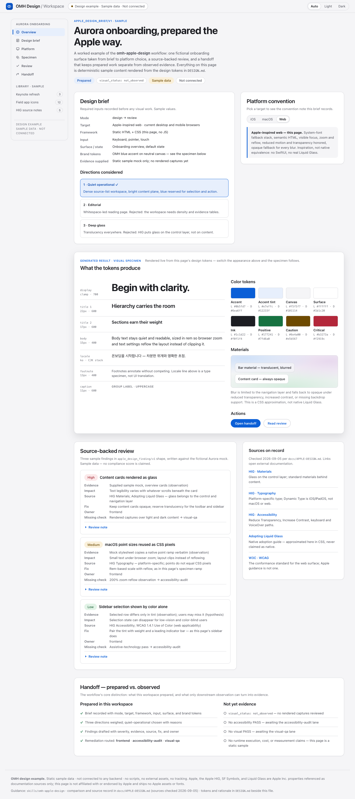
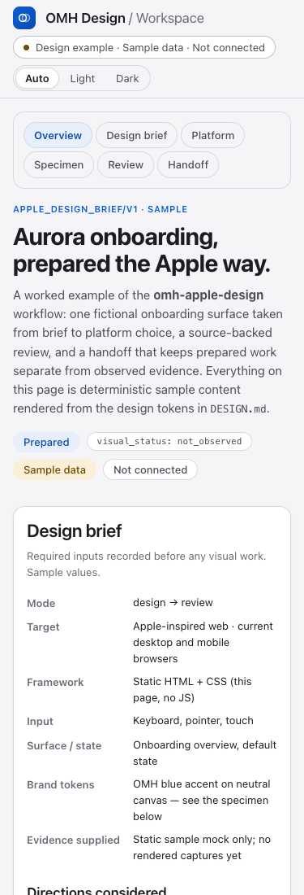

# Apple-Inspired Design Example — OMH Design Workspace

A self-contained, static sample page for the `omh-apple-design` skill: one
fictional "Aurora onboarding" surface taken through an Apple design brief,
platform-convention choice, source-backed review, and a prepared-vs-observed
handoff — plus a live visual specimen (type ramp, color tokens, materials)
rendered from the page's own design system.

**This is a design example, not a product feature.** All runs, findings,
counts, and projects are deterministic sample data; the page states
"Design example · Sample data · Not connected" in the toolbar and sidebar.

## Open it locally

No server, build, dependency, or network access is required:

```sh
open index.html          # macOS
# or double-click index.html, or drag it into any modern browser
```

The page is a single HTML file with embedded CSS and inline SVG icons.
It contains **no JavaScript** and makes zero network requests (source links in
the review rail point at Apple/W3C documentation but nothing loads
automatically).

## What to look at

- **Appearance switch** (toolbar): Auto / Light / Dark radios, CSS-only via
  `:has()`. In browsers without `:has()` it degrades to system appearance.
- **Platform segmented control**: selecting iOS / macOS / Web swaps the
  convention note (same `:has()` mechanism; all notes stay visible as the
  no-`:has()` fallback).
- **Specimen card**: the "generated result" — type hierarchy (including a
  labeled Korean locale line), token swatches with light+dark hex, and a
  translucent-vs-opaque material demo that follows the active appearance.
- **Review findings**: native `<details>` review notes; every finding names
  severity, evidence, source, fix, owner, and missing check.
- Preference media queries: reduced motion, reduced transparency, increased
  contrast, dark scheme — all honored with opaque fallbacks.

Design rationale, full token tables, and verified contrast ratios are in
[`DESIGN.md`](DESIGN.md).

## Previews

Captured from the final HTML in Chromium:




[Dark appearance](previews/dark.png) · [Design specimen](previews/specimen.png)

## Verification status

- Token text/background pairs checked ≥ 4.5:1 (WCAG AA) with a local script.
- HTML structure checked locally: tag balance, unique IDs, resolving anchors
  and `label[for]` targets, no external asset references.
- Browser layout checked at 375, 768, 1280, and 1440 CSS pixels, with desktop,
  mobile, dark, and specimen captures inspected directly.
- Appearance/platform selection, expandable findings, keyboard focus, reduced
  motion/transparency, increased contrast, and 200% text enlargement checked.
  The enlargement pass found and resolved wrapping defects.
- [QA evidence and limitations](QA.md) distinguish this observed browser pass
  from the fictional workspace evidence displayed inside the example.
