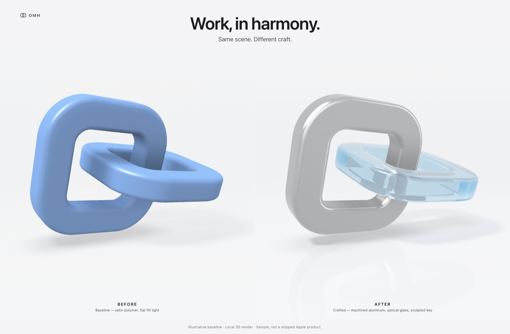

# OMH 3D Hero — Before / After

An Apple-marketing-style product hero rendered **live and locally in 3D**:
one original sculpture (two interlocked rounded-square links, "linked
workflows"), drawn twice from identical geometry, pose, camera, and scale —
once as a competent baseline, once with crafted materials and studio light.

**Sample material.** Illustrative baseline · Local 3D render · Not a shipped
Apple product. No Apple logos, assets, or product copies are used.

## Open it locally

No server, build, dependency, or network access required:

```sh
open index.html     # macOS — plain file:// works
```

Files: `index.html` (layout + HTML type overlay), `renderer.js` (renderer),
`art-direction.md` (full reproducible scene spec).

## Rendered examples



The [mobile example](mobile.png) shows the stacked composition and the
[unavailable-renderer example](no-webgl.png) shows the explicit fallback.
[QA.md](QA.md) records the browser checks and limitations.

## Exact renderer type

A **WebGL 1 signed-distance-field ray-marcher** (fragment shader, one
fullscreen triangle per panel, two canvases sharing one shader with a
`uVariant` uniform). Everything is procedural GLSL — no THREE.js, no meshes,
no textures, no fetched assets.

Per pixel it computes: sphere-traced primary ray, tetrahedral SDF normals,
per-link penumbra soft shadows, 5-tap ambient occlusion, a procedural studio
environment (gradient backdrop + rectangular softboxes) for reflections,
and for the AFTER glass a single-scatter refraction path (entry refraction →
thickness march → exit refraction → Beer–Lambert cool-blue absorption, with a
secondary trace so the aluminum link is visible through the glass).

Rendering is **static and deterministic**: one draw per panel at load and per
size change. There is no animation loop, no motion, and no stochastic sample
accumulation.

## Honest limitations

- This is an approximate real-time shading model, **not** a physically
  validated path tracer: one refraction bounce, no caustics, no dispersion,
  no multiple importance sampling.
- The environment is a procedural gradient + softbox stand-in, not a captured
  HDRI; the floor reflection is a single cheap secondary ray.
- The glass shadow is approximated by letting that link pass ~45% of the key
  light (real glass would focus light into caustics instead).
- No mesh/export exists; the geometry lives only as a signed-distance field.

## Readiness contract (for deterministic capture — no sleeps/polls)

- `html[data-omh-hero]` starts as `"pending"`.
- After shader **compile + link + draw + `gl.finish()`** succeed on *both*
  panels: attribute becomes `"ready"`, `window.__OMH_HERO.state === "ready"`,
  and `window` fires CustomEvent **`omh-hero-ready`** (re-fired after each
  resize re-render, which is driven by a `ResizeObserver`).
- On failure: attribute `"missing-webgl"` or `"error"`, event
  `omh-hero-error`, and an explicit visible fallback message — never a fake
  completed image. `<noscript>` shows the same fallback.
- Canvases use `preserveDrawingBuffer: true`, so pixels survive for
  screenshots after the ready signal.

The static frame uses 2x supersampling, including on 1x displays, with a
~3.2 MP per-panel budget. This smooths silhouette and refraction edges while
bounding the amount of rendering work.

## Layout

1600×1050-first: shared headline "Work, in harmony.", kicker "Same scene.
Different craft.", two equal full-bleed panels (BEFORE / AFTER) with small
HTML captions, tiny disclaimer footer. Under 760 px the panels stack
vertically; verified no horizontal overflow at 390 px. Overlay typography is
the system font stack; colors/spacing/type sizes are CSS custom-property
tokens aligned with `../index.html` (the OMH design workspace example).
